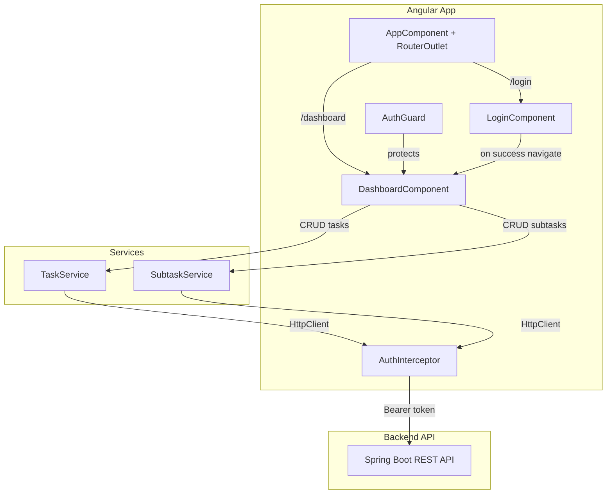
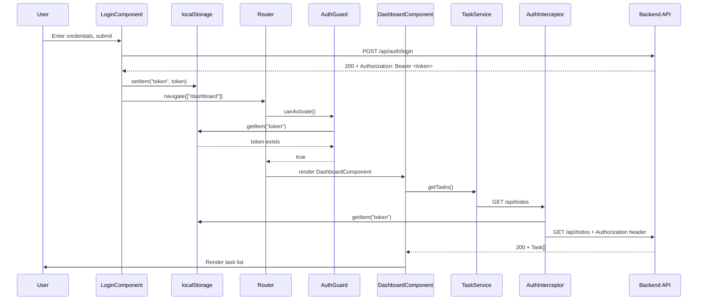
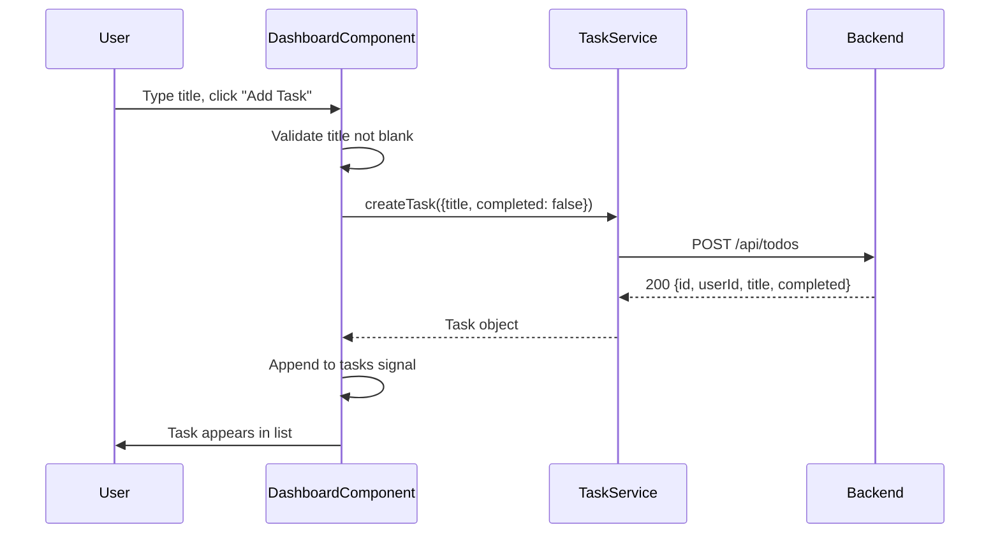
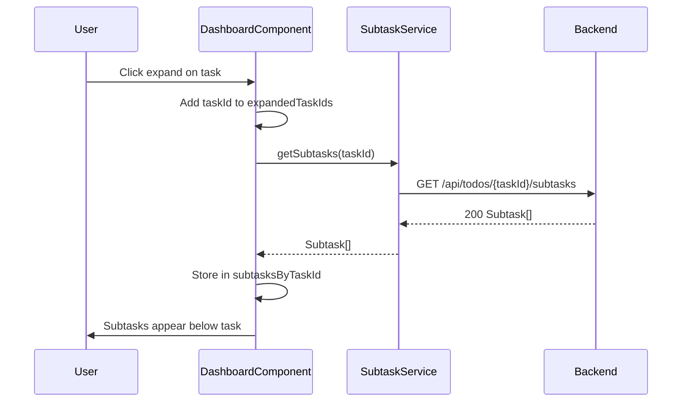
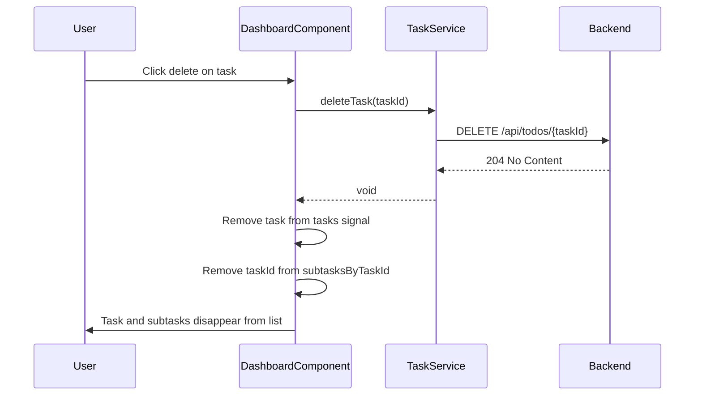
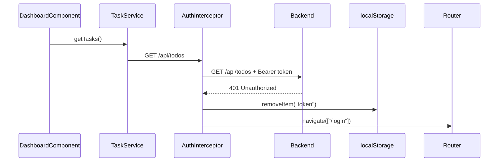

# Design Document: client02-api-dashboard

## Overview

This feature delivers the authenticated Dashboard view for the Todo Management Application's
Angular frontend. It is the central hub where users manage tasks and subtasks after logging in.

The dashboard integrates with the backend REST API (defined in US03 and US04) and relies on the
authentication infrastructure (US02) for JWT storage and request authorization. The feature
includes the `DashboardComponent`, two HTTP services (`TaskService`, `SubtaskService`), an
`AuthInterceptor`, an `AuthGuard`, and shared TypeScript model interfaces.

### Key Design Decisions

| Decision | Rationale |
|----------|-----------|
| Standalone components (no NgModules) | Angular 22 best practice; tree-shakable and simpler imports |
| Signals for reactive state | Modern Angular reactivity model; avoids RxJS complexity for UI state |
| `HttpClient` with functional interceptor | Angular 22 preferred pattern via `withInterceptors()` |
| `localStorage` for JWT storage | Simple persistence across browser refreshes; sufficient for this scope |
| Inline editing for tasks/subtasks | Matches wireframe design; avoids modal overhead |
| Expand/collapse for subtasks | Keeps the UI clean; subtasks are loaded on demand per task |

---

## Architecture



### Component Interaction Flow



---

## Components and Interfaces

### File Layout

```
angular-todo-frontend/src/app/
├── app.config.ts                    ← update: add provideHttpClient, interceptor
├── app.routes.ts                    ← update: add /dashboard route with guard
├── app.ts                           ← existing, unchanged
├── models/
│   ├── task.model.ts                ← new: Task interface
│   └── subtask.model.ts             ← new: Subtask interface
├── services/
│   ├── task.service.ts              ← new: TaskService
│   └── subtask.service.ts           ← new: SubtaskService
├── interceptors/
│   └── auth.interceptor.ts          ← new: functional HTTP interceptor
├── guards/
│   └── auth.guard.ts                ← new: functional route guard
└── dashboard/
    ├── dashboard.component.ts       ← new: DashboardComponent
    ├── dashboard.component.html     ← new: template
    └── dashboard.component.css      ← new: styles
```

### TypeScript Interfaces

#### `models/task.model.ts`
```typescript
export interface Task {
  id: string;
  userId: string;
  title: string;
  completed: boolean;
}
```

#### `models/subtask.model.ts`
```typescript
export interface Subtask {
  id: string;
  taskId: string;
  title: string;
  completed: boolean;
}
```

---

### TaskService

**File:** `services/task.service.ts`

```typescript
@Injectable({ providedIn: 'root' })
export class TaskService {
  private readonly http = inject(HttpClient);
  private readonly apiUrl = '/api/todos';

  getTasks(): Observable<Task[]>;
  createTask(task: Partial<Task>): Observable<Task>;
  updateTask(id: string, updates: Partial<Task>): Observable<Task>;
  deleteTask(id: string): Observable<void>;
}
```

| Method | HTTP Call | Returns |
|--------|----------|---------|
| `getTasks()` | `GET /api/todos` | `Observable<Task[]>` |
| `createTask(task)` | `POST /api/todos` | `Observable<Task>` |
| `updateTask(id, updates)` | `PUT /api/todos/{id}` | `Observable<Task>` |
| `deleteTask(id)` | `DELETE /api/todos/{id}` | `Observable<void>` |

---

### SubtaskService

**File:** `services/subtask.service.ts`

```typescript
@Injectable({ providedIn: 'root' })
export class SubtaskService {
  private readonly http = inject(HttpClient);
  private readonly apiUrl = '/api/todos';

  getSubtasks(taskId: string): Observable<Subtask[]>;
  createSubtask(taskId: string, subtask: Partial<Subtask>): Observable<Subtask>;
  updateSubtask(taskId: string, subtaskId: string, updates: Partial<Subtask>): Observable<Subtask>;
  deleteSubtask(taskId: string, subtaskId: string): Observable<void>;
}
```

| Method | HTTP Call | Returns |
|--------|----------|---------|
| `getSubtasks(taskId)` | `GET /api/todos/{taskId}/subtasks` | `Observable<Subtask[]>` |
| `createSubtask(taskId, subtask)` | `POST /api/todos/{taskId}/subtasks` | `Observable<Subtask>` |
| `updateSubtask(taskId, subtaskId, updates)` | `PUT /api/todos/{taskId}/subtasks/{subtaskId}` | `Observable<Subtask>` |
| `deleteSubtask(taskId, subtaskId)` | `DELETE /api/todos/{taskId}/subtasks/{subtaskId}` | `Observable<void>` |

---

### AuthInterceptor

**File:** `interceptors/auth.interceptor.ts`

A functional interceptor registered via `withInterceptors()`.

```typescript
export const authInterceptor: HttpInterceptorFn = (req, next) => {
  // 1. Read token from localStorage
  // 2. If token exists, clone request with Authorization header
  // 3. Pass to next handler
  // 4. On 401 response: remove token, redirect to /login
};
```

**Behavior:**
1. Read `localStorage.getItem('token')`
2. If token is non-null, clone the request with header `Authorization: Bearer <token>`
3. Call `next(req)` (or cloned request)
4. In the response pipeline, if status is 401: remove `token` from localStorage, inject `Router` and navigate to `/login`

---

### AuthGuard

**File:** `guards/auth.guard.ts`

A functional route guard.

```typescript
export const authGuard: CanActivateFn = (route, state) => {
  // 1. Check localStorage for 'token'
  // 2. If present, return true
  // 3. If absent, redirect to /login and return false
};
```

---

### DashboardComponent

**File:** `dashboard/dashboard.component.ts`

```typescript
@Component({
  selector: 'app-dashboard',
  standalone: true,
  imports: [CommonModule, FormsModule],
  templateUrl: './dashboard.component.html',
  styleUrl: './dashboard.component.css'
})
export class DashboardComponent implements OnInit {
  private readonly taskService = inject(TaskService);
  private readonly subtaskService = inject(SubtaskService);
  private readonly router = inject(Router);

  tasks = signal<Task[]>([]);
  errorMessage = signal<string>('');
  newTaskTitle = signal<string>('');

  // Per-task expanded state and subtask lists
  expandedTaskIds = signal<Set<string>>(new Set());
  subtasksByTaskId = signal<Map<string, Subtask[]>>(new Map());

  ngOnInit(): void;           // Load tasks on init
  createTask(): void;         // Create a new task
  updateTask(task: Task): void;  // Update task title/completed
  deleteTask(taskId: string): void;  // Delete a task
  toggleExpand(taskId: string): void;  // Expand/collapse subtask list
  createSubtask(taskId: string, title: string): void;  // Create a subtask
  updateSubtask(taskId: string, subtask: Subtask): void;  // Update a subtask
  deleteSubtask(taskId: string, subtaskId: string): void;  // Delete a subtask
  logout(): void;             // Remove token and navigate to login
}
```

**State Management:**
- `tasks`: the full list of the user's tasks, fetched on init
- `expandedTaskIds`: tracks which tasks have their subtask section visible
- `subtasksByTaskId`: caches loaded subtasks keyed by parent task ID
- `newTaskTitle`: bound to the "new task" input field
- `errorMessage`: holds transient error messages for display

---

### Route Configuration Update

**File:** `app.routes.ts`

```typescript
import { Routes } from '@angular/router';
import { authGuard } from './guards/auth.guard';

export const routes: Routes = [
  { path: '', redirectTo: '/login', pathMatch: 'full' },
  { path: 'login', loadComponent: () => import('./login/login.component').then(m => m.LoginComponent) },
  { path: 'dashboard', loadComponent: () => import('./dashboard/dashboard.component').then(m => m.DashboardComponent), canActivate: [authGuard] },
  { path: '**', redirectTo: '/login' }
];
```

### App Config Update

**File:** `app.config.ts`

```typescript
import { ApplicationConfig, provideBrowserGlobalErrorListeners } from '@angular/core';
import { provideRouter } from '@angular/router';
import { provideHttpClient, withInterceptors } from '@angular/common/http';
import { authInterceptor } from './interceptors/auth.interceptor';
import { routes } from './app.routes';

export const appConfig: ApplicationConfig = {
  providers: [
    provideBrowserGlobalErrorListeners(),
    provideRouter(routes),
    provideHttpClient(withInterceptors([authInterceptor]))
  ]
};
```

---

## Data Models

### API Request/Response Formats

**GET /api/todos — Response (HTTP 200)**
```json
[
  {
    "id": "550e8400-e29b-41d4-a716-446655440000",
    "userId": "661f9500-f30c-52e5-b827-557766551111",
    "title": "Buy groceries",
    "completed": false
  }
]
```

**POST /api/todos — Request**
```json
{ "title": "Buy groceries", "completed": false }
```

**POST /api/todos — Response (HTTP 200)**
```json
{
  "id": "550e8400-e29b-41d4-a716-446655440000",
  "userId": "661f9500-f30c-52e5-b827-557766551111",
  "title": "Buy groceries",
  "completed": false
}
```

**PUT /api/todos/{id} — Request**
```json
{ "title": "Buy groceries and milk", "completed": true }
```

**DELETE /api/todos/{id} — Response**
```
HTTP 204 No Content
```

**GET /api/todos/{id}/subtasks — Response (HTTP 200)**
```json
[
  {
    "id": "770a9600-a41d-63f6-c938-668877662222",
    "taskId": "550e8400-e29b-41d4-a716-446655440000",
    "title": "Write unit tests",
    "completed": false
  }
]
```

**POST /api/todos/{id}/subtasks — Request**
```json
{ "title": "Write unit tests", "completed": false }
```

**Error Response (JSON from GlobalExceptionHandler)**
```json
{ "status": 404, "message": "Task not found: 550e8400-e29b-41d4-a716-446655440000" }
```

---

## Sequence Diagrams

### Create Task



### Expand Task and Load Subtasks



### Delete Task (cascade)



### 401 Unauthorized Flow



---

## Error Handling

### Error Response Mapping

| Backend Status | Frontend Behavior |
|----------------|-------------------|
| 200 | Success — update UI state |
| 204 | Success (delete) — remove item from UI |
| 400 | Display error message from response body (`message` field) |
| 401 | Remove token, redirect to `/login` (handled by interceptor) |
| 403 | Display "Access denied" message |
| 404 | Remove the item from UI, display informational message |
| 500 | Display generic "Something went wrong" message |

### Client-Side Validation

| Field | Validation | Message |
|-------|-----------|---------|
| Task title (create/update) | Must not be blank | "Task title is required" |
| Subtask title (create/update) | Must not be blank | "Subtask title is required" |

Client-side validation prevents the HTTP request from being sent. Server-side validation provides
a safety net and its error messages are displayed as-is.

---

## Testing Strategy

| Test File | Type | Covers |
|-----------|------|--------|
| `task.service.spec.ts` | Unit (HttpClientTestingModule) | HTTP calls, URL construction, error handling |
| `subtask.service.spec.ts` | Unit (HttpClientTestingModule) | HTTP calls, URL construction, error handling |
| `auth.interceptor.spec.ts` | Unit | Token attachment, 401 handling |
| `auth.guard.spec.ts` | Unit | Guard allow/deny logic |
| `dashboard.component.spec.ts` | Component test | Rendering, user interactions, service integration |

### Key Test Cases

**TaskService:**
- `getTasks()` issues GET to correct URL, returns typed array
- `createTask()` issues POST with correct body
- `updateTask()` issues PUT to correct URL with body
- `deleteTask()` issues DELETE to correct URL

**SubtaskService:**
- `getSubtasks(taskId)` issues GET to `/api/todos/{taskId}/subtasks`
- `createSubtask(taskId, subtask)` issues POST with correct body
- `updateSubtask(taskId, subtaskId, updates)` issues PUT to correct URL
- `deleteSubtask(taskId, subtaskId)` issues DELETE to correct URL

**AuthInterceptor:**
- Attaches Bearer token when present in localStorage
- Sends request without header when no token
- Removes token and redirects on 401 response

**AuthGuard:**
- Returns `true` when token present
- Redirects to `/login` and returns `false` when token absent

**DashboardComponent:**
- Loads and displays tasks on init
- Creates task on form submit with valid title
- Shows validation error on blank title submit
- Expands task to show subtasks
- Deletes task and removes from list
- Logout clears token and navigates to login
