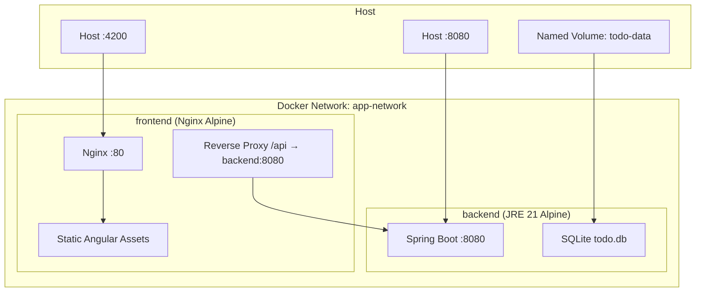

# Design Document: Docker Containerization

## Overview

This design specifies the containerization of the Todo Management Application using Docker. The system consists of two containers orchestrated by Docker Compose:

1. **Frontend Container** — Angular app compiled to static assets and served by Nginx
2. **Backend Container** — Spring Boot JAR running on a minimal JRE with SQLite persistence via a named volume

Both containers use multi-stage builds to minimize image size, run as non-root users for security, and leverage Docker layer caching for fast rebuilds. The entire stack starts with a single `docker compose up` command from the project root.

## Architecture



### Container Communication Flow

1. Browser requests arrive at `localhost:4200` → Nginx serves static Angular assets
2. Angular app makes API calls to `/api/*` → Nginx proxies to `backend:8080`
3. Backend processes requests, reads/writes SQLite database on the mounted volume
4. Direct backend access is also available at `localhost:8080` for development/debugging

### File Layout (new files to create)

```
PEP-Team02-TheDJs/
├── docker-compose.yml          # Root-level Compose orchestration
├── angular-todo-frontend/
│   ├── Dockerfile              # Multi-stage: Node → Nginx Alpine
│   └── nginx.conf              # Custom Nginx config with /api proxy
└── spring-todo-backend/
    └── Dockerfile              # Multi-stage: Gradle → JRE Alpine
```

## Components and Interfaces

### 1. Frontend Dockerfile (`angular-todo-frontend/Dockerfile`)

**Build Stage (Node 22 Alpine)**:
- Copy `package.json` and `package-lock.json` first (layer caching)
- Run `npm ci` to install dependencies
- Copy source code
- Run `npm run build` to produce production output in `dist/angular-todo-frontend/browser/`

**Runtime Stage (Nginx Alpine)**:
- Create non-root user `nginx-user` (UID 1001)
- Copy compiled assets from build stage to Nginx html directory
- Copy custom `nginx.conf` with API reverse proxy
- Set file ownership for the non-root user
- Expose port 80
- Run Nginx as non-root user

### 2. Nginx Configuration (`angular-todo-frontend/nginx.conf`)

**Responsibilities**:
- Serve static Angular files from `/usr/share/nginx/html`
- Proxy `/api/` requests to `http://backend:8080/api/`
- Handle Angular client-side routing by falling back to `index.html` for non-file requests
- Use gzip compression for text assets
- Set appropriate cache headers

**Key proxy directives**:
```nginx
location /api/ {
    proxy_pass http://backend:8080/api/;
    proxy_set_header Host $host;
    proxy_set_header X-Real-IP $remote_addr;
    proxy_set_header X-Forwarded-For $proxy_add_x_forwarded_for;
    proxy_set_header X-Forwarded-Proto $scheme;
}
```

### 3. Backend Dockerfile (`spring-todo-backend/Dockerfile`)

**Build Stage (Gradle 8 + JDK 21)**:
- Copy Gradle wrapper files (`gradlew`, `gradle/`, `build.gradle.kts`, `settings.gradle.kts`) first (layer caching)
- Run dependency download step (`./gradlew dependencies`)
- Copy source code
- Run `./gradlew bootJar -x test` to build the Spring Boot fat JAR

**Runtime Stage (Eclipse Temurin JRE 21 Alpine)**:
- Create non-root user `appuser` (UID 1001)
- Create application directory `/app` and data directory `/app/data`
- Copy the built JAR from build stage
- Set ownership for the non-root user
- Expose port 8080
- Run with `java -jar` pointing datasource to `/app/data/todo.db`

### 4. Docker Compose Configuration (`docker-compose.yml`)

**Services**:

| Service | Build Context | Ports | Depends On | Volumes |
|---------|--------------|-------|------------|---------|
| `frontend` | `./angular-todo-frontend` | `4200:80` | `backend` | — |
| `backend` | `./spring-todo-backend` | `8080:8080` | — | `todo-data:/app/data` |

**Network**: Custom bridge network `app-network` for inter-service DNS resolution.

**Volumes**: Named volume `todo-data` for SQLite persistence.

**Environment Variables** (backend service):
- `SPRING_DATASOURCE_URL=jdbc:sqlite:/app/data/todo.db`
- `JWT_SECRET` (from `.env` file or inline)
- `CORS_ALLOWED_ORIGINS=http://localhost:4200`

### 5. Interface Contracts

**Frontend → Backend (via Nginx proxy)**:
- Path: `/api/*` → proxied to `http://backend:8080/api/*`
- Protocol: HTTP (internal Docker network, no TLS needed)
- DNS: Docker Compose service name `backend` resolves to backend container IP

**Backend → SQLite**:
- Path: `/app/data/todo.db` (inside container)
- Mounted from named volume `todo-data`
- Spring Boot overrides `spring.datasource.url` via environment variable

## Data Models

This feature does not introduce new application-level data models. It uses existing entities (User, Task, Subtask) persisted in the SQLite database.

### Docker-Specific Configuration Data

**Environment Variable Mapping** (Spring Boot relaxed binding):

| Env Variable | Overrides Property | Default Value |
|---|---|---|
| `SPRING_DATASOURCE_URL` | `spring.datasource.url` | `jdbc:sqlite:/app/data/todo.db` |
| `JWT_SECRET` | `jwt.secret` | (must be provided) |
| `CORS_ALLOWED_ORIGINS` | `cors.allowed-origins` | `http://localhost:4200` |

**Volume Structure**:
```
todo-data (named volume)
└── todo.db          # SQLite database file
```

## Error Handling

### Build-Time Errors

| Scenario | Mitigation |
|---|---|
| `npm ci` fails (missing/corrupt lock file) | Dockerfile fails fast at build stage; developer must fix `package-lock.json` |
| Gradle build fails | Dockerfile fails at build stage; developer checks compilation errors locally |
| Out of disk space during build | Docker reports error; user cleans dangling images with `docker system prune` |

### Runtime Errors

| Scenario | Mitigation |
|---|---|
| Backend not ready when frontend starts | Compose `depends_on` ensures ordering; Nginx will return 502 for `/api` calls until backend is healthy |
| SQLite database locked | Single-writer architecture (one backend container); no concurrent write conflicts |
| Volume mount permissions | Dockerfile sets ownership to non-root user before switching USER |
| Container OOM killed | Can be mitigated with `deploy.resources.limits` in Compose (not required for development) |
| Port already in use on host | User must stop conflicting services or change port mappings in Compose |

### Healthcheck Strategy

The backend service should include a basic health endpoint (`/api/health` or Spring Actuator) that Docker Compose can use for `healthcheck`. For the initial implementation, `depends_on` ordering is sufficient. A healthcheck with `condition: service_healthy` can be added as a follow-up enhancement.

## Testing Strategy

Property-based testing is **not applicable** for this feature. Docker containerization is Infrastructure as Code — declarative configuration that defines how services are built and deployed. There are no pure functions with input/output behavior to test with property-based techniques. The Dockerfiles and Compose configuration are validated through build verification and integration tests.

### Build Verification Tests (Smoke Tests)

These confirm that the Docker images build successfully and containers start:

1. `docker compose build` completes without errors
2. `docker compose up -d` starts all services
3. Frontend container responds on `localhost:4200` with HTTP 200
4. Backend container responds on `localhost:8080` with HTTP 200
5. API proxy works: `localhost:4200/api/auth/login` proxies to backend

### Integration Tests

These verify the containers work together as a system:

1. Register a user via `POST localhost:4200/api/auth/register`
2. Login and receive JWT via `POST localhost:4200/api/auth/login`
3. Create a todo via `POST localhost:4200/api/todos` with JWT
4. Verify data persists across container restart (`docker compose restart backend`)

### Security Verification

1. Verify frontend container runs as non-root: `docker exec frontend whoami` ≠ root
2. Verify backend container runs as non-root: `docker exec backend whoami` ≠ root

### Image Size Verification

Confirm multi-stage builds produce lean images:
- Frontend image should be < 50MB (Nginx Alpine + static assets)
- Backend image should be < 300MB (JRE Alpine + Spring Boot fat JAR)

### Layer Caching Verification

1. Modify a `.ts` source file, rebuild — dependency layer should be cached (fast rebuild)
2. Modify a `.java` source file, rebuild — Gradle dependency layer should be cached (fast rebuild)

### Manual Testing Checklist

- [ ] `docker compose up --build` launches the full stack
- [ ] Angular UI loads at `http://localhost:4200`
- [ ] User registration and login work end-to-end
- [ ] CRUD operations on tasks and subtasks work
- [ ] Data persists after `docker compose down && docker compose up`
- [ ] `docker compose down -v` removes the volume (clean start)
