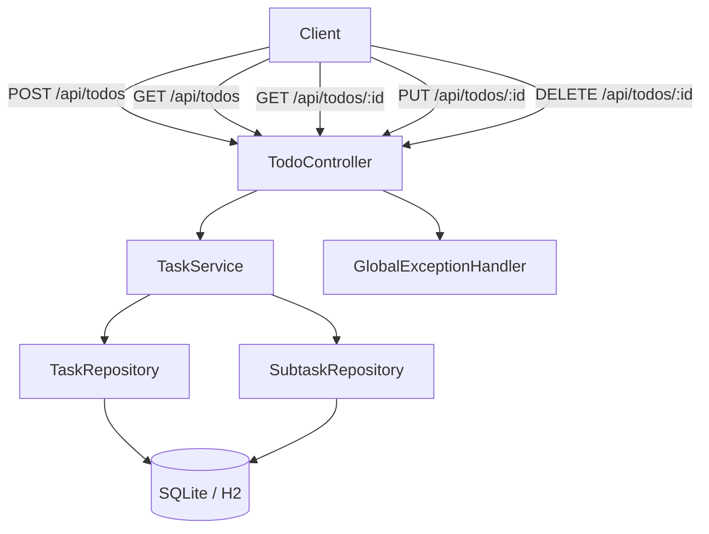
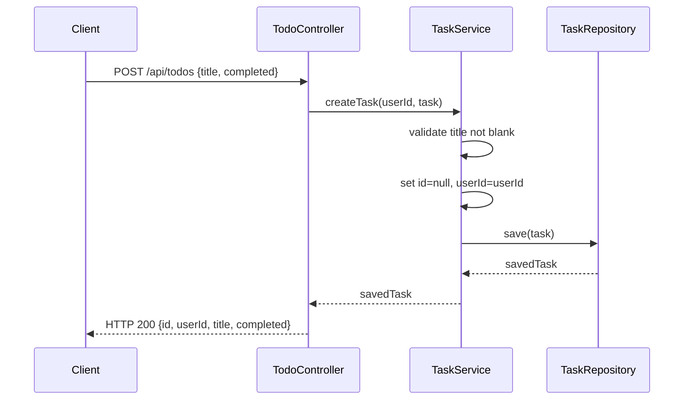
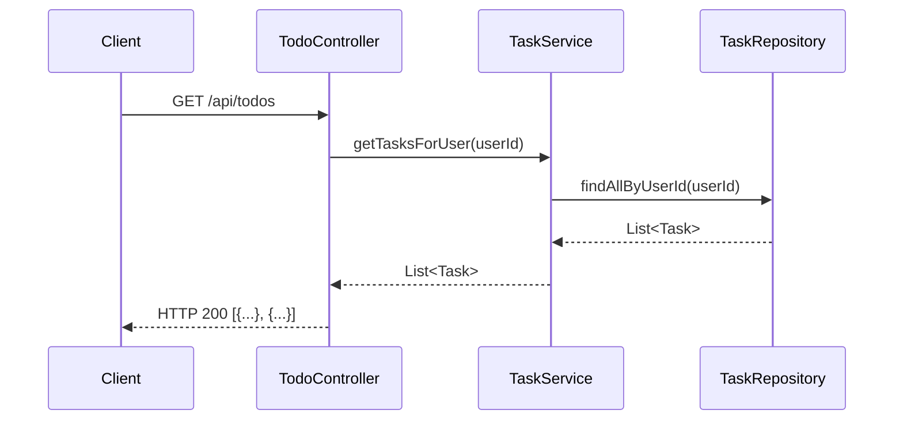
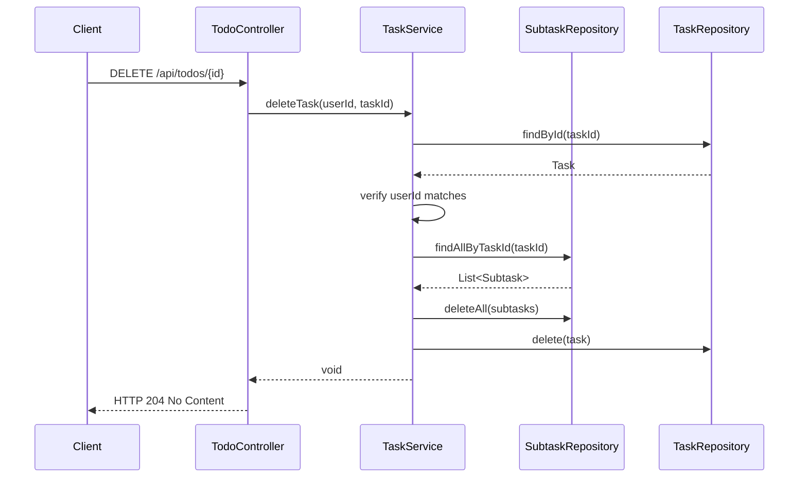
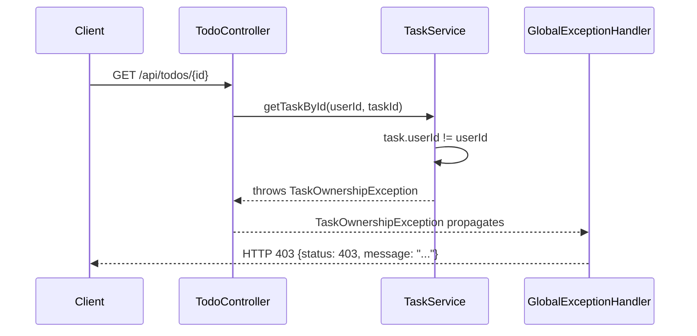

# Design Document: task-management

## Overview

This feature delivers the Task Management vertical slice for the Todo Management Application.
It wires together the HTTP layer, business logic, exception handling, and tests for full CRUD
on todo tasks — all within the existing Spring Boot 4.1.0 / Java 21 stack.

Five public endpoints are exposed:

| Method | Path | Purpose |
|--------|------|---------|
| POST | `/api/todos` | Create a new task for the authenticated user |
| GET | `/api/todos` | List all tasks owned by the authenticated user |
| GET | `/api/todos/{id}` | Retrieve a single task by ID |
| PUT | `/api/todos/{id}` | Update a task's title and/or completed status |
| DELETE | `/api/todos/{id}` | Delete a task and cascade-delete its subtasks |

All endpoints require the authenticated user's ID (extracted from the JWT) to enforce ownership.
No task is readable or modifiable by any user other than its owner.

---

## Architecture

The feature follows the existing layered architecture established in the project:

```
HTTP (TodoController)
       │
       ▼
Service (TaskService)
  ├─ TaskRepository    (Spring Data JPA)
  └─ SubtaskRepository (Spring Data JPA — cascade delete)
       │
       ▼
Database (SQLite via Hibernate / H2 in tests)
```

Cross-cutting concerns are handled by:
- **GlobalExceptionHandler** (`@ControllerAdvice`) — maps domain exceptions to HTTP status codes



---

## Components and Interfaces

### Package Layout

```
com.revature.todomanagement
├── controller/
│   └── TodoController.java              ← fill in existing shell
├── service/
│   └── TaskService.java                 ← already implemented
├── repository/
│   ├── TaskRepository.java              ← already implemented
│   └── SubtaskRepository.java           ← already implemented
├── entity/
│   ├── Task.java                        ← existing, unchanged
│   └── Subtask.java                     ← existing, unchanged
└── exception/
    ├── TaskNotFoundException.java       ← already implemented
    ├── TaskOwnershipException.java      ← already implemented
    └── GlobalExceptionHandler.java      ← new
```

### Class Signatures

#### `TodoController`
```java
package com.revature.todomanagement.controller;

import com.revature.todomanagement.entity.Task;
import com.revature.todomanagement.service.TaskService;
import lombok.RequiredArgsConstructor;
import org.springframework.http.ResponseEntity;
import org.springframework.web.bind.annotation.*;

import java.util.List;
import java.util.UUID;

@RestController
@RequestMapping("/api/todos")
@RequiredArgsConstructor
public class TodoController {

    private final TaskService taskService;

    @PostMapping
    public ResponseEntity<Task> createTask(@RequestAttribute UUID userId,
                                           @RequestBody Task task);

    @GetMapping
    public ResponseEntity<List<Task>> getTasks(@RequestAttribute UUID userId);

    @GetMapping("/{id}")
    public ResponseEntity<Task> getTaskById(@RequestAttribute UUID userId,
                                            @PathVariable UUID id);

    @PutMapping("/{id}")
    public ResponseEntity<Task> updateTask(@RequestAttribute UUID userId,
                                           @PathVariable UUID id,
                                           @RequestBody Task updates);

    @DeleteMapping("/{id}")
    public ResponseEntity<Void> deleteTask(@RequestAttribute UUID userId,
                                           @PathVariable UUID id);
}
```

#### `GlobalExceptionHandler`
```java
package com.revature.todomanagement.exception;

import org.springframework.http.ResponseEntity;
import org.springframework.web.bind.annotation.*;
import java.util.Map;

@RestControllerAdvice
public class GlobalExceptionHandler {

    @ExceptionHandler(TaskNotFoundException.class)
    public ResponseEntity<Map<String, Object>> handleTaskNotFound(TaskNotFoundException ex);
    // → HTTP 404, body: {"status": 404, "message": "..."}

    @ExceptionHandler(TaskOwnershipException.class)
    public ResponseEntity<Map<String, Object>> handleTaskOwnership(TaskOwnershipException ex);
    // → HTTP 403, body: {"status": 403, "message": "..."}

    @ExceptionHandler(IllegalArgumentException.class)
    public ResponseEntity<Map<String, Object>> handleIllegalArgument(IllegalArgumentException ex);
    // → HTTP 400, body: {"status": 400, "message": "..."}

    @ExceptionHandler(Exception.class)
    public ResponseEntity<Map<String, Object>> handleGeneric(Exception ex);
    // → HTTP 500, body: {"status": 500}
}
```

---

## Data Models

### `Task` Entity (existing — no changes required)

```
tasks
├── id         UUID     PK  (generated)
├── userId     UUID     NOT NULL
├── title      TEXT     NOT NULL
└── completed  BOOLEAN  NOT NULL  DEFAULT false
```

### Wire Formats

**POST /api/todos — Request**
```json
{ "title": "Buy groceries", "completed": false }
```

**POST /api/todos — Response (HTTP 200)**
```json
{
  "id": "550e8400-e29b-41d4-a716-446655440000",
  "userId": "661f9500-f30c-52e5-b827-557766551111",
  "title": "Buy groceries",
  "completed": false
}
```

**GET /api/todos — Response (HTTP 200)**
```json
[
  {
    "id": "550e8400-e29b-41d4-a716-446655440000",
    "userId": "661f9500-f30c-52e5-b827-557766551111",
    "title": "Buy groceries",
    "completed": false
  }
]
```

**PUT /api/todos/{id} — Request**
```json
{ "title": "Buy groceries and milk", "completed": true }
```

**DELETE /api/todos/{id} — Response**
```
HTTP 204 No Content
```

**Error Response**
```json
{ "status": 404, "message": "Task not found: 550e8400-e29b-41d4-a716-446655440000" }
```

---

## Sequence Diagrams

### Create Task



### List Tasks



### Delete Task (cascade)



### Ownership Violation



---

## Error Handling

### Exception Hierarchy

```
RuntimeException
├── TaskNotFoundException    (task ID does not exist)
└── TaskOwnershipException   (task exists but belongs to a different user)

IllegalArgumentException     (built-in; blank title validation)
```

### Error Response Contract

| Condition | HTTP Status | Response Body |
|-----------|-------------|---------------|
| Task not found | 404 | `{"status": 404, "message": "..."}` |
| Ownership violation | 403 | `{"status": 403, "message": "..."}` |
| Blank title | 400 | `{"status": 400, "message": "..."}` |
| Unhandled exception | 500 | `{"status": 500}` |

### Service-Layer Validation Order

`TaskService.createTask`:
1. Validate `title` not blank → `IllegalArgumentException`
2. Override `id` to `null`, set `userId`
3. Persist → `TaskRepository.save`

`TaskService.getTaskById` / `updateTask` / `deleteTask`:
1. Load task → `TaskRepository.findById`, empty → `TaskNotFoundException`
2. Verify `task.getUserId().equals(userId)` → `TaskOwnershipException`
3. Apply update / cascade-delete subtasks then delete task

---

## Testing Strategy

| Test Class | Slice | What it covers |
|---|---|---|
| `TaskServiceTest` | Plain JUnit 5 + Mockito | CRUD logic, ownership checks, cascade delete |
| `TodoControllerTest` | `@WebMvcTest` + Mockito | HTTP status codes, exception to response mapping |

### `TaskServiceTest` (key cases)
- `createTask` with valid title → `save` called once, returned task has correct `userId`
- `createTask` with blank title → `IllegalArgumentException`, `save` never called
- `getTasksForUser` → delegates to `findAllByUserId`
- `getTaskById` with unknown ID → `TaskNotFoundException`
- `getTaskById` with wrong owner → `TaskOwnershipException`
- `updateTask` with valid fields → `save` called with updated values
- `updateTask` with blank title → `IllegalArgumentException`
- `deleteTask` → subtasks deleted first via `deleteAll`, then task deleted
- `deleteTask` with unknown ID → `TaskNotFoundException`
- `deleteTask` with wrong owner → `TaskOwnershipException`

### `TodoControllerTest` (key cases)
- `POST /api/todos` with valid body → HTTP 200
- `POST /api/todos` with blank title → HTTP 400
- `GET /api/todos` → HTTP 200, JSON array
- `GET /api/todos/{id}` with unknown ID → HTTP 404
- `GET /api/todos/{id}` with wrong owner → HTTP 403
- `PUT /api/todos/{id}` with valid body → HTTP 200
- `DELETE /api/todos/{id}` → HTTP 204
