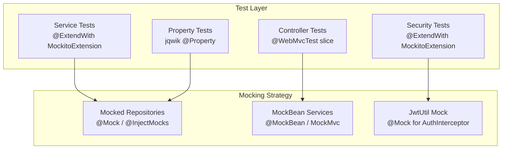

# Design Document: Todo Management Unit Test Suite

## Overview

This design specifies a comprehensive JUnit 5 test suite for the Todo Management Spring Boot backend. The suite validates business logic (services), security components (PasswordValidator, JwtUtil, AuthInterceptor), and REST controller behavior using isolated mocks and Spring WebMvc test slices.

The test architecture is organized into three tiers:
- **Service tests** — `@ExtendWith(MockitoExtension.class)` with mocked repositories
- **Security tests** — same Mockito-only approach for PasswordValidator, JwtUtil, AuthInterceptor
- **Controller tests** — `@WebMvcTest` slice with `@MockBean` service dependencies

Property-based tests (jqwik 1.9.3) supplement the example-based tests for three invariants where input-space coverage adds real value.

## Architecture



### Package Layout

```
src/test/java/com/revature/todomanagement/
├── service/
│   ├── RegistrationServiceTest.java
│   ├── UserServiceTest.java
│   ├── TaskServiceTest.java
│   └── TaskServiceOwnershipPropertyTest.java   (jqwik)
├── security/
│   ├── PasswordValidatorTest.java
│   ├── PasswordValidatorPropertyTest.java      (jqwik)
│   ├── JwtUtilTest.java
│   ├── JwtUtilPropertyTest.java                (jqwik)
│   └── AuthInterceptorTest.java
└── controller/
    ├── LoginControllerTest.java
    ├── RegistrationControllerTest.java
    ├── TodoControllerTest.java
    └── SubtaskControllerTest.java
```

The existing `SubtaskServiceTest.java` in the root test package remains unchanged.

## Components and Interfaces

### Service Tests

#### RegistrationServiceTest

```java
@ExtendWith(MockitoExtension.class)
@DisplayName("RegistrationService")
class RegistrationServiceTest {

    @Mock UserRepository userRepository;
    @Mock PasswordValidator passwordValidator;
    @InjectMocks RegistrationService registrationService;

    @Nested @DisplayName("Username validation")
    class UsernameValidation { /* criteria 1.1-1.3 */ }

    @Nested @DisplayName("Password validation")
    class PasswordValidation { /* criteria 1.4-1.5 */ }

    @Nested @DisplayName("Duplicate checking")
    class DuplicateChecking { /* criteria 1.6 */ }

    @Nested @DisplayName("Persistence")
    class Persistence { /* criteria 1.7-1.8 */ }
}
```

**Method signatures:**
- `registerUser_nullUsername_throwsRegistrationFailureWithBlank()`
- `registerUser_blankUsername_throwsRegistrationFailureWithBlank()`
- `registerUser_shortUsername_throwsRegistrationFailureWithLengthMessage()`
- `registerUser_longUsername_throwsRegistrationFailureWithLengthMessage()`
- `registerUser_validUsernameNullPassword_throwsRegistrationFailureWithBlank()`
- `registerUser_validUsernameBlankPassword_throwsRegistrationFailureWithBlank()`
- `registerUser_passwordViolations_throwsRegistrationFailureWithAllViolations()`
- `registerUser_duplicateUsername_throwsRegistrationFailureWithAlreadyTaken()`
- `registerUser_validCredentials_savesUserExactlyOnce()`

#### UserServiceTest

```java
@ExtendWith(MockitoExtension.class)
@DisplayName("UserService")
class UserServiceTest {

    @Mock UserRepository userRepository;
    @InjectMocks UserService userService;

    @Nested @DisplayName("login")
    class Login { /* criteria 2.1-2.6 */ }
}
```

**Method signatures:**
- `login_validCredentials_returnsStoredUserEntity()`
- `login_nullUsername_throwsInvalidCredentialsException()`
- `login_blankUsername_throwsInvalidCredentialsException()`
- `login_nullPassword_throwsInvalidCredentialsException()`
- `login_blankPassword_throwsInvalidCredentialsException()`
- `login_usernameNotFound_throwsInvalidCredentialsException()`
- `login_passwordMismatch_throwsInvalidCredentialsException()`
- `login_validCredentials_callsFindByUsernameExactlyOnce()`

#### TaskServiceTest

```java
@ExtendWith(MockitoExtension.class)
@DisplayName("TaskService")
class TaskServiceTest {

    @Mock TaskRepository taskRepository;
    @Mock SubtaskRepository subtaskRepository;
    @InjectMocks TaskService taskService;

    @Nested @DisplayName("createTask")
    class CreateTask { /* criteria 3.1-3.2 */ }

    @Nested @DisplayName("getTasksForUser")
    class GetTasksForUser { /* criterion 3.3 */ }

    @Nested @DisplayName("getTaskById")
    class GetTaskById { /* criteria 3.4-3.6 */ }

    @Nested @DisplayName("updateTask")
    class UpdateTask { /* criteria 3.7-3.9, 3.12 */ }

    @Nested @DisplayName("deleteTask")
    class DeleteTask { /* criteria 3.10-3.11 */ }
}
```

**Method signatures:**
- `createTask_validTitle_setsUserIdAndSaves()`
- `createTask_nullTitle_throwsIllegalArgAndNoSave()`
- `createTask_blankTitle_throwsIllegalArgAndNoSave()`
- `getTasksForUser_delegatesToRepository()`
- `getTaskById_ownedTask_returnsTask()`
- `getTaskById_nonExistentTask_throwsTaskNotFoundException()`
- `getTaskById_wrongOwner_throwsTaskOwnershipException()`
- `updateTask_validTitle_updatesAndSaves()`
- `updateTask_blankTitle_throwsIllegalArgAndNoSave()`
- `updateTask_nullTitle_preservesOriginalTitle()`
- `updateTask_wrongOwner_throwsTaskOwnershipException()`
- `deleteTask_ownedTask_deletesSubtasksThenTask()`
- `deleteTask_wrongOwner_throwsTaskOwnershipExceptionAndNoDeletes()`

#### TaskServiceOwnershipPropertyTest (jqwik)

```java
@ExtendWith(MockitoExtension.class)
@DisplayName("TaskService ownership invariant")
class TaskServiceOwnershipPropertyTest {

    @Mock TaskRepository taskRepository;
    @Mock SubtaskRepository subtaskRepository;
    @InjectMocks TaskService taskService;

    @Property
    void getTaskById_mismatchedOwner_alwaysThrows(
            @ForAll UUID requestingUserId,
            @ForAll UUID taskOwnerId,
            @ForAll UUID taskId) { /* filter: !requestingUserId.equals(taskOwnerId) */ }
}
```

### Security Tests

#### PasswordValidatorTest

```java
@ExtendWith(MockitoExtension.class)
@DisplayName("PasswordValidator")
class PasswordValidatorTest {

    PasswordValidator validator = new PasswordValidator();

    @Nested @DisplayName("Individual rules")
    class IndividualRules { /* criteria 4.1-4.7 */ }

    @Nested @DisplayName("All rules pass")
    class AllRulesPass { /* criterion 4.8 */ }

    @Nested @DisplayName("Multiple violations")
    class MultipleViolations { /* criterion 4.9 */ }

    @Nested @DisplayName("Boundary lengths")
    class BoundaryLengths { /* criterion 4.10 */ }
}
```

**Boundary test uses `@ParameterizedTest` with `@MethodSource`:**
```java
@ParameterizedTest
@MethodSource("boundaryLengthPasswords")
void getViolations_boundaryLength_returnsEmptyList(String password) { ... }

static Stream<Arguments> boundaryLengthPasswords() {
    return Stream.of(
        Arguments.of("Abcde1!x"),          // exactly 8 chars
        Arguments.of("A" + "a".repeat(63) + "1234567!")  // exactly 72 chars
    );
}
```

#### PasswordValidatorPropertyTest (jqwik)

```java
@DisplayName("PasswordValidator regex/rule round-trip")
class PasswordValidatorPropertyTest {

    PasswordValidator validator = new PasswordValidator();

    @Property
    void regexMatchingPasswords_alwaysPassRuleEngine(
            @ForAll("passwordsMatchingRegex") String password) { ... }

    @Provide
    Arbitrary<String> passwordsMatchingRegex() { /* builds strings matching PASSWORD_REGEX */ }
}
```

#### JwtUtilTest

```java
@ExtendWith(MockitoExtension.class)
@DisplayName("JwtUtil")
class JwtUtilTest {

    // Constructed directly with a known 32-byte secret
    JwtUtil jwtUtil = new JwtUtil("my-test-secret-key-32-bytes-lon!");

    @Nested @DisplayName("generateToken")
    class GenerateToken { /* criterion 5.1 */ }

    @Nested @DisplayName("extractUsername")
    class ExtractUsername { /* criteria 5.2, 5.4, 5.5 */ }

    @Nested @DisplayName("extractUserId")
    class ExtractUserId { /* criteria 5.3, 5.10 */ }

    @Nested @DisplayName("isTokenValid")
    class IsTokenValid { /* criteria 5.6-5.8 */ }
}
```

#### JwtUtilPropertyTest (jqwik)

```java
@DisplayName("JwtUtil claim extraction round-trip")
class JwtUtilPropertyTest {

    JwtUtil jwtUtil = new JwtUtil("my-test-secret-key-32-bytes-lon!");

    @Property
    void generateThenExtract_preservesUsernameAndId(
            @ForAll("validUsers") User user) { ... }

    @Provide
    Arbitrary<User> validUsers() {
        Arbitrary<String> usernames = Arbitraries.strings()
                .ofMinLength(1).ofMaxLength(255)
                .alpha().numeric();
        Arbitrary<UUID> ids = Arbitraries.create(UUID::randomUUID);
        return Combinators.combine(usernames, ids)
                .as((name, id) -> new User(id, name, "irrelevant"));
    }
}
```

#### AuthInterceptorTest

```java
@ExtendWith(MockitoExtension.class)
@DisplayName("AuthInterceptor")
class AuthInterceptorTest {

    @Mock JwtUtil jwtUtil;
    @InjectMocks AuthInterceptor authInterceptor;

    MockHttpServletRequest request;
    MockHttpServletResponse response;
    Object handler = new Object();

    @BeforeEach
    void setUp() {
        request = new MockHttpServletRequest();
        response = new MockHttpServletResponse();
    }

    @Nested @DisplayName("CORS preflight bypass")
    class CorsPreflight { /* criterion 6.1 */ }

    @Nested @DisplayName("Header validation")
    class HeaderValidation { /* criteria 6.2-6.3 */ }

    @Nested @DisplayName("Token validation")
    class TokenValidation { /* criteria 6.4-6.5, 6.10 */ }

    @Nested @DisplayName("Successful authentication")
    class SuccessfulAuth { /* criteria 6.6-6.8 */ }

    @Nested @DisplayName("Rejection side-effects")
    class RejectionSideEffects { /* criterion 6.9 */ }
}
```

### Controller Tests

All controller tests share these patterns:
- `@WebMvcTest(value = XController.class, excludeFilters = @ComponentScan.Filter(type = FilterType.ASSIGNABLE_TYPE, classes = {WebConfig.class, AuthInterceptor.class}))`
- `@MockBean` for service dependencies
- `MockMvc` autowired for request simulation
- `requestAttr("userId", uuid)` set via `MockMvcRequestBuilders` where needed

#### LoginControllerTest

```java
@WebMvcTest(value = LoginController.class,
    excludeFilters = @ComponentScan.Filter(type = FilterType.ASSIGNABLE_TYPE,
        classes = {WebConfig.class, AuthInterceptor.class}))
@DisplayName("LoginController")
class LoginControllerTest {

    @Autowired MockMvc mockMvc;
    @MockBean UserService userService;
    @MockBean JwtUtil jwtUtil;

    @Nested @DisplayName("POST /api/auth/login")
    class PostLogin { /* criteria 7.1-7.2 */ }
}
```

#### RegistrationControllerTest

```java
@WebMvcTest(value = RegistrationController.class,
    excludeFilters = @ComponentScan.Filter(type = FilterType.ASSIGNABLE_TYPE,
        classes = {WebConfig.class, AuthInterceptor.class}))
@DisplayName("RegistrationController")
class RegistrationControllerTest {

    @Autowired MockMvc mockMvc;
    @MockBean RegistrationService registrationService;

    @Nested @DisplayName("POST /api/auth/register")
    class PostRegister { /* criteria 8.1-8.3 */ }
}
```

#### TodoControllerTest

```java
@WebMvcTest(value = TodoController.class,
    excludeFilters = @ComponentScan.Filter(type = FilterType.ASSIGNABLE_TYPE,
        classes = {WebConfig.class, AuthInterceptor.class}))
@DisplayName("TodoController")
class TodoControllerTest {

    @Autowired MockMvc mockMvc;
    @MockBean TaskService taskService;

    @Nested @DisplayName("CRUD operations")
    class CrudOps { /* criteria 9.1-9.5 */ }

    @Nested @DisplayName("Exception handling")
    class ExceptionHandling { /* criteria 9.6-9.8 */ }
}
```

#### SubtaskControllerTest

```java
@WebMvcTest(value = SubtaskController.class,
    excludeFilters = @ComponentScan.Filter(type = FilterType.ASSIGNABLE_TYPE,
        classes = {WebConfig.class, AuthInterceptor.class}))
@DisplayName("SubtaskController")
class SubtaskControllerTest {

    @Autowired MockMvc mockMvc;
    @MockBean SubtaskService subtaskService;

    @Nested @DisplayName("CRUD operations")
    class CrudOps { /* criteria 10.1-10.5 */ }

    @Nested @DisplayName("Exception handling")
    class ExceptionHandling { /* criteria 10.6-10.9 */ }
}
```

## Data Models

### Test Fixtures

Entities are constructed directly using `@AllArgsConstructor`:

```java
// User
User user = new User(UUID.randomUUID(), "testuser", "Password1!");

// Task
UUID userId = UUID.randomUUID();
UUID taskId = UUID.randomUUID();
Task task = new Task(taskId, userId, "Buy groceries", false);

// Subtask
UUID subtaskId = UUID.randomUUID();
Subtask subtask = new Subtask(subtaskId, taskId, "Buy milk", false);
```

### jqwik Arbitrary Providers

| Provider | Target Type | Strategy |
|---|---|---|
| `validUsers()` | `Arbitrary<User>` | Random UUID id, alpha-numeric username (1-255 chars), fixed password |
| `passwordsMatchingRegex()` | `Arbitrary<String>` | Compose: length 8-72, at least one uppercase, one lowercase, one digit, one special char from `!@#$%^&*`, no whitespace |
| `uuidPairs()` | `Arbitrary<Tuple2<UUID, UUID>>` | Two random UUIDs filtered to be unequal |

### Mock Wiring Patterns

| Test Class | @Mock | @InjectMocks |
|---|---|---|
| RegistrationServiceTest | UserRepository, PasswordValidator | RegistrationService |
| UserServiceTest | UserRepository | UserService |
| TaskServiceTest | TaskRepository, SubtaskRepository | TaskService |
| AuthInterceptorTest | JwtUtil | AuthInterceptor |
| TaskServiceOwnershipPropertyTest | TaskRepository, SubtaskRepository | TaskService |

## Correctness Properties

*A property is a characteristic or behavior that should hold true across all valid executions of a system — essentially, a formal statement about what the system should do. Properties serve as the bridge between human-readable specifications and machine-verifiable correctness guarantees.*

### Property 1: TaskService ownership invariant

*For any* pair of UUIDs (requestingUserId, taskOwnerId) where requestingUserId does not equal taskOwnerId, when a Task exists with userId = taskOwnerId, calling `TaskService.getTaskById(requestingUserId, taskId)` SHALL throw `TaskOwnershipException`.

**Validates: Requirements 3.6, 11.1**

### Property 2: PasswordValidator regex/rule-engine round-trip

*For any* password string that matches `PasswordValidator.PASSWORD_REGEX`, calling `getViolations(password)` SHALL return an empty list. The regex and the rule engine are two representations of the same constraints, and they must agree.

**Validates: Requirements 4.11**

### Property 3: JwtUtil claim extraction round-trip

*For any* User entity where username is a non-blank string of 1 to 255 characters and id is a non-null UUID, `extractUsername(generateToken(user))` SHALL equal `user.getUsername()` AND `extractUserId(generateToken(user))` SHALL equal `user.getId().toString()`.

**Validates: Requirements 5.2, 5.3, 5.9**

## Error Handling

### Test-Level Error Handling

| Scenario | Expected Exception | Verified By |
|---|---|---|
| Blank/null username on register | `RegistrationFailure` | RegistrationServiceTest |
| Username length out of 5-18 range | `RegistrationFailure` | RegistrationServiceTest |
| Password validation failures | `RegistrationFailure` | RegistrationServiceTest |
| Duplicate username | `RegistrationFailure` | RegistrationServiceTest |
| Invalid login credentials | `InvalidCredentialsException` | UserServiceTest |
| Blank task title | `IllegalArgumentException` | TaskServiceTest |
| Task not found | `TaskNotFoundException` | TaskServiceTest |
| Task ownership mismatch | `TaskOwnershipException` | TaskServiceTest + Property |
| Tampered/expired JWT | returns `null` | JwtUtilTest |
| Missing/malformed auth header | HTTP 401 | AuthInterceptorTest |

### Controller Exception-to-HTTP Mapping

| Exception | HTTP Status | Response Format |
|---|---|---|
| `InvalidCredentialsException` | 401 | Plain text body |
| `RegistrationFailure` | 400 | Plain text body |
| `DataIntegrityViolationException` | 409 | Plain text body |
| `TaskNotFoundException` | 404 | JSON `{status, message}` |
| `SubtaskNotFoundException` | 404 | JSON `{status, message}` |
| `TaskOwnershipException` | 403 | JSON `{status, message}` |
| `IllegalArgumentException` | 400 | JSON `{status, message}` |

## Testing Strategy

### Framework and Libraries

| Tool | Purpose | Scope |
|---|---|---|
| JUnit 5 (Jupiter) | Test lifecycle, assertions, `@Nested`, `@DisplayName` | All tests |
| Mockito 5.x (via spring-boot-starter-test) | Mock creation, stubbing, verification | Service + Security tests |
| MockitoExtension | STRICT_STUBS, `@Mock`/`@InjectMocks` injection | Service + Security tests |
| Spring WebMvc Test | `MockMvc`, `@WebMvcTest`, `@MockBean` | Controller tests |
| jqwik 1.9.3 | `@Property`, `Arbitrary`, `@Provide` | Property tests |
| H2 2.4.240 | In-memory DB for any integration slice | Not used for pure unit tests |

### Test Execution

- All tests run via `./gradlew test` (JUnit Platform)
- jqwik integrates with JUnit Platform; no separate runner needed
- Test count target: ~75 example-based tests + 3 property tests (100+ tries each)
- All tests are deterministic (no shared state, no real I/O)

### Property-Based Testing Configuration

- Library: **jqwik 1.9.3** (already in build.gradle.kts)
- Minimum iterations: 100 per `@Property` method (jqwik default is 1000)
- Each property test is in a dedicated class for clarity
- Tag format in comments: `Feature: test01-unit-test, Property {N}: {title}`

### Test Naming Convention

```
methodUnderTest_stateOrInput_expectedBehavior
```

Examples:
- `registerUser_nullUsername_throwsRegistrationFailureWithBlank`
- `login_passwordMismatch_throwsInvalidCredentialsException`
- `getTaskById_mismatchedOwner_alwaysThrows` (property)

### Dual Testing Approach

- **Unit tests** (example-based): Cover specific scenarios, edge cases (null, blank, boundary lengths), error conditions, and wiring verification. Each acceptance criterion maps to one or more focused test methods.
- **Property tests** (jqwik): Cover universal invariants where input-space coverage reveals bugs that specific examples miss — ownership enforcement across arbitrary UUID pairs, regex/rule consistency across the full password space, and JWT round-trip fidelity across arbitrary usernames.

### Infrastructure Conventions (Requirement 12)

1. Service/Security tests: `@ExtendWith(MockitoExtension.class)` — no Spring context
2. Controller tests: `@WebMvcTest` with `excludeFilters` for `WebConfig` and `AuthInterceptor`
3. Package mirroring: test classes in `.service`, `.security`, `.controller` sub-packages
4. Naming: `methodUnderTest_stateOrInput_expectedBehavior`
5. Grouping: `@Nested` inner classes per logical context
6. Readability: `@DisplayName` on classes and nested groups
7. Strictness: STRICT_STUBS (MockitoExtension default) — no unused stubbing
8. Data-driven: `@ParameterizedTest` + `@MethodSource` for PasswordValidator boundary tests
