# Design Document

## Overview

This design specifies a comprehensive REST Assured integration test suite for the Todo Management API. The suite exercises 45+ scenarios across registration, authentication, token validation, task CRUD, subtask CRUD, ownership enforcement, cascade delete, and business rules. All tests run against an embedded Spring Boot server backed by an H2 in-memory database, ensuring complete isolation from production data.

The test architecture uses a single abstract base class (`BaseIntegrationTest`) that configures REST Assured with the embedded server's random port, provides an `Auth_Helper` utility for token acquisition, and enforces consistent teardown. Eight concrete test classes — one per API domain — extend this base and use REST Assured's BDD-style `given()`/`when()`/`then()` DSL for all assertions.

## Architecture

```mermaid
classDiagram
    class BaseIntegrationTest {
        <<abstract>>
        #int port
        +setupRestAssured() void
        +teardownRestAssured() void
        +getAuthToken(username, password) String
    }

    class RegistrationIT {
        +blankUsername_returns400()
        +shortUsername_returns400()
        +longUsername_returns400()
        +blankPassword_returns400()
        +noSpecialChar_returns400()
        +validRegistration_returns201()
        +duplicateUsername_returns400()
    }

    class AuthenticationIT {
        +validLogin_returns200WithToken()
        +wrongPassword_returns401()
        +unknownUsername_returns401()
        +emptyCredentials_returns401()
    }

    class AuthInterceptorIT {
        +noAuthHeader_returns401()
        +invalidSignature_returns401()
        +malformedHeader_returns401()
        +expiredToken_returns401()
        +validToken_proceeds()
    }

    class TaskCrudIT {
        +createWithValidTitle_returns200()
        +createWithBlankTitle_returns400()
        +listTasks_returnsUserTasksOnly()
        +getById_returns200()
        +getByNonExistentId_returns404()
        +update_returns200()
        +updateBlankTitle_returns400()
        +delete_returns204()
        +deleteAlreadyDeleted_returns404()
        +deleteThenGet_returns404()
    }

    class SubtaskCrudIT {
        +createWithValidTitle_returns200()
        +createWithBlankTitle_returns400()
        +listSubtasks_returnsAll()
        +listSubtasksEmpty_returnsEmptyArray()
        +getById_returns200()
        +getByNonExistentId_returns404()
        +update_returns200()
        +updateBlankTitle_returns400()
        +delete_returns204()
        +deleteAlreadyDeleted_returns404()
        +listSubtasksNonExistentTask_returns404()
    }

    class OwnershipIT {
        +crossUserGet_returns403()
        +crossUserUpdate_returns403()
        +crossUserDelete_returns403AndPreservesTask()
        +crossUserListSubtasks_returns403()
        +userBListOwnTasks_returnsEmpty()
    }

    class CascadeDeleteIT {
        +subtasksExistBeforeDelete()
        +deleteTaskWithSubtasks_returns204()
        +getDeletedTask_returns404()
        +listTasksExcludesDeleted()
        +getSubtasksOfDeletedTask_returns404()
    }

    class BusinessRuleIT {
        +markTaskCompleted_returns200()
        +createSubtaskOnCompleted_returns400()
        +createSubtaskOnIncomplete_returns200()
    }

    BaseIntegrationTest <|-- RegistrationIT
    BaseIntegrationTest <|-- AuthenticationIT
    BaseIntegrationTest <|-- AuthInterceptorIT
    BaseIntegrationTest <|-- TaskCrudIT
    BaseIntegrationTest <|-- SubtaskCrudIT
    BaseIntegrationTest <|-- OwnershipIT
    BaseIntegrationTest <|-- CascadeDeleteIT
    BaseIntegrationTest <|-- BusinessRuleIT
```



### Execution Model

- Spring Boot starts an embedded Tomcat on a random port per application context.
- H2 is configured with `create-drop` schema generation and `DB_CLOSE_DELAY=-1`, so each context begins with an empty database.
- Each test class manages its own user accounts and resource IDs — no cross-class data dependencies.
- Ordered test sequences (within a class) use `@TestMethodOrder(OrderAnnotation.class)` with `@TestInstance(Lifecycle.PER_CLASS)` to share state created by earlier test methods.

## Components and Interfaces

### BaseIntegrationTest (Abstract)

| Responsibility | Method/Annotation |
|---|---|
| Boot the full application | `@SpringBootTest(webEnvironment = RANDOM_PORT)` |
| Override datasource to H2 | `@TestPropertySource(locations = "classpath:test.properties")` |
| Inject random port | `@LocalServerPort int port` |
| Configure REST Assured before each test | `@BeforeEach setupRestAssured()` — sets `baseURI`, `port`, content type `JSON`, and enables logging on validation failure |
| Reset REST Assured after all tests | `@AfterAll teardownRestAssured()` — resets `baseURI`, `port`, `basePath`, and request filters |
| Acquire JWT token | `String getAuthToken(String username, String password)` — registers + logs in, returns stripped token |

### REST Assured RequestSpecification Pattern

Each test method builds requests using REST Assured's fluent API:

```java
given()
    .header("Authorization", "Bearer " + token)
    .body(Map.of("title", "Buy milk"))
.when()
    .post("/api/todos")
.then()
    .statusCode(200)
    .body("title", equalTo("Buy milk"))
    .body("id", notNullValue());
```

### Test Properties File (`src/test/resources/test.properties`)

```properties
spring.datasource.url=jdbc:h2:mem:testdb;DB_CLOSE_DELAY=-1
spring.datasource.driver-class-name=org.h2.Driver
spring.jpa.database-platform=org.hibernate.dialect.H2Dialect
spring.jpa.hibernate.ddl-auto=create-drop
spring.docker.compose.enabled=false
jwt.secret=TestSecretKeyThatIsAtLeast32CharactersLong!!
cors.allowed-origins=http://localhost:4200
```

### Dependency Addition (`build.gradle.kts`)

```kotlin
testImplementation("io.rest-assured:rest-assured:6.0.0")
```

## Data Models

### Request/Response Structures (as used in tests)

**Registration/Login Request:**
```json
{ "username": "string", "password": "string" }
```

**Login Response:**
- Status 200, empty body
- Header: `Authorization: Bearer <jwt-token>`

**Task JSON:**
```json
{
  "id": "uuid-string",
  "userId": "uuid-string",
  "title": "string",
  "completed": false
}
```

**Subtask JSON:**
```json
{
  "id": "uuid-string",
  "taskId": "uuid-string",
  "title": "string",
  "completed": false
}
```

**Error Response (Controllers using Map):**
```json
{ "status": 400, "message": "Error description" }
```

**Error Response (Registration — plain text):**
```
Error description
```

### Token Structure (JWT Claims)

| Claim | Value |
|---|---|
| `sub` | username |
| `userId` | User UUID |
| `iat` | issued-at timestamp |
| `exp` | expiration (24h from issue) |

## Correctness Properties

*A property is a characteristic or behavior that should hold true across all valid executions of a system — essentially, a formal statement about what the system should do. Properties serve as the bridge between human-readable specifications and machine-verifiable correctness guarantees.*

### Property 1: Password without special character is rejected

*For any* password string that does not contain at least one character from the set `!@#$%^&*`, a registration request with that password and an otherwise valid username SHALL return HTTP 400 with a message containing "Password must contain at least one special character".

**Validates: Requirements 2.5**

### Property 2: Valid login produces a well-formed Bearer token

*For any* username/password pair that was previously registered successfully, a login request with those credentials SHALL return HTTP 200 with an `Authorization` header whose value starts with `Bearer ` followed by at least 20 characters.

**Validates: Requirements 3.2**

### Property 3: Task creation with valid title produces correct structure

*For any* non-blank string of 1 to 255 characters used as a task title, an authenticated POST to `/api/todos` SHALL return HTTP 200 with a JSON body containing a non-null `id`, the authenticated user's `userId`, the submitted `title` verbatim, and `completed` set to `false`.

**Validates: Requirements 5.1**

### Property 4: Blank or whitespace-only task title is rejected

*For any* string that is empty or composed entirely of whitespace characters, an authenticated POST to `/api/todos` with that string as the title SHALL return HTTP 400 with message "Task title must not be blank."

**Validates: Requirements 5.2**

### Property 5: Task listing returns only the authenticated user's tasks

*For any* authenticated user, GET `/api/todos` SHALL return a JSON array where every element's `userId` field matches the authenticated user's ID, and no task belonging to any other user appears in the response.

**Validates: Requirements 5.3, 7.6**

### Property 6: Subtask creation with valid title produces correct structure

*For any* non-blank string of 1 to 255 characters used as a subtask title, an authenticated POST to `/api/todos/{taskId}/subtasks` for a non-completed task owned by the user SHALL return HTTP 200 with a JSON body containing a non-null UUID `id`, the parent `taskId` matching the path parameter, the submitted `title` verbatim, and `completed` set to `false`.

**Validates: Requirements 6.1**

### Property 7: Blank or whitespace-only subtask title is rejected

*For any* string that is empty or composed entirely of whitespace characters, an authenticated POST to `/api/todos/{taskId}/subtasks` with that string as the title SHALL return HTTP 400 with message "Subtask title must not be blank."

**Validates: Requirements 6.2**

### Property 8: Non-owner access to any task operation is denied

*For any* task owned by User A and *for any* other authenticated user (User B), attempting GET, PUT, or DELETE on that task or GET on its subtasks SHALL return HTTP 403 with a message containing "does not own task", and the task SHALL remain accessible to User A afterward.

**Validates: Requirements 7.2, 7.3, 7.4, 7.5**

### Property 9: Cascade delete removes all subtasks of a task

*For any* task that has one or more subtasks, after the owner sends DELETE to `/api/todos/{id}` and receives HTTP 204, a subsequent GET to `/api/todos/{id}/subtasks` SHALL return HTTP 404, confirming all child subtasks were removed along with the parent task.

**Validates: Requirements 8.2, 8.3, 8.5**

### Property 10: Subtask creation on a completed task is rejected

*For any* task whose `completed` field is `true`, an authenticated POST to `/api/todos/{id}/subtasks` with a valid non-empty title SHALL return HTTP 400 with message "Cannot add subtasks to a completed task."

**Validates: Requirements 9.2**

## Error Handling

### Error Response Strategy in Tests

The test suite validates two distinct error response formats produced by the application:

| Source | Content-Type | Body Format | Tests Assert |
|---|---|---|---|
| `TodoController`, `SubtaskController` | `application/json` | `{"status": int, "message": "..."}` | `body("message", containsString(...))` |
| `RegistrationController`, `LoginController` | `text/plain` | Plain string | `body(containsString(...))` |
| `AuthInterceptor` | `text/plain` | Plain string | `body(containsString(...))` |

### HTTP Status Codes Under Test

| Code | Meaning | Triggered By |
|---|---|---|
| 200 | Success | Valid CRUD operations, login |
| 201 | Created | Successful registration |
| 204 | No Content | Successful delete |
| 400 | Bad Request | Validation failures (blank title, weak password, business rule) |
| 401 | Unauthorized | Invalid/missing/expired token, bad credentials |
| 403 | Forbidden | Ownership violation |
| 404 | Not Found | Non-existent task or subtask |

### AuthInterceptorIT — Crafted Token Generation

The `AuthInterceptorIT` class requires tokens that intentionally fail validation:

1. **Invalid signature**: Generate a JWT signed with a different secret key (e.g., `"WrongSecretKeyThatIsAlsoAtLeast32Characters!!"`)
2. **Expired token**: Generate a JWT with `exp` set to a past timestamp using JJWT directly
3. **Malformed header**: Send `"Token xyz"` or `"Bearerxyz"` (no space) as the Authorization header value

These tokens are constructed directly using `io.jsonwebtoken.Jwts.builder()` within the test class to avoid depending on the application's `JwtUtil`.

## Testing Strategy

### Framework and Libraries

| Tool | Version | Purpose |
|---|---|---|
| JUnit 5 | via spring-boot-starter-test | Test lifecycle, assertions, ordering |
| REST Assured | 6.0.0 | HTTP request DSL with BDD-style assertions |
| H2 | 2.4.240 | In-memory database for test isolation |
| Spring Boot Test | 4.1.0 | `@SpringBootTest` with embedded server |
| JJWT | 0.13.0 | Crafting invalid/expired tokens in `AuthInterceptorIT` |

### Dual Testing Approach

**Example-based tests** (majority of the suite):
- Verify specific HTTP scenarios with concrete inputs
- Cover happy paths, error paths, and edge cases
- Each test method targets one assertion scenario

**Property-based tests** (jqwik, already in `build.gradle.kts`):
- Verify universal invariants across generated inputs
- Configured for minimum 100 iterations per property
- Each property test references its design document property number
- Tag format: `Feature: test02-api-integration, Property {N}: {title}`

### Property-Based Test Configuration

The project already includes `net.jqwik:jqwik:1.9.3`. Property tests will use jqwik's `@Property` annotation with `tries = 100` minimum. Each property test will be placed in a dedicated inner class or alongside the relevant integration test class.

However, given that these are **integration tests** hitting a live embedded server, running 100+ HTTP round-trips per property is expensive. The practical approach is:

1. **Properties 1, 3, 4, 6, 7** (input validation / creation) — Use jqwik `@Property` with generated strings hitting the actual API. Feasible since H2 is fast and requests are local.
2. **Properties 2, 5, 8, 9, 10** (multi-step state-dependent) — Test as parameterized example-based tests with representative inputs. The universal quantification is validated by the logic coverage rather than random generation.

### Test Execution

```bash
# Windows
gradlew.bat test

# Run only integration tests (by class name pattern)
gradlew.bat test --tests "*IT"
```

### Test Class Summary

| Class | Scenarios | Key Validations |
|---|---|---|
| `RegistrationIT` | 7 | Input validation rules, duplicate detection |
| `AuthenticationIT` | 4+ setup | Login success/failure, token format |
| `AuthInterceptorIT` | 5 | Token absence, malformation, expiry, invalid sig |
| `TaskCrudIT` | 10 | Create, read, update, delete with validation |
| `SubtaskCrudIT` | 11 | Nested CRUD with parent-task validation |
| `OwnershipIT` | 5+ setup | Cross-user access denied, no data leakage |
| `CascadeDeleteIT` | 5 | Parent delete removes children |
| `BusinessRuleIT` | 3 | No subtasks on completed tasks |
