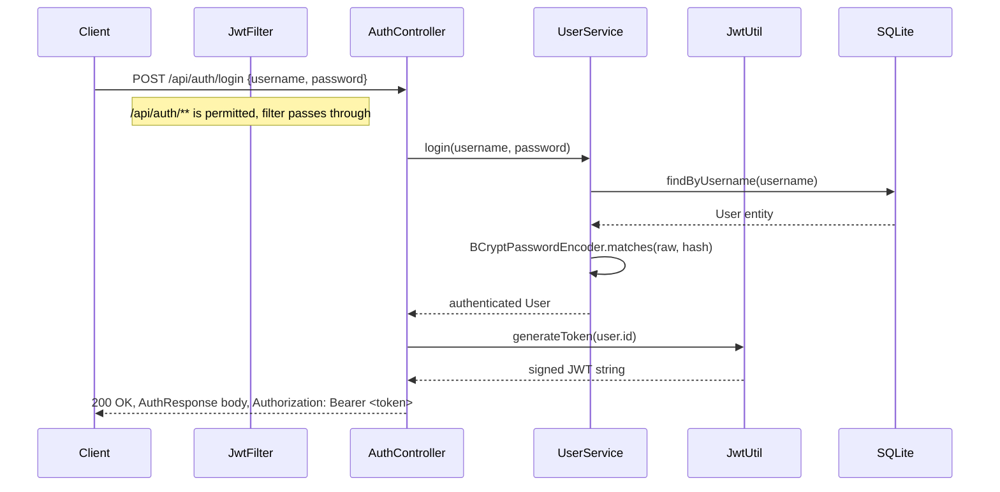
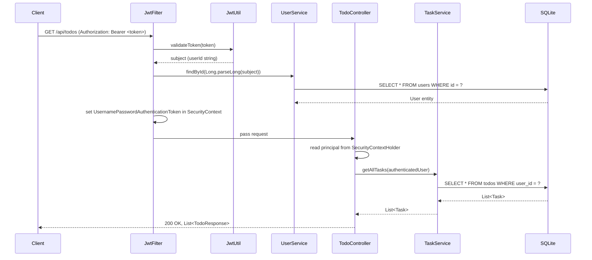

# Design Document: Todo Management Backend

## Overview

The Todo Management Backend is a Spring Boot 4.1.0 REST API backed by a SQLite file database.
A partial implementation already exists. Four gaps must be closed: mocked authentication must be
replaced with real JWT-based Spring Security; plaintext password handling must be replaced with
BCrypt hashing and verification; input validation is absent from all DTOs; and one subtask
endpoint (GET list) is missing.

The design is organized around the existing three-layer convention
(Controller -> Service -> Repository) and adds a new `security/` package containing a filter
chain, a JWT utility, and a global exception handler. All new code targets Java 21 and follows
the Lombok and Spring Data JPA patterns already established in the project.

---

## Architecture

### Component and Layer Diagram

```mermaid
graph TD
    subgraph HTTP Layer
        Client
    end

    subgraph Spring Security Filter Chain
        SC[SecurityConfig]
        JF[JwtFilter\nOncePerRequestFilter]
    end

    subgraph Controller Layer
        AC[AuthController\n/api/auth/**]
        TC[TodoController\n/api/todos/**]
        GEH[GlobalExceptionHandler\n@RestControllerAdvice]
    end

    subgraph Service Layer
        US[UserService]
        TS[TaskService]
        SS[SubtaskService]
    end

    subgraph Security Utilities
        JU[JwtUtil]
        BP[BCryptPasswordEncoder\n@Bean in SecurityConfig]
    end

    subgraph Repository Layer
        UR[UserRepository]
        TR[TaskRepository]
        SR[SubtaskRepository]
    end

    subgraph Persistence
        DB[(SQLite todo.db)]
    end

    Client -->|HTTP request| SC
    SC --> JF
    JF -->|/api/auth/** passes through| AC
    JF -->|/api/todos/** requires Bearer| TC
    JF -->|invalid token| GEH
    AC --> US
    TC --> TS
    TC --> SS
    US --> JU
    US --> BP
    AC --> JU
    TS --> TR
    SS --> SR
    SS --> TS
    US --> UR
    TR --> DB
    SR --> DB
    UR --> DB
```

---

### Request Flow -- Login Sequence



---

### Request Flow -- Protected Todo Request



---

## Components and Interfaces

### Package Structure

All sources live under `spring-todo-backend/src/main/java/com/revature/todomanagement/`.

```
com.revature.todomanagement
|-- TodomanagementApplication.java          (unchanged)
|
|-- controller/
|   |-- AuthController.java                 (modified: @Valid on @RequestBody, JWT header emission)
|   +-- TodoController.java                 (modified: SecurityContext user resolution, GET subtask endpoint)
|
|-- service/
|   |-- UserService.java                    (modified: BCrypt hash on register, BCrypt verify on login)
|   |-- TaskService.java                    (modified: throw UnauthorizedAccessException instead of RuntimeException)
|   +-- SubtaskService.java                 (modified: add getSubtasksByTask(), throw UnauthorizedAccessException)
|
|-- security/                               (NEW package)
|   |-- JwtUtil.java                        (NEW: token generation and validation)
|   |-- JwtFilter.java                      (NEW: OncePerRequestFilter, populates SecurityContext)
|   +-- SecurityConfig.java                 (NEW: filter chain, BCryptPasswordEncoder bean)
|
|-- entity/
|   |-- User.java                           (unchanged)
|   |-- Task.java                           (unchanged)
|   +-- Subtask.java                        (unchanged)
|
|-- dto/
|   |-- AuthResponse.java                   (unchanged)
|   |-- LoginRequest.java                   (modified: @NotBlank validation annotations)
|   |-- UserRegistrationRequest.java        (modified: @NotBlank, @Size, @Email annotations)
|   |-- TodoRequest.java                    (modified: @NotBlank, @Size annotations)
|   |-- TodoResponse.java                   (unchanged)
|   |-- SubtaskRequest.java                 (modified: @NotBlank, @Size annotations)
|   +-- SubtaskResponse.java                (modified: add accountId field)
|
|-- repository/
|   |-- UserRepository.java                 (unchanged)
|   |-- TaskRepository.java                 (unchanged)
|   +-- SubtaskRepository.java              (unchanged -- findByTask already exists)
|
+-- exception/
    |-- ResourceNotFoundException.java      (unchanged)
    |-- ResourceConflictException.java      (unchanged)
    |-- UnauthorizedAccessException.java    (NEW: maps to HTTP 403)
    +-- GlobalExceptionHandler.java         (NEW: @RestControllerAdvice)
```

---

### New Classes -- Detailed Design

#### `security/JwtUtil.java`

Responsible for generating, signing, and validating JWTs. JJWT 0.13.0 is already on the
classpath (`jjwt-api`, `jjwt-impl`, `jjwt-jackson`), so no new runtime dependency is needed.

The secret key is read once from `application.properties` at construction time via
`@Value("${jwt.secret}")`. The value must be a Base64url-encoded string of at least 256 bits
to satisfy HMAC-SHA256 requirements.

```java
package com.revature.todomanagement.security;

import io.jsonwebtoken.Claims;
import io.jsonwebtoken.JwtException;
import io.jsonwebtoken.Jwts;
import io.jsonwebtoken.security.Keys;
import org.springframework.beans.factory.annotation.Value;
import org.springframework.stereotype.Component;

import javax.crypto.SecretKey;
import java.util.Base64;
import java.util.Date;

@Component
public class JwtUtil {

    private final SecretKey secretKey;
    private static final long EXPIRY_SECONDS = 3600L;

    // Decodes the Base64url secret from properties and builds the signing key once.
    public JwtUtil(@Value("${jwt.secret}") String base64Secret) {
        byte[] keyBytes = Base64.getUrlDecoder().decode(base64Secret);
        this.secretKey = Keys.hmacShaKeyFor(keyBytes);
    }

    // Generates a signed JWT; sub is set to the userId as a decimal string.
    public String generateToken(Long userId) {
        long nowMillis = System.currentTimeMillis();
        return Jwts.builder()
                .subject(String.valueOf(userId))
                .issuedAt(new Date(nowMillis))
                .expiration(new Date(nowMillis + EXPIRY_SECONDS * 1000))
                .signWith(secretKey)
                .compact();
    }

    // Extracts the sub claim; throws JwtException on any validation failure.
    public String extractSubject(String token) {
        return parseClaims(token).getSubject();
    }

    // Returns true only when the token is structurally valid, correctly signed, and not expired.
    public boolean isTokenValid(String token) {
        try {
            parseClaims(token);
            return true;
        } catch (JwtException | IllegalArgumentException e) {
            return false;
        }
    }

    private Claims parseClaims(String token) {
        return Jwts.parser()
                .verifyWith(secretKey)
                .build()
                .parseSignedClaims(token)
                .getPayload();
    }
}
```

---

#### `security/JwtFilter.java`

Extends `OncePerRequestFilter`. Executes on every request; for `/api/auth/**` the filter still
runs but delegates immediately because those paths are permitted in the filter chain. For all
other paths, a missing or invalid token causes an `HTTP 401` to be written directly to the
response before the filter chain continues.

`UsernamePasswordAuthenticationToken` is stored with a `User` principal (not a Spring
`UserDetails` string), so `TodoController` can cast the principal directly to `User`.

```java
package com.revature.todomanagement.security;

import com.revature.todomanagement.entity.User;
import com.revature.todomanagement.service.UserService;
import jakarta.servlet.FilterChain;
import jakarta.servlet.ServletException;
import jakarta.servlet.http.HttpServletRequest;
import jakarta.servlet.http.HttpServletResponse;
import lombok.RequiredArgsConstructor;
import org.springframework.security.authentication.UsernamePasswordAuthenticationToken;
import org.springframework.security.core.context.SecurityContextHolder;
import org.springframework.stereotype.Component;
import org.springframework.web.filter.OncePerRequestFilter;

import java.io.IOException;
import java.util.Collections;

@Component
@RequiredArgsConstructor
public class JwtFilter extends OncePerRequestFilter {

    private final JwtUtil jwtUtil;
    private final UserService userService;

    @Override
    protected void doFilterInternal(HttpServletRequest request,
                                    HttpServletResponse response,
                                    FilterChain filterChain)
            throws ServletException, IOException {

        String authHeader = request.getHeader("Authorization");

        // Extract raw token; null or non-Bearer headers are treated as absent.
        String token = null;
        if (authHeader != null && authHeader.startsWith("Bearer ")) {
            token = authHeader.substring(7);
        }

        if (token != null && jwtUtil.isTokenValid(token)) {
            try {
                String subject = jwtUtil.extractSubject(token);
                Long userId = Long.parseLong(subject);
                User user = userService.findById(userId);  // throws ResourceNotFoundException if missing

                UsernamePasswordAuthenticationToken authentication =
                        new UsernamePasswordAuthenticationToken(user, null, Collections.emptyList());
                SecurityContextHolder.getContext().setAuthentication(authentication);
            } catch (Exception e) {
                // Subject does not map to a known user; treat as 401.
                sendUnauthorized(response);
                return;
            }
        }

        filterChain.doFilter(request, response);
    }

    private void sendUnauthorized(HttpServletResponse response) throws IOException {
        response.setStatus(HttpServletResponse.SC_UNAUTHORIZED);
        response.setContentType("application/json");
        response.getWriter().write("{\"status\":401}");
    }
}
```

---

#### `security/SecurityConfig.java`

Declares the Spring Security filter chain and exposes `BCryptPasswordEncoder` as a bean.
CSRF is disabled because the API is stateless. Session creation is set to `STATELESS`.
`JwtFilter` is registered before `UsernamePasswordAuthenticationFilter`.

`BCryptPasswordEncoder` is constructed with strength 10 as required by Requirement 1.5.

```java
package com.revature.todomanagement.security;

import lombok.RequiredArgsConstructor;
import org.springframework.context.annotation.Bean;
import org.springframework.context.annotation.Configuration;
import org.springframework.security.config.annotation.web.builders.HttpSecurity;
import org.springframework.security.config.annotation.web.configuration.EnableWebSecurity;
import org.springframework.security.config.http.SessionCreationPolicy;
import org.springframework.security.crypto.bcrypt.BCryptPasswordEncoder;
import org.springframework.security.web.SecurityFilterChain;
import org.springframework.security.web.authentication.UsernamePasswordAuthenticationFilter;

@Configuration
@EnableWebSecurity
@RequiredArgsConstructor
public class SecurityConfig {

    private final JwtFilter jwtFilter;

    @Bean
    public SecurityFilterChain filterChain(HttpSecurity http) throws Exception {
        http
            .csrf(csrf -> csrf.disable())
            .sessionManagement(sm -> sm.sessionCreationPolicy(SessionCreationPolicy.STATELESS))
            .authorizeHttpRequests(auth -> auth
                .requestMatchers("/api/auth/**").permitAll()
                .anyRequest().authenticated()
            )
            .addFilterBefore(jwtFilter, UsernamePasswordAuthenticationFilter.class);
        return http.build();
    }

    // Strength 10 satisfies BCrypt requirement in Requirement 1.5.
    @Bean
    public BCryptPasswordEncoder passwordEncoder() {
        return new BCryptPasswordEncoder(10);
    }
}
```

---

#### `exception/UnauthorizedAccessException.java`

Replaces the bare `RuntimeException` currently thrown for ownership violations in `TaskService`
and `SubtaskService`. The `@ResponseStatus` annotation is retained for symmetry with the other
exception classes, but `GlobalExceptionHandler` takes precedence for the actual response body
shape.

```java
package com.revature.todomanagement.exception;

import org.springframework.http.HttpStatus;
import org.springframework.web.bind.annotation.ResponseStatus;

@ResponseStatus(HttpStatus.FORBIDDEN)
public class UnauthorizedAccessException extends RuntimeException {
    public UnauthorizedAccessException(String message) {
        super(message);
    }
}
```

---

#### `exception/GlobalExceptionHandler.java`

A `@RestControllerAdvice` that centralizes all error response shaping. Each handler returns a
`Map<String, Integer>` with a single `"status"` key so the body always reads `{"status": N}`.
The `MethodArgumentNotValidException` handler covers all `@Valid` failures regardless of how
many fields fail (single response per request, as required by Requirement 4.5).

```java
package com.revature.todomanagement.exception;

import org.springframework.http.HttpStatus;
import org.springframework.http.ResponseEntity;
import org.springframework.web.bind.MethodArgumentNotValidException;
import org.springframework.web.bind.annotation.ExceptionHandler;
import org.springframework.web.bind.annotation.RestControllerAdvice;

import java.util.Map;

@RestControllerAdvice
public class GlobalExceptionHandler {

    @ExceptionHandler(MethodArgumentNotValidException.class)
    public ResponseEntity<Map<String, Integer>> handleValidation(MethodArgumentNotValidException ex) {
        return ResponseEntity.badRequest().body(Map.of("status", 400));
    }

    @ExceptionHandler(ResourceNotFoundException.class)
    public ResponseEntity<Map<String, Integer>> handleNotFound(ResourceNotFoundException ex) {
        return ResponseEntity.status(HttpStatus.NOT_FOUND).body(Map.of("status", 404));
    }

    @ExceptionHandler(ResourceConflictException.class)
    public ResponseEntity<Map<String, Integer>> handleConflict(ResourceConflictException ex) {
        return ResponseEntity.status(HttpStatus.CONFLICT).body(Map.of("status", 409));
    }

    @ExceptionHandler(UnauthorizedAccessException.class)
    public ResponseEntity<Map<String, Integer>> handleForbidden(UnauthorizedAccessException ex) {
        return ResponseEntity.status(HttpStatus.FORBIDDEN).body(Map.of("status", 403));
    }

    @ExceptionHandler(Exception.class)
    public ResponseEntity<Map<String, Integer>> handleGeneric(Exception ex) {
        return ResponseEntity.status(HttpStatus.INTERNAL_SERVER_ERROR).body(Map.of("status", 500));
    }
}
```

---

### DTO Modifications

#### `UserRegistrationRequest.java`

Add jakarta validation annotations. No structural fields change.

```java
import jakarta.validation.constraints.Email;
import jakarta.validation.constraints.NotBlank;
import jakarta.validation.constraints.Size;

@Data
public class UserRegistrationRequest {
    @NotBlank
    @Size(min = 1, max = 50)
    private String username;

    @NotBlank
    @Email
    @Size(max = 254)
    private String email;

    @NotBlank
    @Size(min = 8, max = 128)
    private String password;
}
```

#### `LoginRequest.java`

```java
import jakarta.validation.constraints.NotBlank;

@Data
public class LoginRequest {
    @NotBlank
    private String username;

    @NotBlank
    private String password;
}
```

#### `TodoRequest.java`

```java
import jakarta.validation.constraints.NotBlank;
import jakarta.validation.constraints.Size;

@Data
public class TodoRequest {
    @NotBlank
    @Size(min = 1, max = 255)
    private String title;

    @Size(max = 1000)
    private String description;

    private boolean completed;
}
```

#### `SubtaskRequest.java`

```java
import jakarta.validation.constraints.NotBlank;
import jakarta.validation.constraints.Size;

@Data
public class SubtaskRequest {
    @NotBlank
    @Size(min = 1, max = 255)
    private String title;

    private boolean completed;
}
```

#### `SubtaskResponse.java` -- add `accountId`

The `accountId` field is populated from `subtask.getTask().getUser().getId()` in the mapping
helper inside `TodoController`.

```java
@Data
@Builder
public class SubtaskResponse {
    private Long id;
    private Long todoId;
    private Long accountId;   // added -- populated from parent todo's user_id
    private String title;
    private boolean completed;
}
```

---

### Service Modifications

#### `UserService.java`

`BCryptPasswordEncoder` is injected (it is declared as a `@Bean` in `SecurityConfig`). The two
TODO comments are replaced with real calls.

Key changes:
- Constructor injection of `BCryptPasswordEncoder passwordEncoder`.
- `register()`: replace `userRepository.save(user)` preamble with `user.setPassword(passwordEncoder.encode(user.getPassword()))` before save.
- `login()`: replace `user.getPassword().equals(password)` with `passwordEncoder.matches(password, user.getPassword())`, and throw an appropriate exception on mismatch.

Precise method bodies after modification:

```java
@Transactional
public User register(User user) {
    if (userRepository.existsByUsername(user.getUsername())) {
        throw new ResourceConflictException("Username already exists");
    }
    if (userRepository.existsByEmail(user.getEmail())) {
        throw new ResourceConflictException("Email already exists");
    }
    // Hash plaintext password before persisting; raw value is never stored.
    user.setPassword(passwordEncoder.encode(user.getPassword()));
    return userRepository.save(user);
}

public User login(String username, String password) {
    User user = userRepository.findByUsername(username)
            .orElseThrow(() -> new ResourceNotFoundException("User not found"));
    // Verify submitted password against stored BCrypt hash.
    if (!passwordEncoder.matches(password, user.getPassword())) {
        throw new ResourceNotFoundException("Invalid credentials");
    }
    return user;
}
```

Note: `ResourceNotFoundException` is used for the invalid-credentials case so that the HTTP
response is `401 Unauthorized` via `GlobalExceptionHandler` (404 status code from the handler
would be incorrect; a dedicated `InvalidCredentialsException` mapping to 401 may be added
during task execution if needed -- the requirement specifies 401 for login failures).

> Implementation note: if a more precise mapping is desired, a new
> `InvalidCredentialsException` that `GlobalExceptionHandler` maps to `401` can be introduced.
> The design leaves this as a decision for the task phase.

---

#### `TaskService.java`

Replace `throw new RuntimeException("Unauthorized access to task")` in `getTaskById()` with:

```java
throw new UnauthorizedAccessException("Access denied to task " + id);
```

No other changes are required to this service.

---

#### `SubtaskService.java`

Two changes:

1. Replace `throw new RuntimeException("Subtask does not belong to the specified task")` in
   `updateSubtask()` and `deleteSubtask()` with `throw new UnauthorizedAccessException(...)`.

2. Add a `getSubtasksByTask()` method used by the new GET endpoint:

```java
public List<Subtask> getSubtasksByTask(Long taskId, User user) {
    // Ownership check delegated to TaskService; throws UnauthorizedAccessException if denied.
    Task task = taskService.getTaskById(taskId, user);
    return subtaskRepository.findByTask(task);
}
```

`SubtaskRepository.findByTask(Task task)` already exists, so no repository change is needed.

---

### Controller Modifications

#### `AuthController.java`

Two changes:

1. Add `@Valid` to both `@RequestBody` parameters so `MethodArgumentNotValidException` is raised
   before any service call on invalid input.
2. On the `login()` handler, inject `JwtUtil` and emit the token in the `Authorization` header.

```java
@Autowired  // or constructor injection via @RequiredArgsConstructor field
private JwtUtil jwtUtil;

@PostMapping("/register")
public ResponseEntity<AuthResponse> register(@Valid @RequestBody UserRegistrationRequest request) {
    // ... existing body unchanged ...
}

@PostMapping("/login")
public ResponseEntity<AuthResponse> login(@Valid @RequestBody LoginRequest request) {
    User user = userService.login(request.getUsername(), request.getPassword());
    String token = jwtUtil.generateToken(user.getId());

    return ResponseEntity.ok()
            .header("Authorization", "Bearer " + token)
            .body(AuthResponse.builder()
                    .accountId(user.getId())
                    .username(user.getUsername())
                    .build());
}
```

---

#### `TodoController.java`

Three changes:

1. Replace the `getAuthenticatedUser()` helper with a SecurityContext-based resolution.
2. Add `@Valid` to all `@RequestBody` parameters.
3. Add the missing `GET /api/todos/{id}/subtask` endpoint.

SecurityContext helper replacement:

```java
// Remove the old helper entirely; extract principal inline or via a private method.
private User getAuthenticatedUser() {
    // Reads the User principal stored by JwtFilter; cast is safe because JwtFilter
    // always stores a User entity (not a UserDetails wrapper).
    return (User) SecurityContextHolder.getContext().getAuthentication().getPrincipal();
}
```

New GET subtask endpoint (placed alongside the existing `@PostMapping("/{id}/subtask")`):

```java
@GetMapping("/{id}/subtask")
public ResponseEntity<List<SubtaskResponse>> getSubtasksByTodo(@PathVariable Long id) {
    User user = getAuthenticatedUser();
    List<SubtaskResponse> responses = subtaskService.getSubtasksByTask(id, user).stream()
            .map(this::mapToSubtaskResponse)
            .collect(Collectors.toList());
    return ResponseEntity.ok(responses);
}
```

Updated `mapToSubtaskResponse()` helper (adds `accountId`):

```java
private SubtaskResponse mapToSubtaskResponse(Subtask subtask) {
    return SubtaskResponse.builder()
            .id(subtask.getId())
            .todoId(subtask.getTask().getId())
            .accountId(subtask.getTask().getUser().getId())  // new field
            .title(subtask.getTitle())
            .completed(subtask.isCompleted())
            .build();
}
```

Note: `subtask.getTask().getUser()` requires the `task` and `task.user` associations to be
loaded. Because `Task` uses `FetchType.LAZY` for `user`, the mapping call must occur within the
transaction of the service method or with an explicit fetch. The safe pattern is to ensure
`getSubtasksByTask()` and all other service methods are annotated `@Transactional` so that the
session is open when the controller calls the mapping helper. This is already true for write
methods; `getSubtasksByTask()` must be marked `@Transactional(readOnly = true)`.

---

### Build Configuration -- `build.gradle.kts`

A single dependency block addition is required. Spring Security must be declared explicitly
because the starter is not yet on the classpath.

```kotlin
// Add to the dependencies { } block:
implementation("org.springframework.boot:spring-boot-starter-security")
testImplementation("org.springframework.security:spring-security-test")
```

No version pins are needed because both coordinates are managed by the Spring Boot BOM
(already present via `io.spring.dependency-management`).

The existing `testImplementation("org.springframework.boot:spring-boot-starter-data-jpa-test")`
and `testImplementation("org.springframework.boot:spring-boot-starter-webmvc-test")` entries
are non-standard; the conventional equivalents are `spring-boot-starter-test` (already present)
combined with `@DataJpaTest` and `@WebMvcTest` slice annotations. These entries should not be
removed during this feature to avoid unrelated breakage, but they may be cleaned up in a
follow-on task.

---

### `application.properties` Changes

The following properties are added or changed. Existing properties that are not listed here
remain unchanged.

```properties
# Change from create-drop to update; data is retained across restarts (Requirement 7.4).
spring.jpa.hibernate.ddl-auto=update

# Enable SQLite foreign-key enforcement on every new connection (Requirement 7.6).
# The Hibernate SQLiteDialect does not send this pragma automatically, so it must be
# delivered through the connection initialization script.
spring.datasource.hikari.connection-init-sql=PRAGMA foreign_keys = ON

# Secret key for HMAC-SHA256 JWT signing (at least 32 bytes / 256 bits, Base64url-encoded).
# This placeholder MUST be replaced with a real generated key before deployment.
jwt.secret=REPLACE_WITH_BASE64URL_ENCODED_SECRET_OF_AT_LEAST_32_BYTES

# Optional: suppress Spring Security's default login page banner in logs.
spring.security.user.password=unused
```

A `spring.datasource.hikari.connection-init-sql` value is the correct approach for HikariCP,
which is the default connection pool in Spring Boot. If HikariCP is not being used, the
equivalent is a `SQLiteDataSourceInitializer` or a `HibernatePropertiesCustomizer` that adds
`"hibernate.connection.provider_disables_autocommit"` and executes the pragma. The HikariCP
property is preferred because it requires no new code.

---

### Dependencies Summary

New items required before any implementation begins:

| Coordinate | Scope | Reason |
|---|---|---|
| `org.springframework.boot:spring-boot-starter-security` | `implementation` | Spring Security filter chain and config |
| `org.springframework.security:spring-security-test` | `testImplementation` | MockMvc security support in slice tests |
| `net.jqwik:jqwik` | `testImplementation` | Property-based testing harness |

All three are available on Maven Central. The Spring Boot BOM manages the first two; `jqwik`
requires an explicit version pin (current stable: `1.9.1`).

```kotlin
// additions to build.gradle.kts dependencies { }
implementation("org.springframework.boot:spring-boot-starter-security")
testImplementation("org.springframework.security:spring-security-test")
testImplementation("net.jqwik:jqwik:1.9.1")
```

---

## Data Models

### Entity Relationship Overview

Three tables are defined: `users`, `todos`, and `subtasks`. A `users` row may own zero or more
`todos` rows; deletion of a `users` row cascades to its `todos` rows. A `todos` row may own
zero or more `subtasks` rows; deletion of a `todos` row cascades to its `subtasks` rows. Foreign
keys are enforced at the SQLite engine level via `PRAGMA foreign_keys = ON`, which must be sent
on every new connection.

### `users` Table

| Column | Type | Constraints |
|---|---|---|
| `id` | INTEGER | PRIMARY KEY AUTOINCREMENT |
| `username` | TEXT | NOT NULL UNIQUE |
| `email` | TEXT | NOT NULL UNIQUE |
| `password_hash` | TEXT | NOT NULL |
| `created_at` | TEXT | NOT NULL |
| `updated_at` | TEXT | NOT NULL |

Timestamps are stored as ISO-8601 strings in UTC format (e.g., `2024-01-15T10:30:00Z`).
The `password_hash` column stores only the BCrypt output; the plaintext password is never
persisted.

### `todos` Table

| Column | Type | Constraints |
|---|---|---|
| `id` | INTEGER | PRIMARY KEY AUTOINCREMENT |
| `user_id` | INTEGER | NOT NULL, REFERENCES users(id) ON DELETE CASCADE |
| `title` | TEXT | NOT NULL |
| `description` | TEXT | |
| `completed` | INTEGER | NOT NULL DEFAULT 0 |
| `created_at` | TEXT | NOT NULL |
| `updated_at` | TEXT | NOT NULL |

`completed` is stored as an integer (0 = false, 1 = true) following SQLite convention.
`description` is nullable; an absent description is distinct from an empty string.

### `subtasks` Table

| Column | Type | Constraints |
|---|---|---|
| `id` | INTEGER | PRIMARY KEY AUTOINCREMENT |
| `todo_id` | INTEGER | NOT NULL, REFERENCES todos(id) ON DELETE CASCADE |
| `title` | TEXT | NOT NULL |
| `completed` | INTEGER | NOT NULL DEFAULT 0 |
| `created_at` | TEXT | NOT NULL |
| `updated_at` | TEXT | NOT NULL |

`subtasks` rows have no direct reference to `users`; the owning user is resolved by joining
through the parent `todos` row. The `SubtaskResponse` DTO exposes `accountId` by traversing
`subtask -> task -> user.id` within the transaction boundary.

---

## Correctness Properties

*A property is a characteristic or behavior that should hold true across all valid executions of a system -- essentially, a formal statement about what the system should do. Properties serve as the bridge between human-readable specifications and machine-verifiable correctness guarantees.*

The following properties are suitable for property-based testing using `jqwik` (Java, available
on Maven Central). Each property is stated as a universally quantified invariant, followed by
the generators and oracle required to test it.

---

### Property 1: JWT Authenticity

For all valid `userId` values u in Long, a token `t = jwtUtil.generateToken(u)` SHALL satisfy
`jwtUtil.isTokenValid(t) == true` and `jwtUtil.extractSubject(t).equals(String.valueOf(u))`.

For all strings `t'` constructed by altering any single character of `t`, OR by replacing the
third Base64url segment (signature) with any other string, `jwtUtil.isTokenValid(t') == false`.

**Generator:** `Arbitraries.longs().filter(id -> id > 0)` for u; string mutation via character
replacement at a random position for the tampered variant.

**Oracle:** `isTokenValid` returns true only for the unmodified token; false for all
single-character mutations of the signature segment.

**Validates: Requirements 2.4, 2.5**

---

### Property 2: Ownership Isolation

For all pairs of distinct users (A, B) and all task IDs t belonging to A, a call to
`taskService.getTaskById(t, B)` SHALL throw `UnauthorizedAccessException`.

**Generator:** Two `User` instances with distinct IDs; one `Task` entity with `user` set to A.
All generated in-memory without database I/O.

**Oracle:** `assertThatThrownBy(() -> taskService.getTaskById(t.getId(), B))
    .isInstanceOf(UnauthorizedAccessException.class)`.

**Validates: Requirements 5.6, 5.9, 5.13**

---

### Property 3: Cascade Integrity

For all tasks T with N >= 0 subtasks, deleting T via `taskService.deleteTask(T.id, owner)`
SHALL reduce `subtaskRepository.findByTask(T).size()` from N to 0 and SHALL reduce
`taskRepository.findById(T.id)` to `Optional.empty()`.

**Generator:** `@ForAll @IntRange(min=0, max=20) int n` for subtask count; task and subtasks
persisted to H2 in-memory database in `@DataJpaTest` slice.

**Oracle:** After delete, both assertions above hold for every generated n.

**Validates: Requirements 5.12**

---

### Property 4: Registration Idempotency

For all valid usernames u, exactly one registration with username u SHALL succeed with HTTP
200; every subsequent registration attempt carrying the same u SHALL return HTTP 409 regardless
of the email or password values supplied.

**Generator:** `Arbitraries.strings().alpha().ofMinLength(1).ofMaxLength(50)` for u; random
valid emails and passwords for the second attempt.

**Oracle:** First call returns `ResponseEntity` with status 200; all subsequent calls return
status 409. Tested via `MockMvc` in `@WebMvcTest(AuthController.class)` with a mocked
`UserService` that throws `ResourceConflictException` on the second call.

**Validates: Requirements 1.2, 1.7**

---

### Property 5: BCrypt Hash Verifiability

For all plaintext passwords p where p has length in [8, 128], the value
`encoder.encode(p)` SHALL satisfy `encoder.matches(p, encoder.encode(p)) == true`
and `!encoder.encode(p).equals(p)` (hash is never equal to plaintext).

Additionally, for all pairs (p1, p2) where p1 != p2,
`encoder.matches(p1, encoder.encode(p2)) == false`.

**Generator:** `Arbitraries.strings().withCharRange(' ', '~').ofMinLength(8).ofMaxLength(128)`
for passwords. Two independent passwords for the cross-match case.

**Oracle:** Direct assertion on `BCryptPasswordEncoder` bean without database involvement.

**Validates: Requirements 1.5, 2.7**

---

## Error Handling

The table below maps every exception type to its HTTP status and response body shape as
enforced by `GlobalExceptionHandler`.

| Exception | HTTP Status | Response Body |
|---|---|---|
| `MethodArgumentNotValidException` | 400 | `{"status": 400}` |
| `ResourceNotFoundException` | 404 | `{"status": 404}` |
| `ResourceConflictException` | 409 | `{"status": 409}` |
| `UnauthorizedAccessException` | 403 | `{"status": 403}` |
| `Exception` (catch-all) | 500 | `{"status": 500}` |

Authentication failures (missing, invalid, or expired JWT) are handled directly in `JwtFilter`
by writing `{"status": 401}` to the response before the filter chain proceeds, because
Spring Security's default 401 response does not match the required JSON body shape.

---

## Testing Strategy

### Test Infrastructure

- **In-memory database:** H2 is already on the classpath (`com.h2database:h2:2.4.240`). All
  slice tests (`@DataJpaTest`, `@WebMvcTest`) use H2 via a `test/resources/application.properties`
  override that sets `spring.datasource.url=jdbc:h2:mem:testdb` and
  `spring.jpa.database-platform=org.hibernate.dialect.H2Dialect`.
- **PBT library:** `net.jqwik:jqwik` will be added to `testImplementation` in `build.gradle.kts`.
  jqwik integrates with JUnit 5 Platform and requires no additional runner configuration.
- **Security test support:** `spring-security-test` provides `@WithMockUser` and
  `SecurityMockMvcRequestPostProcessors` for `@WebMvcTest` slices.

---

### Unit Tests -- Per Service

Each service class gets a corresponding `*ServiceTest` in `src/test/java/.../service/`.
Mockito is used to stub repositories. No Spring context is loaded.

**UserServiceTest**
- `register_hashesPassword`: given a plaintext password, verify stored hash differs from plaintext
  and `matches()` returns true.
- `register_throwsConflict_onDuplicateUsername`: stub `existsByUsername` to return true; assert
  `ResourceConflictException`.
- `login_throwsNotFound_onUnknownUsername`: stub `findByUsername` to return empty; assert
  exception.
- `login_throwsOnWrongPassword`: stub user with a known hash; supply wrong raw password; assert
  exception.

**TaskServiceTest**
- `getTaskById_throwsUnauthorized_whenOwnerMismatch`: construct two User stubs with different
  IDs; assert `UnauthorizedAccessException`.
- `deleteTask_delegatesToRepository`: verify `taskRepository.delete()` is called once.

**SubtaskServiceTest**
- `getSubtasksByTask_returnsListForOwner`: stub `findByTask`; assert returned list matches stub.
- `updateSubtask_throwsUnauthorized_whenOwnerMismatch`: verify `UnauthorizedAccessException`.
- `deleteSubtask_throwsUnauthorized_whenOwnerMismatch`: verify `UnauthorizedAccessException`.

---

### Integration / Slice Tests -- Per Controller

Each controller gets a `*ControllerTest` using `@WebMvcTest`. Spring Security autoconfiguration
is included so that `SecurityConfig` and `JwtFilter` participate.

**AuthControllerTest**
- `register_returns200_onValidRequest`: `MockMvc` POST with valid body; assert 200 and
  `AuthResponse` fields.
- `register_returns400_onBlankUsername`: body with blank username; assert 400 and
  `{"status":400}`.
- `register_returns409_onDuplicateUsername`: service stub throws `ResourceConflictException`;
  assert 409.
- `login_returns200_andBearerHeader`: service stub returns user, JwtUtil stub returns token;
  assert 200 and `Authorization` header starts with `"Bearer "`.
- `login_returns400_onBlankPassword`: assert 400.

**TodoControllerTest**
- `getAllTodos_returns401_withoutToken`: no `Authorization` header; assert 401.
- `getAllTodos_returns200_withValidToken`: inject valid principal via `@WithMockUser` or
  `SecurityMockMvcRequestPostProcessors.user()`; assert 200.
- `createTodo_returns400_onBlankTitle`: valid token, blank title; assert 400.
- `getTodoById_returns403_onOwnerMismatch`: service stub throws `UnauthorizedAccessException`;
  assert 403 and `{"status":403}`.
- `getTodoById_returns404_onMissingTask`: service stub throws `ResourceNotFoundException`;
  assert 404.
- `getSubtasksByTodo_returns200_withList`: new endpoint test; stub returns two subtasks; assert
  200 and response array length 2.

---

### PBT Harness

A dedicated `PbtTests` class (or one per property) is annotated `@ExtendWith(JqwikExtension.class)`.
Each property method is annotated `@Property`.

The five properties from the Correctness Properties section are encoded as `@Property` methods.
Generators use `@ForAll` parameters with `@Provide`-annotated arbitraries or inline
`Arbitraries.*` combinators. Each property runs at least 100 tries by default
(`tries = 100` in `@Property`).

Properties 3 (cascade integrity) and 4 (registration idempotency) require a Spring context;
they are placed in a `@SpringBootTest` test class with H2, accepting the longer execution time
in exchange for full stack coverage. Properties 1, 2, and 5 are pure unit tests with no Spring
context.

Each property test must carry a comment in the format:
`// Feature: todo-management-backend, Property N: <property_text>`
