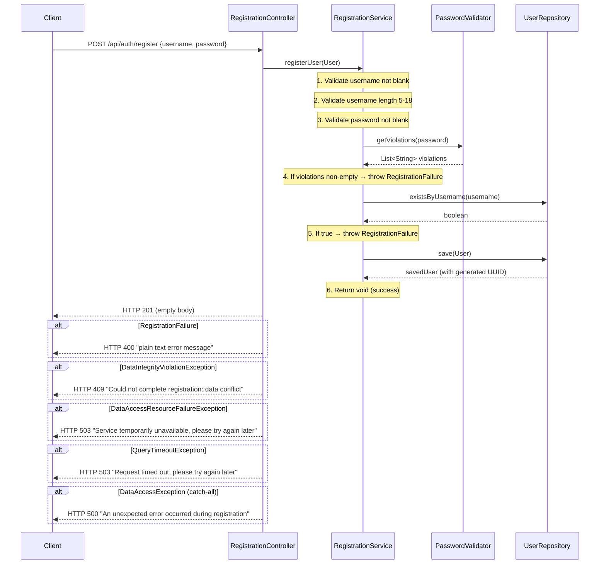

# Design Document: User Registration

## Overview

This document describes the technical design for the `POST /api/auth/register` endpoint. The
feature creates a new `User` account: it validates the submitted username and password,
persists the record to SQLite, and returns HTTP 201 with an empty body.

The design is scoped to **registration only**. Login, JWT issuance, and Spring Security filter
chains are handled by the authentication feature.

### Relationship to Existing Code

| File | Status | Notes |
|---|---|---|
| `entity/User.java` | **Exists — do not modify** | Fields: `UUID id`, `String username`, `String password` |
| `repository/UserRepository.java` | **Exists — do not modify** | Already declares `existsByUsername` and `findByUsername` |
| `service/UserService.java` | **Exists — do not modify** | Handles both register and login; kept for backward compatibility. New code uses `RegistrationService`. |
| `controller/TodoController.java` | **Exists — empty stub** | Not involved in this feature |
| `security/JwtUtil.java` | **Exists — do not modify** | Not involved in this feature |
| `service/RegistrationService.java` | **Create** | Registration-only service |
| `controller/RegistrationController.java` | **Create** | REST controller for `/api/auth/register` with local exception handlers |
| `exception/RegistrationFailure.java` | **Create** | Custom runtime exception for all registration validation failures |
| `security/PasswordValidator.java` | **Create** | Password strength checker |

---

## Architecture

The request travels through three Spring layers. There is no caching layer — every registration
hits the database exactly once (the duplicate check) and then again for the save. Exception
handling is local to the controller — no `@ControllerAdvice` or `GlobalExceptionHandler` is used.



---

## Components and Interfaces

### `security/PasswordValidator.java`

A `@Component` with a single public method. It evaluates each rule independently and collects all
violations into a list so the client receives all failure reasons in one response.

```java
package com.revature.todomanagement.security;

// @Component
// public List<String> getViolations(String password)
```

Rules checked in order (each adds its message to the list independently):

| Rule | Violation message |
|---|---|
| Length ≥ 8 | `"Password must be at least 8 characters long."` |
| Length ≤ 72 | `"Password must be no more than 72 characters long."` |
| At least one `A–Z` | `"Password must contain at least one uppercase letter."` |
| At least one `a–z` | `"Password must contain at least one lowercase letter."` |
| At least one `0–9` | `"Password must contain at least one digit."` |
| At least one `!@#$%^&*` | `"Password must contain at least one special character (!@#$%^&*)."` |
| No whitespace | `"Password must not contain whitespace."` |

The method never throws; it always returns a (possibly empty) `List<String>`. A blank/null
password is handled upstream in `RegistrationService` before `PasswordValidator` is ever called.

Combined regex (used as a secondary consistency check or documentation):

```
^(?=.*[A-Z])(?=.*[a-z])(?=.*\d)(?=.*[!@#$%^&*])\S{8,72}$
```

---

### `service/RegistrationService.java`

Contains all business logic for user registration. Dependencies are injected via constructor
(Lombok `@RequiredArgsConstructor`).

```java
package com.revature.todomanagement.service;

// @Service @RequiredArgsConstructor
// Dependencies: UserRepository, PasswordValidator
// public void registerUser(User user)
```

Validation order (throws immediately on first failure, except password-strength which collects
all violations first):

1. `username` blank → `RegistrationFailure("Username must not be blank.")`
2. `username` length < 5 or > 18 → `RegistrationFailure("Username must be between 5 and 18 characters.")`
3. `password` blank → `RegistrationFailure("Password must not be blank.")`
4. `passwordValidator.getViolations(password)` non-empty → `RegistrationFailure` whose message is all violations joined by `"\n"`
5. `userRepository.existsByUsername(username)` → `RegistrationFailure("Username '<username>' is already taken.")`
6. `userRepository.save(user)` → persisted
7. Return (void — no return value)

`UserRepository` is **never accessed** before steps 1–4 pass.

---

### `controller/RegistrationController.java`

A thin HTTP adapter with local exception handlers. Contains no business logic. Uses `@Slf4j`
for logging data access exceptions.

```java
package com.revature.todomanagement.controller;

// @RestController @RequestMapping("/api/auth") @RequiredArgsConstructor @Slf4j
// POST /api/auth/register → ResponseEntity<Void>
// Accepts @RequestBody User user
// Returns ResponseEntity.status(HttpStatus.CREATED).build() on success (empty body)
```

Returns `ResponseEntity<Void>` with HTTP 201 and null body on success. All error cases are handled
by local `@ExceptionHandler` methods within this controller.

#### Local Exception Handlers

| Exception | HTTP Status | Response body (plain text) |
|---|---|---|
| `RegistrationFailure` | 400 | Exception message string |
| `DataIntegrityViolationException` | 409 | `"Could not complete registration: data conflict"` |
| `DataAccessResourceFailureException` | 503 | `"Service temporarily unavailable, please try again later"` |
| `QueryTimeoutException` | 503 | `"Request timed out, please try again later"` |
| `DataAccessException` (catch-all) | 500 | `"An unexpected error occurred during registration"` |

All error responses return `ResponseEntity<String>` with `Content-Type: text/plain`.
The `@Slf4j` logger logs data access exceptions at `warn` or `error` level before returning.

---

### `exception/RegistrationFailure.java`

```java
package com.revature.todomanagement.exception;

// public class RegistrationFailure extends RuntimeException
// Constructor: public RegistrationFailure(String message)
// Calls super(message)
```

A single custom exception used for ALL registration validation failures. The service throws
this for blank username, bad length, bad password, and duplicate username scenarios.

---

## Data Models

### `User` entity (existing — no changes)

```
users
├── id       UUID   PK, generated
├── username TEXT   NOT NULL, UNIQUE
└── password TEXT   NOT NULL
```

The `User` entity already maps to the `users` table via `@Table(name = "users")`. No schema
changes are required by this feature.

---

## Correctness Properties

*A property is a characteristic or behavior that should hold true across all valid executions of a system — essentially, a formal statement about what the system should do. Properties serve as the bridge between human-readable specifications and machine-verifiable correctness guarantees.*

The prework analysis identified the following testable properties among the acceptance criteria. Properties are sourced from criteria where input variation meaningfully changes behavior and where testing the logic directly (not external infrastructure) is cost-effective.

---

### Property 1: Blank username always rejected

*For any* string that is null, empty, or composed entirely of whitespace characters, calling
`RegistrationService.registerUser` with that value as the username SHALL throw
`RegistrationFailure` with message `"Username must not be blank."` and SHALL NOT invoke
any method on `UserRepository`.

**Validates: Requirements 2.1**

---

### Property 2: Out-of-range username always rejected

*For any* string whose length is strictly less than 5 or strictly greater than 18, calling
`RegistrationService.registerUser` with that value as the username (assuming it is non-blank) SHALL
throw `RegistrationFailure` with message
`"Username must be between 5 and 18 characters."` and SHALL NOT invoke any method on
`UserRepository`.

**Validates: Requirements 2.2**

---

### Property 3: Duplicate username always rejected without persistence

*For any* valid username (non-blank, length 5–18), when `UserRepository.existsByUsername`
returns `true` for that username, calling `RegistrationService.registerUser` SHALL throw
`RegistrationFailure` and SHALL NOT call `UserRepository.save`.

**Validates: Requirements 2.3**

---

### Property 4: Blank password always rejected before database access

*For any* string that is null, empty, or composed entirely of whitespace characters, calling
`RegistrationService.registerUser` with that value as the password (assuming a valid username) SHALL
throw `RegistrationFailure` with message `"Password must not be blank."` and SHALL NOT
invoke `UserRepository`.

**Validates: Requirements 3.1**

---

### Property 5: PasswordValidator returns a violation for each broken rule

*For any* password that violates exactly one of the seven strength rules, `PasswordValidator.getViolations`
SHALL return a list containing exactly the corresponding violation message and no other messages.
Conversely, *for any* password that satisfies all seven rules, `getViolations` SHALL return an
empty list.

**Validates: Requirements 3.2, 3.3**

---

## Error Handling

| Scenario | Thrown by | Caught by | HTTP |
|---|---|---|---|
| Blank username | `RegistrationService` | `RegistrationController @ExceptionHandler` | 400 |
| Username too short / too long | `RegistrationService` | `RegistrationController @ExceptionHandler` | 400 |
| Blank password | `RegistrationService` | `RegistrationController @ExceptionHandler` | 400 |
| Password violates strength rules | `RegistrationService` | `RegistrationController @ExceptionHandler` | 400 |
| Duplicate username | `RegistrationService` | `RegistrationController @ExceptionHandler` | 400 |
| `DataIntegrityViolationException` from save | `UserRepository` (propagated) | `RegistrationController @ExceptionHandler` | 409 |
| `DataAccessResourceFailureException` | `UserRepository` (propagated) | `RegistrationController @ExceptionHandler` | 503 |
| `QueryTimeoutException` | `UserRepository` (propagated) | `RegistrationController @ExceptionHandler` | 503 |
| `DataAccessException` (catch-all) from save | `UserRepository` (propagated) | `RegistrationController @ExceptionHandler` | 500 |

All exception handlers are local `@ExceptionHandler` methods inside `RegistrationController`.
There is no `@ControllerAdvice` or `GlobalExceptionHandler` class.

---

## Testing Strategy

### Test infrastructure

- **Unit tests**: JUnit 5 + Mockito (via `spring-boot-starter-test`). No Spring context loaded.
- **Repository slice tests**: `@DataJpaTest` with H2 in-memory database (replaces SQLite in test
  profile). Spring Boot auto-configures H2 when it is on the test classpath.
- **Web MVC slice tests**: `@WebMvcTest(RegistrationController.class)` with `MockMvc`. Spring
  Security auto-configuration is excluded or a test `SecurityConfig` permits all, so the tests
  focus on HTTP behavior rather than auth filters.
- **Property-based tests**: Implemented using the
  [jqwik](https://jqwik.net/) library (JUnit 5 native). Each property test runs a minimum of
  100 iterations with randomly generated inputs.

  Add to `build.gradle.kts`:
  ```kotlin
  testImplementation("net.jqwik:jqwik:1.9.3")
  ```

### Test classes to create

| Class | Type | Covers |
|---|---|---|
| `RegistrationServiceTest` | Unit | Requirements 2.1–2.4, 3.1, 3.4, 4.1–4.3, 6.1 |
| `PasswordValidatorTest` | Unit + Property | Requirements 3.2, 3.3 (Property 5) |
| `UserRepositoryTest` | `@DataJpaTest` | Requirements 4.4, 4.5 |
| `RegistrationControllerTest` | `@WebMvcTest` | Requirements 1.1–1.3, 5.1–5.7, 7.8–7.10 |

### Unit tests are preferred over property tests for service-layer behavior

Because `RegistrationService` delegates all complex logic to `PasswordValidator` and
`UserRepository` (which are individually property- and integration-tested), the service unit
tests use concrete examples with Mockito verification. Property tests live at the validator
level where input variation genuinely matters.

### Property test configuration

Each property test must be tagged with:

```java
// Feature: user-registration, Property N: <property title>
```

Minimum iterations: **100** (jqwik default is 1000, which is fine).

### `@DataJpaTest` H2 configuration

Add `src/test/resources/application-test.properties` (or rely on Spring Boot's auto-configuration):

```properties
spring.datasource.url=jdbc:h2:mem:testdb;DB_CLOSE_DELAY=-1
spring.datasource.driver-class-name=org.h2.Driver
spring.jpa.database-platform=org.hibernate.dialect.H2Dialect
spring.jpa.hibernate.ddl-auto=create-drop
```

Spring Boot's `@DataJpaTest` activates the `test` profile by default and will pick up H2 from
the classpath automatically, overriding the SQLite datasource.
