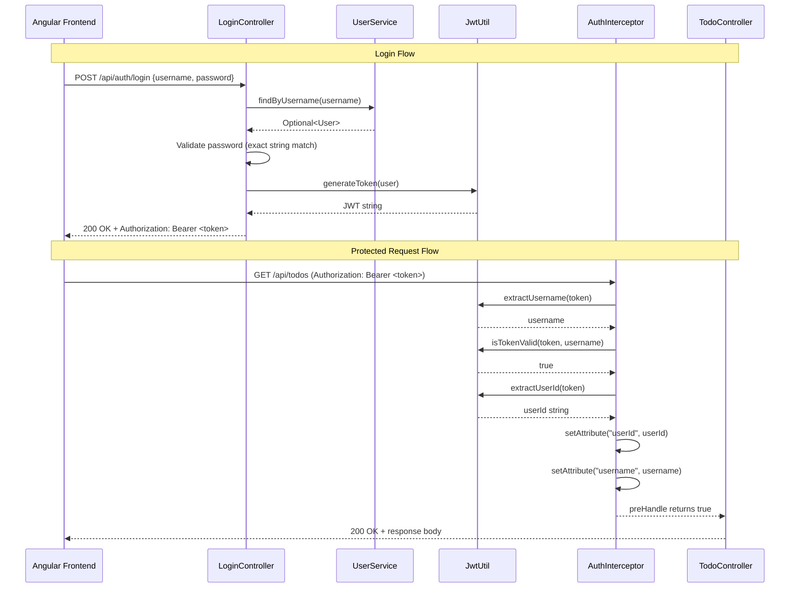
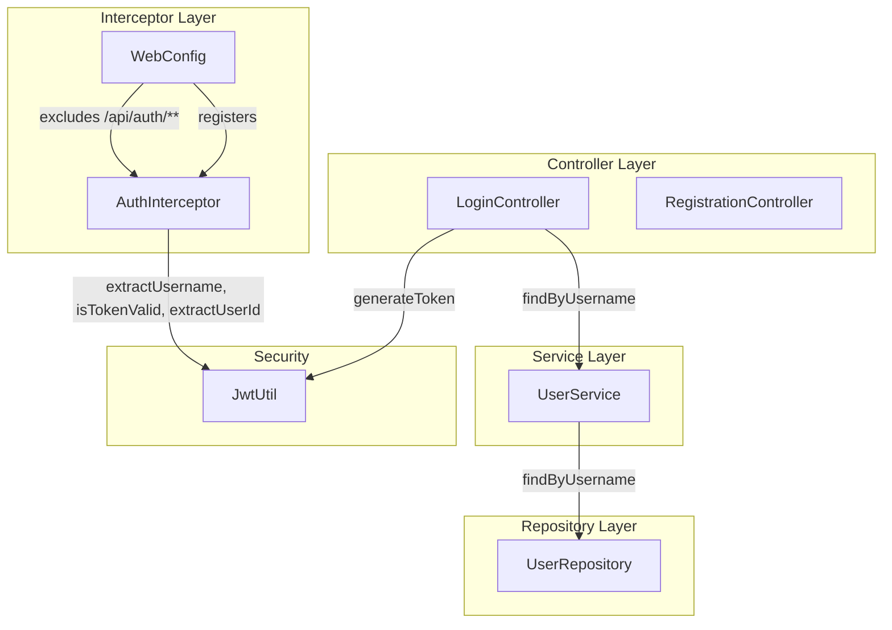

# Design Document: US02 Authentication

## Overview

This feature implements user authentication for the Todo Management Application, providing a login endpoint that validates credentials and issues JWTs, a `HandlerInterceptor` that guards protected routes, and a `WebConfig` that ties together interception and CORS configuration.

The design follows the existing project conventions: controllers handle HTTP mapping only, services contain business logic, and security utilities live in the `security` package. The authentication layer uses Spring's `HandlerInterceptor` mechanism (NOT Spring Security's filter chain) as specified by the project guide.

### Key Design Decisions

| Decision | Rationale |
|----------|-----------|
| `HandlerInterceptor` over Spring Security filter | Project guide mandates MVC-level interception; avoids pulling in `spring-boot-starter-security` |
| Plaintext password comparison | Matches US01 persistence behavior; hashing is a future iteration |
| Generic 401 message for both "user not found" and "wrong password" | Prevents username enumeration attacks |
| Token in `Authorization` response header | Standard Bearer token pattern; Angular interceptor reads it from response headers |
| Local `@ExceptionHandler` in controller | Follows `RegistrationController` convention; keeps error mapping co-located |

---

## Architecture



### Component Interaction



---

## Components and Interfaces

### LoginController

**Package:** `com.revature.todomanagement.controller`

**Responsibilities:**
- Accept `POST /api/auth/login` with a `@RequestBody User` payload
- Validate that username and password are not blank
- Delegate credential lookup to `UserService.findByUsername`
- Compare submitted password against stored password (exact string match)
- Delegate token generation to `JwtUtil.generateToken`
- Return the token in the `Authorization` response header
- Handle `InvalidCredentialsException` via local `@ExceptionHandler`

**Public Interface:**

```java
@RestController
@RequestMapping("/api/auth")
@RequiredArgsConstructor
public class LoginController {

    private final UserService userService;
    private final JwtUtil jwtUtil;

    @PostMapping("/login")
    public ResponseEntity<Void> login(@RequestBody User loginRequest);

    @ExceptionHandler(InvalidCredentialsException.class)
    public ResponseEntity<String> handleInvalidCredentials(InvalidCredentialsException ex);
}
```

**Behavior:**
1. Extract `username` and `password` from the request body
2. If either is blank (null, empty, or whitespace-only), return HTTP 400 with plain text message
3. Call `userService.findByUsername(username)`
4. If `Optional` is empty, throw `InvalidCredentialsException`
5. If password does not match (`.equals()`), throw `InvalidCredentialsException`
6. Call `jwtUtil.generateToken(user)` to get the signed token
7. Return HTTP 200 with header `Authorization: Bearer <token>`

---

### AuthInterceptor

**Package:** `com.revature.todomanagement.security`

**Responsibilities:**
- Intercept all requests to protected routes
- Bypass token validation for OPTIONS (CORS preflight) requests
- Extract and validate the Bearer token from the `Authorization` header
- Attach `userId` and `username` as request attributes for downstream use
- Reject unauthorized requests with HTTP 401 and plain text message

**Public Interface:**

```java
@Component
@RequiredArgsConstructor
public class AuthInterceptor implements HandlerInterceptor {

    private final JwtUtil jwtUtil;

    @Override
    public boolean preHandle(HttpServletRequest request,
                             HttpServletResponse response,
                             Object handler) throws Exception;
}
```

**`preHandle` Logic:**
1. If `request.getMethod()` equals `"OPTIONS"`, return `true` immediately
2. Read `Authorization` header from request
3. If header is null or does not start with `"Bearer "`, write 401 response with `"Missing or malformed Authorization header"` and return `false`
4. Strip `"Bearer "` prefix to get the raw token
5. Call `jwtUtil.extractUsername(token)` to get the subject
6. If username is null, write 401 response with `"Invalid or expired token"` and return `false`
7. Call `jwtUtil.isTokenValid(token, username)`
8. If invalid, write 401 response with `"Invalid or expired token"` and return `false`
9. Call `jwtUtil.extractUserId(token)` to get the userId claim
10. Set request attributes: `request.setAttribute("userId", userId)` and `request.setAttribute("username", username)`
11. Return `true`

---

### WebConfig

**Package:** `com.revature.todomanagement.security`

**Responsibilities:**
- Register `AuthInterceptor` on all paths with exclusions for public auth endpoints
- Configure global CORS mappings for the Angular frontend

**Public Interface:**

```java
@Configuration
@RequiredArgsConstructor
public class WebConfig implements WebMvcConfigurer {

    private final AuthInterceptor authInterceptor;

    @Value("${cors.allowed-origins}")
    private String allowedOrigins;

    @Override
    public void addInterceptors(InterceptorRegistry registry);

    @Override
    public void addCorsMappings(CorsRegistry registry);
}
```

**Interceptor Registration:**
- Path pattern: `/**`
- Excluded paths: `/api/auth/register`, `/api/auth/login`

**CORS Configuration:**
- Applies to: `/**`
- Allowed origins: value from `cors.allowed-origins` property
- Allowed methods: `GET`, `POST`, `PUT`, `PATCH`, `DELETE`, `OPTIONS`
- Allowed headers: `*`
- Allow credentials: `true`

---

### JwtUtil Enhancement

**Package:** `com.revature.todomanagement.security`

**New Method:**

```java
/**
 * Extracts the userId claim from a token.
 * Returns null on any parse failure - never throws.
 */
public String extractUserId(String token) {
    try {
        return Jwts.parser()
                .verifyWith(key)
                .build()
                .parseSignedClaims(token)
                .getPayload()
                .get("userId", String.class);
    } catch (JwtException | IllegalArgumentException e) {
        return null;
    }
}
```

This method follows the same null-on-failure pattern as the existing `extractUsername` method. The existing `generateToken`, `extractUsername`, and `isTokenValid` methods remain unchanged.

---

### InvalidCredentialsException

**Package:** `com.revature.todomanagement.exception`

```java
public class InvalidCredentialsException extends RuntimeException {

    public InvalidCredentialsException() {
        super("Invalid username or password");
    }
}
```

The message is intentionally generic and identical regardless of whether the username was not found or the password was wrong. This prevents username enumeration.

---

## Data Models

### Existing Entities (unchanged)

**User** (`entity/User.java`):

| Field | Type | Constraints |
|-------|------|-------------|
| `id` | `UUID` | PK, auto-generated |
| `username` | `String` | NOT NULL, UNIQUE |
| `password` | `String` | NOT NULL |

### Request/Response Payloads

**Login Request** (reuses `User` entity as `@RequestBody`):

```json
{
  "username": "string",
  "password": "string"
}
```

Note: The `id` field is ignored during deserialization of the login request body. Only `username` and `password` are read.

**Login Success Response:**
- Status: `200 OK`
- Headers: `Authorization: Bearer <jwt-token>`
- Body: empty

**Login Failure Responses:**
- Status: `400 Bad Request` — blank credentials or malformed body
  - Content-Type: `text/plain`
  - Body: validation error message
- Status: `401 Unauthorized` — invalid credentials
  - Content-Type: `text/plain`
  - Body: `"Invalid username or password"`

### JWT Token Claims

| Claim | Key | Value |
|-------|-----|-------|
| Subject | `sub` | username string |
| User ID | `userId` | UUID as string |
| Issued At | `iat` | epoch seconds |
| Expiration | `exp` | iat + 86,400,000ms (24 hours) |

### Application Properties (additions)

```properties
# JWT signing secret (override with JWT_SECRET env var in production)
jwt.secret=ThisIsADevelopmentSecretKeyThatIsAtLeast32Characters

# CORS allowed origins (override with CORS_ALLOWED_ORIGINS env var in production)
cors.allowed-origins=http://localhost:4200
```

---

## Correctness Properties

*A property is a characteristic or behavior that should hold true across all valid executions of a system — essentially, a formal statement about what the system should do. Properties serve as the bridge between human-readable specifications and machine-verifiable correctness guarantees.*

### Property 1: Login token round-trip

*For any* valid `User` object (non-blank username and non-blank password) that exists in the data store, performing a login and then decoding the returned JWT SHALL yield the same `username` as the subject claim and the same `id.toString()` as the `"userId"` claim.

**Validates: Requirements 1.1, 4.1**

### Property 2: Blank credential rejection without DB access

*For any* string that is null, empty, or composed entirely of whitespace characters, supplying it as the `username` or `password` in a login request SHALL result in rejection (HTTP 400) without `UserService.findByUsername` ever being invoked.

**Validates: Requirements 1.4, 7.10**

### Property 3: Interceptor attribute extraction preserves token claims

*For any* valid `User` object, generating a token via `JwtUtil.generateToken(user)` and passing it through `AuthInterceptor.preHandle` SHALL result in request attributes `"userId"` equal to `user.getId().toString()` and `"username"` equal to `user.getUsername()`.

**Validates: Requirements 2.2, 2.6**

### Property 4: extractUserId round-trip

*For any* `User` with a non-null UUID `id`, calling `JwtUtil.generateToken(user)` followed by `JwtUtil.extractUserId(token)` SHALL return a string equal to `user.getId().toString()`.

**Validates: Requirements 4.1**

---

## Error Handling

### Error Response Strategy

All authentication errors follow the `RegistrationController` pattern: local `@ExceptionHandler` methods in the controller class, `Content-Type: text/plain`, no JSON error bodies.

| Scenario | HTTP Status | Response Body | Handler |
|----------|-------------|---------------|---------|
| Blank username or password | 400 | Descriptive validation message | Inline check in controller method |
| Malformed/absent request body | 400 | Spring default or custom message | Spring framework (`HttpMessageNotReadableException`) |
| Username not found | 401 | `"Invalid username or password"` | `@ExceptionHandler(InvalidCredentialsException.class)` |
| Password mismatch | 401 | `"Invalid username or password"` | `@ExceptionHandler(InvalidCredentialsException.class)` |
| Missing/malformed auth header | 401 | `"Missing or malformed Authorization header"` | `AuthInterceptor.preHandle` |
| Invalid/expired token | 401 | `"Invalid or expired token"` | `AuthInterceptor.preHandle` |

### Security Considerations

- **Username enumeration prevention:** Both "user not found" and "wrong password" produce identical 401 responses with the same generic message.
- **Token validation:** `JwtUtil` methods return `null` on any parse failure rather than throwing exceptions, preventing stack trace leakage.
- **CORS preflight:** OPTIONS requests bypass token validation to allow browser preflight requests to complete.

---

## Testing Strategy

### Testing Framework

- **Unit tests:** JUnit 5 with Mockito for service/utility isolation
- **Web layer tests:** `@WebMvcTest` slice for controller HTTP behavior
- **Property-based tests:** jqwik 1.9.3 (`net.jqwik:jqwik`) — already in `build.gradle.kts`

### Dual Testing Approach

**Unit tests** cover specific examples, edge cases, and integration points:
- Login with valid credentials returns 200 + token (Req 7.1)
- Login with non-existent username throws `InvalidCredentialsException` (Req 7.2)
- Login with wrong password throws `InvalidCredentialsException` (Req 7.3)
- AuthInterceptor passes valid token and sets attributes (Req 7.4)
- AuthInterceptor rejects invalid token with 401 (Req 7.5)
- AuthInterceptor passes OPTIONS without token check (Req 7.6)
- `@WebMvcTest` login success returns 200 + Authorization header (Req 7.7)
- `@WebMvcTest` login failure returns 401 + plain text (Req 7.8)
- `JwtUtil.extractUserId` returns correct UUID string (Req 7.9)

**Property-based tests** verify universal properties across randomized inputs:
- Blank credential rejection (Property 2) — jqwik `@Property(tries = 100)` (Req 7.10)
- Login token round-trip (Property 1) — jqwik `@Property(tries = 100)`
- Interceptor attribute extraction (Property 3) — jqwik `@Property(tries = 100)`
- extractUserId round-trip (Property 4) — jqwik `@Property(tries = 100)`

### Property Test Configuration

- Library: jqwik 1.9.3 (already declared in `build.gradle.kts`)
- Minimum iterations: 100 per property (`@Property(tries = 100)`)
- Each property test is tagged with a comment referencing the design property:
  - **Feature: us02-authentication, Property 1: Login token round-trip**
  - **Feature: us02-authentication, Property 2: Blank credential rejection without DB access**
  - **Feature: us02-authentication, Property 3: Interceptor attribute extraction preserves token claims**
  - **Feature: us02-authentication, Property 4: extractUserId round-trip**

### Test Organization

```
src/test/java/com/revature/todomanagement/
├── controller/
│   └── LoginControllerTest.java          # @WebMvcTest tests (Reqs 7.7, 7.8)
├── security/
│   ├── AuthInterceptorTest.java          # Unit tests (Reqs 7.4, 7.5, 7.6)
│   ├── JwtUtilTest.java                  # Unit test (Req 7.9)
│   └── AuthPropertyTest.java            # jqwik property tests (Properties 1-4)
└── service/
    └── LoginServiceTest.java             # Unit tests for login logic (Reqs 7.1, 7.2, 7.3)
```

### H2 Test Configuration

Tests use an H2 in-memory database (already declared in `build.gradle.kts`). A `src/test/resources/application.properties` will configure:
- `spring.datasource.url=jdbc:h2:mem:testdb`
- `spring.jpa.database-platform=org.hibernate.dialect.H2Dialect`
- `jwt.secret=TestSecretKeyThatIsAtLeast32CharactersLong`
- `cors.allowed-origins=http://localhost:4200`
