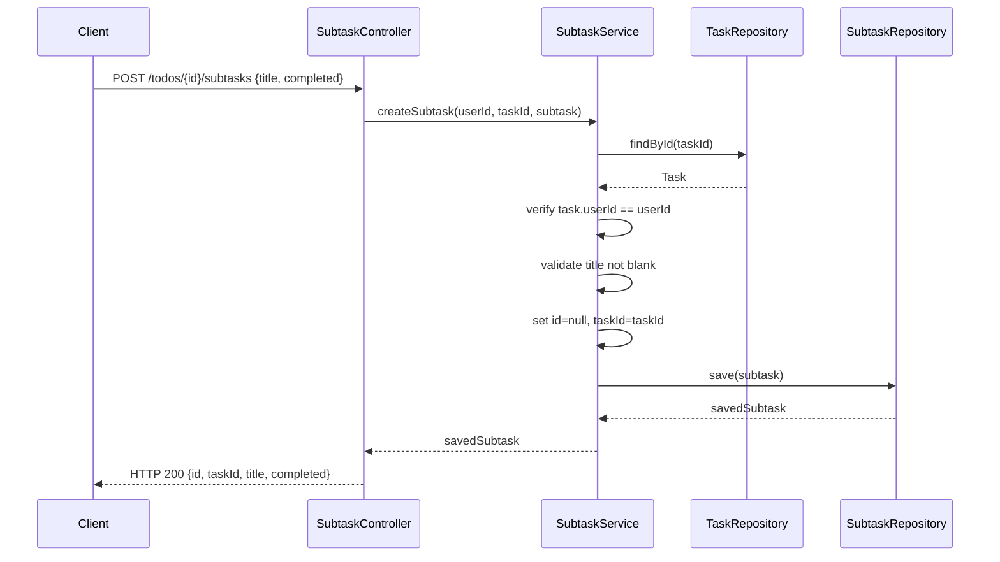
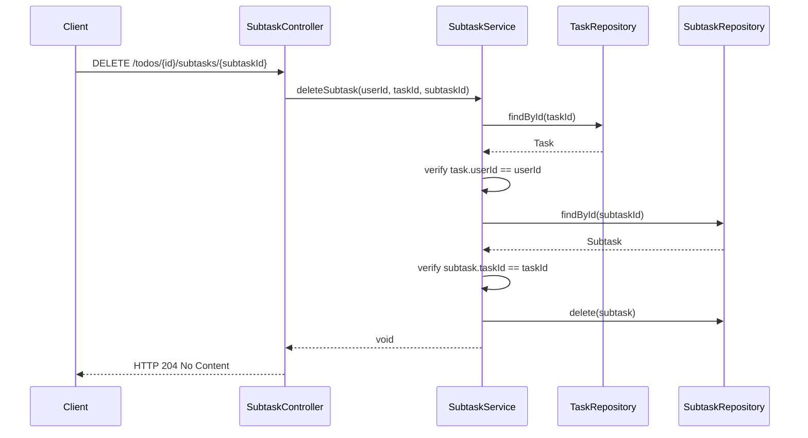
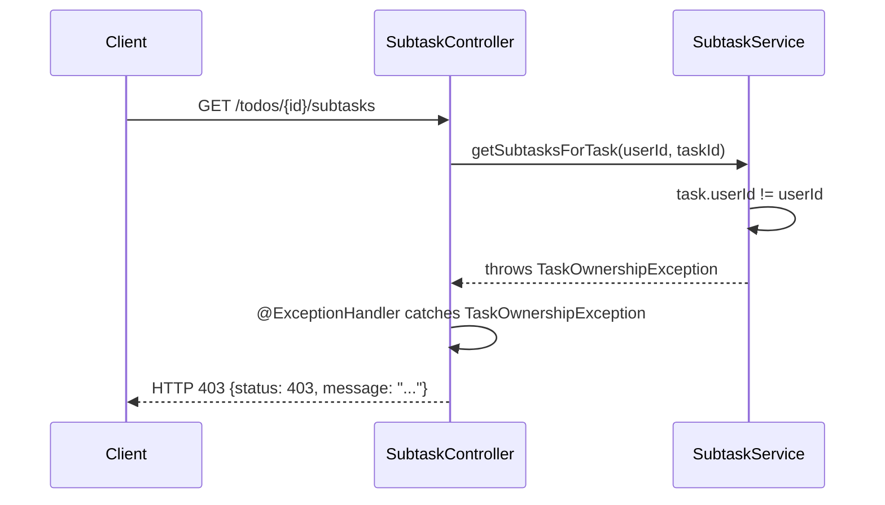

# Design Document: subtask-organization

## Overview

This feature delivers the Subtask Organization vertical slice for the Todo Management Application.
It wires together the HTTP layer, business logic, exception handling, and tests for full CRUD
on subtasks — all within the existing Spring Boot 4.1.0 / Java 21 stack.

Five public endpoints are exposed:

| Method | Path | Purpose |
|--------|------|---------|
| GET | `/todos/{id}/subtasks` | List all subtasks for the given task |
| POST | `/todos/{id}/subtasks` | Create a new subtask under the given task |
| GET | `/todos/{id}/subtasks/{subtaskId}` | Retrieve a single subtask by ID |
| PUT | `/todos/{id}/subtasks/{subtaskId}` | Update a subtask's title and/or completed status |
| DELETE | `/todos/{id}/subtasks/{subtaskId}` | Delete a subtask |

Every operation first verifies that the parent task exists and belongs to the authenticated user.

---

## Architecture

```
HTTP (SubtaskController)
       │
       ▼
Service (SubtaskService)
  ├─ SubtaskRepository (Spring Data JPA)
  └─ TaskRepository    (Spring Data JPA — ownership check)
       │
       ▼
Database (SQLite via Hibernate / H2 in tests)
```

Exception handling is done via **controller-local `@ExceptionHandler` methods** inside `SubtaskController` — consistent with `TodoController` and `LoginController`.

```mermaid
graph TD
    Client -->|GET /todos/:id/subtasks| SC[SubtaskController]
    Client -->|POST /todos/:id/subtasks| SC
    Client -->|GET /todos/:id/subtasks/:sid| SC
    Client -->|PUT /todos/:id/subtasks/:sid| SC
    Client -->|DELETE /todos/:id/subtasks/:sid| SC
    SC --> SS[SubtaskService]
    SS --> SR[SubtaskRepository]
    SS --> TR[TaskRepository]
    SR --> DB[(SQLite / H2)]
    TR --> DB
    SC -->|@ExceptionHandler| SC
```

---

## Components and Interfaces

### Package Layout

```
com.revature.todomanagement
├── controller/
│   └── SubtaskController.java           ← new (includes @ExceptionHandler methods)
├── service/
│   └── SubtaskService.java              ← already implemented
├── repository/
│   ├── SubtaskRepository.java           ← already implemented
│   └── TaskRepository.java              ← already implemented
├── entity/
│   ├── Subtask.java                     ← existing, unchanged
│   └── Task.java                        ← existing, unchanged
└── exception/
    ├── SubtaskNotFoundException.java    ← already implemented
    ├── TaskNotFoundException.java       ← already implemented
    └── TaskOwnershipException.java      ← already implemented
```

### Class Signatures

#### `SubtaskController` (includes local `@ExceptionHandler` methods)
```java
package com.revature.todomanagement.controller;

import com.revature.todomanagement.entity.Subtask;
import com.revature.todomanagement.exception.SubtaskNotFoundException;
import com.revature.todomanagement.exception.TaskNotFoundException;
import com.revature.todomanagement.exception.TaskOwnershipException;
import com.revature.todomanagement.service.SubtaskService;
import lombok.RequiredArgsConstructor;
import org.springframework.http.ResponseEntity;
import org.springframework.web.bind.annotation.*;

import java.util.List;
import java.util.Map;
import java.util.UUID;

@RestController
@RequestMapping("/todos/{id}/subtasks")
@RequiredArgsConstructor
public class SubtaskController {

    private final SubtaskService subtaskService;

    @GetMapping
    public ResponseEntity<List<Subtask>> getSubtasks(@RequestAttribute UUID userId,
                                                     @PathVariable UUID id);

    @PostMapping
    public ResponseEntity<Subtask> createSubtask(@RequestAttribute UUID userId,
                                                 @PathVariable UUID id,
                                                 @RequestBody Subtask subtask);

    @GetMapping("/{subtaskId}")
    public ResponseEntity<Subtask> getSubtaskById(@RequestAttribute UUID userId,
                                                  @PathVariable UUID id,
                                                  @PathVariable UUID subtaskId);

    @PutMapping("/{subtaskId}")
    public ResponseEntity<Subtask> updateSubtask(@RequestAttribute UUID userId,
                                                 @PathVariable UUID id,
                                                 @PathVariable UUID subtaskId,
                                                 @RequestBody Subtask updates);

    @DeleteMapping("/{subtaskId}")
    public ResponseEntity<Void> deleteSubtask(@RequestAttribute UUID userId,
                                              @PathVariable UUID id,
                                              @PathVariable UUID subtaskId);

    // ---- Exception Handlers (controller-local) ----

    @ExceptionHandler(SubtaskNotFoundException.class)
    public ResponseEntity<Map<String, Object>> handleSubtaskNotFound(SubtaskNotFoundException ex);
    // → HTTP 404, body: {"status": 404, "message": "..."}

    @ExceptionHandler(TaskNotFoundException.class)
    public ResponseEntity<Map<String, Object>> handleTaskNotFound(TaskNotFoundException ex);
    // → HTTP 404, body: {"status": 404, "message": "..."}

    @ExceptionHandler(TaskOwnershipException.class)
    public ResponseEntity<Map<String, Object>> handleTaskOwnership(TaskOwnershipException ex);
    // → HTTP 403, body: {"status": 403, "message": "..."}

    @ExceptionHandler(IllegalArgumentException.class)
    public ResponseEntity<Map<String, Object>> handleIllegalArgument(IllegalArgumentException ex);
    // → HTTP 400, body: {"status": 400, "message": "..."}
}
```

#### `SubtaskService` (existing — no changes required)
```java
public Subtask createSubtask(UUID userId, UUID taskId, Subtask subtask);
public List<Subtask> getSubtasksForTask(UUID userId, UUID taskId);
public Subtask getSubtaskById(UUID userId, UUID taskId, UUID subtaskId);
public Subtask updateSubtask(UUID userId, UUID taskId, UUID subtaskId, Subtask updates);
public void deleteSubtask(UUID userId, UUID taskId, UUID subtaskId);
```

---

## Data Models

### `Subtask` Entity (existing — no changes required)

```
subtasks
├── id         UUID     PK  (generated)
├── taskId     UUID     NOT NULL
├── title      TEXT     NOT NULL
└── completed  BOOLEAN  NOT NULL  DEFAULT false
```

### Wire Formats

**POST /todos/{id}/subtasks — Request**
```json
{ "title": "Write unit tests", "completed": false }
```

**POST /todos/{id}/subtasks — Response (HTTP 200)**
```json
{
  "id": "770a9600-a41d-63f6-c938-668877662222",
  "taskId": "550e8400-e29b-41d4-a716-446655440000",
  "title": "Write unit tests",
  "completed": false
}
```

**GET /todos/{id}/subtasks — Response (HTTP 200)**
```json
[
  {
    "id": "770a9600-a41d-63f6-c938-668877662222",
    "taskId": "550e8400-e29b-41d4-a716-446655440000",
    "title": "Write unit tests",
    "completed": false
  }
]
```

**PUT /todos/{id}/subtasks/{subtaskId} — Request**
```json
{ "title": "Write unit tests", "completed": true }
```

**DELETE /todos/{id}/subtasks/{subtaskId} — Response**
```
HTTP 204 No Content
```

**Error Response**
```json
{ "status": 404, "message": "Subtask not found: 770a9600-a41d-63f6-c938-668877662222" }
```

---

## Sequence Diagrams

### Create Subtask



### Delete Subtask



### Ownership Violation



---

## Error Handling

### Exception Hierarchy

```
RuntimeException
├── TaskNotFoundException     (parent task ID does not exist)
├── TaskOwnershipException    (parent task belongs to a different user)
└── SubtaskNotFoundException  (subtask ID does not exist or wrong parent task)

IllegalArgumentException      (built-in; blank title validation)
```

### Error Response Contract

| Condition | HTTP Status | Response Body |
|-----------|-------------|---------------|
| Parent task not found | 404 | `{"status": 404, "message": "..."}` |
| Ownership violation | 403 | `{"status": 403, "message": "..."}` |
| Subtask not found | 404 | `{"status": 404, "message": "..."}` |
| Blank title | 400 | `{"status": 400, "message": "..."}` |
| Unhandled exception | 500 | `{"status": 500}` |

### Service-Layer Validation Order

All subtask operations:
1. Load parent task → `TaskRepository.findById`, empty → `TaskNotFoundException`
2. Verify `task.getUserId().equals(userId)` → `TaskOwnershipException`

`SubtaskService.createSubtask` (after ownership check):
3. Validate `title` not blank → `IllegalArgumentException`
4. Override `id` to `null`, set `taskId`
5. Persist → `SubtaskRepository.save`

`SubtaskService.getSubtaskById` / `updateSubtask` / `deleteSubtask` (after ownership check):
3. Load subtask → `SubtaskRepository.findById`, empty → `SubtaskNotFoundException`
4. Verify `subtask.getTaskId().equals(taskId)` → `SubtaskNotFoundException`
5. Apply update / delete

---

## Testing Strategy

| Test Class | Slice | What it covers |
|---|---|---|
| `SubtaskServiceTest` | Plain JUnit 5 + Mockito | CRUD logic, ownership checks, subtask-task association |
| `SubtaskControllerTest` | `@WebMvcTest` + Mockito | HTTP status codes, controller-local exception handler to response mapping |

### `SubtaskServiceTest` (key cases)
- `createSubtask` with valid title → `save` called once, returned subtask has correct `taskId`
- `createSubtask` with blank title → `IllegalArgumentException`, `save` never called
- `createSubtask` with unknown parent task → `TaskNotFoundException`
- `createSubtask` with wrong owner → `TaskOwnershipException`
- `getSubtasksForTask` → delegates to `findAllByTaskId` after ownership check
- `getSubtaskById` with unknown subtask ID → `SubtaskNotFoundException`
- `getSubtaskById` with subtask belonging to a different task → `SubtaskNotFoundException`
- `updateSubtask` with valid fields → `save` called with updated values
- `updateSubtask` with blank title → `IllegalArgumentException`
- `deleteSubtask` → subtask deleted after ownership and association checks
- `deleteSubtask` with unknown parent task → `TaskNotFoundException`
- `deleteSubtask` with wrong owner → `TaskOwnershipException`

### `SubtaskControllerTest` (key cases)
- `GET /todos/{id}/subtasks` → HTTP 200, JSON array
- `POST /todos/{id}/subtasks` with valid body → HTTP 200
- `POST /todos/{id}/subtasks` with blank title → HTTP 400
- `GET /todos/{id}/subtasks/{subtaskId}` with unknown ID → HTTP 404
- `PUT /todos/{id}/subtasks/{subtaskId}` with valid body → HTTP 200
- `DELETE /todos/{id}/subtasks/{subtaskId}` → HTTP 204
- Any request with unknown parent task → HTTP 404
- Any request with wrong owner → HTTP 403
