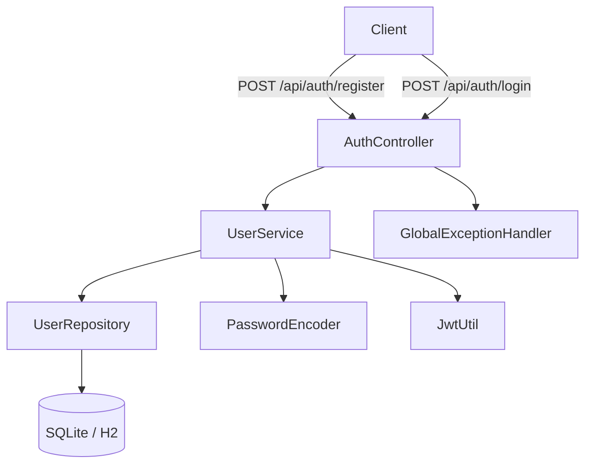
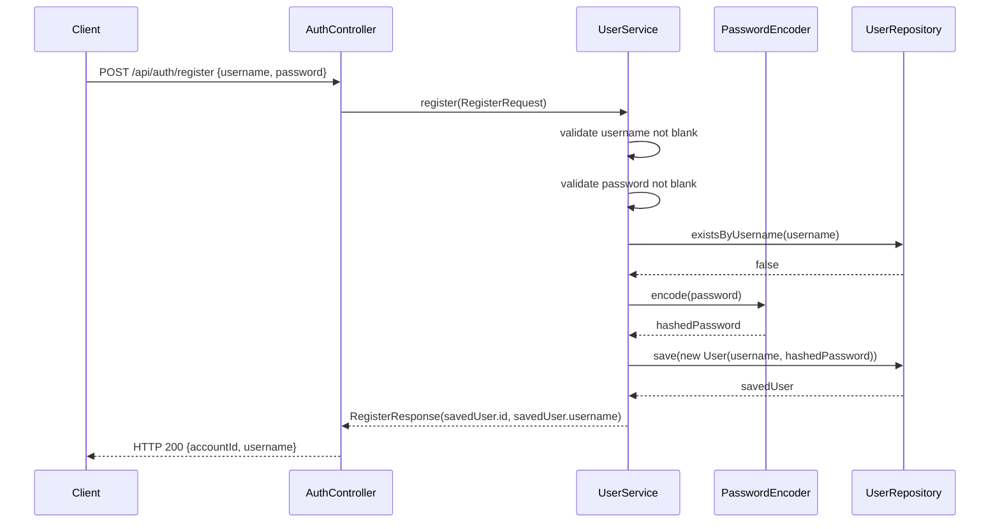
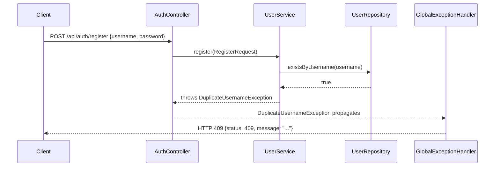
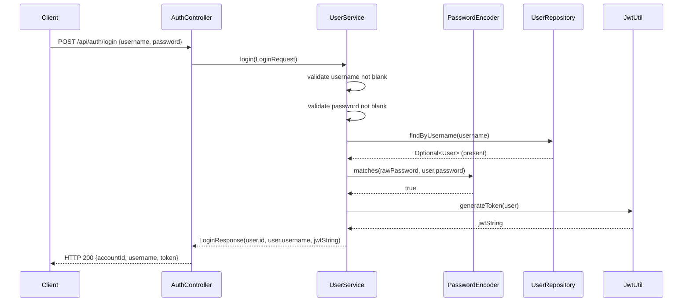
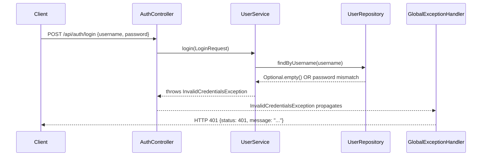

# Design Document: user-auth-repository

## Overview

This feature delivers the complete authentication vertical slice for the Todo Management Application.
It wires together the persistence layer, business logic, HTTP layer, JWT infrastructure, DTOs, exception
handling, and tests — all within the existing Spring Boot 4.1.0 / Java 21 stack.

Two public endpoints are exposed:

| Method | Path | Purpose |
|--------|------|---------|
| POST | `/api/auth/register` | Create a new user account, return UUID + username |
| POST | `/api/auth/login` | Validate credentials, return UUID + username + JWT |

All passwords are BCrypt-hashed before persistence. JWTs are signed with HMAC-SHA256, carry a `userId`
claim, and expire after 24 hours. No Spring Security filter chain is configured in this slice — token
validation infrastructure (`JwtUtil`) is built here for use by a future `JwtFilter`.

---

## Architecture

The feature follows the existing layered architecture established in the project:

```
HTTP (AuthController)
       │
       ▼
Service (UserService)
  ├─ PasswordEncoder (BCryptPasswordEncoder bean)
  ├─ UserRepository  (Spring Data JPA)
  └─ JwtUtil         (HMAC-SHA256 JWT component)
       │
       ▼
Database (SQLite via Hibernate / H2 in tests)
```

Cross-cutting concerns are handled by:

- **GlobalExceptionHandler** (`@ControllerAdvice`) — maps domain exceptions to HTTP status codes
- **DTOs** (`dto/` package) — decouple the HTTP contract from JPA entities



---

## Components and Interfaces

### Package Layout

```
com.revature.todomanagement
├── controller/
│   └── AuthController.java
├── service/
│   └── UserService.java          ← fill in existing shell
├── repository/
│   └── UserRepository.java       ← new
├── entity/
│   └── User.java                 ← existing, unchanged
├── dto/
│   ├── RegisterRequest.java      ← new
│   ├── RegisterResponse.java     ← new
│   ├── LoginRequest.java         ← new
│   └── LoginResponse.java        ← new
├── exception/
│   ├── DuplicateUsernameException.java   ← new
│   ├── InvalidCredentialsException.java  ← new
│   └── GlobalExceptionHandler.java       ← new
└── security/
    └── JwtUtil.java              ← new
```

### Class Signatures

#### `UserRepository`
```java
package com.revature.todomanagement.repository;

import com.revature.todomanagement.entity.User;
import org.springframework.data.jpa.repository.JpaRepository;
import java.util.Optional;
import java.util.UUID;

public interface UserRepository extends JpaRepository<User, UUID> {
    Optional<User> findByUsername(String username);
    boolean existsByUsername(String username);
}
```

#### `UserService`
```java
package com.revature.todomanagement.service;

import com.revature.todomanagement.dto.*;
import com.revature.todomanagement.entity.User;
import com.revature.todomanagement.exception.*;
import com.revature.todomanagement.repository.UserRepository;
import com.revature.todomanagement.security.JwtUtil;
import lombok.RequiredArgsConstructor;
import org.springframework.security.crypto.password.PasswordEncoder;
import org.springframework.stereotype.Service;

@Service
@RequiredArgsConstructor
public class UserService {

    private final UserRepository userRepository;
    private final PasswordEncoder passwordEncoder;
    private final JwtUtil jwtUtil;

    public RegisterResponse register(RegisterRequest request);
    public LoginResponse login(LoginRequest request);
}
```

#### `AuthController`
```java
package com.revature.todomanagement.controller;

import com.revature.todomanagement.dto.*;
import com.revature.todomanagement.service.UserService;
import lombok.RequiredArgsConstructor;
import org.springframework.http.ResponseEntity;
import org.springframework.web.bind.annotation.*;

@RestController
@RequestMapping("/api/auth")
@RequiredArgsConstructor
public class AuthController {

    private final UserService userService;

    @PostMapping("/register")
    public ResponseEntity<RegisterResponse> register(@RequestBody RegisterRequest request);

    @PostMapping("/login")
    public ResponseEntity<LoginResponse> login(@RequestBody LoginRequest request);
}
```

#### `JwtUtil`
```java
package com.revature.todomanagement.security;

import com.revature.todomanagement.entity.User;
import io.jsonwebtoken.*;
import io.jsonwebtoken.security.Keys;
import org.springframework.beans.factory.annotation.Value;
import org.springframework.stereotype.Component;

import javax.crypto.SecretKey;
import java.util.Date;

@Component
public class JwtUtil {

    // Secret injected from application.properties (jwt.secret); minimum 32 chars (256 bits)
    private final SecretKey key;

    public JwtUtil(@Value("${jwt.secret}") String secret) { /* derive key */ }

    /** Generates a signed JWT; subject = username, userId claim = user.getId(), expiry = 24 h */
    public String generateToken(User user);

    /** Extracts the subject (username) from a token; returns null on any parse failure */
    public String extractUsername(String token);

    /** Returns true iff token is valid, non-expired, and subject matches the given username */
    public boolean isTokenValid(String token, String username);
}
```

#### DTOs

```java
// dto/RegisterRequest.java
package com.revature.todomanagement.dto;
import lombok.Data;

@Data
public class RegisterRequest {
    private String username;   // 1–50 characters, non-blank
    private String password;   // 1–72 characters, non-blank
}

// dto/RegisterResponse.java
package com.revature.todomanagement.dto;
import lombok.AllArgsConstructor;
import lombok.Data;
import java.util.UUID;

@Data
@AllArgsConstructor
public class RegisterResponse {
    private UUID accountId;
    private String username;
}

// dto/LoginRequest.java
package com.revature.todomanagement.dto;
import lombok.Data;

@Data
public class LoginRequest {
    private String username;   // 1–50 characters, non-blank
    private String password;   // 1–72 characters, non-blank
}

// dto/LoginResponse.java
package com.revature.todomanagement.dto;
import lombok.AllArgsConstructor;
import lombok.Data;
import java.util.UUID;

@Data
@AllArgsConstructor
public class LoginResponse {
    private UUID accountId;
    private String username;
    private String token;
}
```

#### Exception Classes

```java
// exception/DuplicateUsernameException.java
package com.revature.todomanagement.exception;

public class DuplicateUsernameException extends RuntimeException {
    public DuplicateUsernameException(String username) {
        super("Username already taken: " + username);
    }
}

// exception/InvalidCredentialsException.java
package com.revature.todomanagement.exception;

public class InvalidCredentialsException extends RuntimeException {
    public InvalidCredentialsException() {
        super("Invalid username or password");
    }
}
```

#### `GlobalExceptionHandler`

```java
package com.revature.todomanagement.exception;

import org.springframework.http.ResponseEntity;
import org.springframework.web.bind.annotation.*;
import java.util.Map;

@RestControllerAdvice
public class GlobalExceptionHandler {

    @ExceptionHandler(DuplicateUsernameException.class)
    public ResponseEntity<Map<String, Object>> handleDuplicate(DuplicateUsernameException ex);
    // → HTTP 409, body: {"status": 409, "message": "..."}

    @ExceptionHandler(InvalidCredentialsException.class)
    public ResponseEntity<Map<String, Object>> handleInvalidCredentials(InvalidCredentialsException ex);
    // → HTTP 401, body: {"status": 401, "message": "..."}

    @ExceptionHandler(IllegalArgumentException.class)
    public ResponseEntity<Map<String, Object>> handleIllegalArgument(IllegalArgumentException ex);
    // → HTTP 400, body: {"status": 400, "message": "..."}

    @ExceptionHandler(Exception.class)
    public ResponseEntity<Map<String, Object>> handleGeneric(Exception ex);
    // → HTTP 500, body: {"status": 500}
}
```

#### Security Configuration (PasswordEncoder Bean)

The `PasswordEncoder` bean is declared in a dedicated `@Configuration` class to avoid circular
dependencies between `UserService` and any future `SecurityConfig`:

```java
package com.revature.todomanagement.security;

import org.springframework.context.annotation.Bean;
import org.springframework.context.annotation.Configuration;
import org.springframework.security.crypto.bcrypt.BCryptPasswordEncoder;
import org.springframework.security.crypto.password.PasswordEncoder;

@Configuration
public class SecurityConfig {

    @Bean
    public PasswordEncoder passwordEncoder() {
        return new BCryptPasswordEncoder();
    }
}
```

> **Note:** Since Spring Boot 4.x auto-configures a security filter chain that protects all endpoints by
> default, `SecurityConfig` must also expose a `SecurityFilterChain` bean that permits requests to
> `/api/auth/**` without authentication (and ideally all routes until the JWT filter is wired in):
>
> ```java
> @Bean
> public SecurityFilterChain filterChain(HttpSecurity http) throws Exception {
>     return http
>         .csrf(csrf -> csrf.disable())
>         .authorizeHttpRequests(auth -> auth.anyRequest().permitAll())
>         .sessionManagement(s -> s.sessionCreationPolicy(SessionCreationPolicy.STATELESS))
>         .build();
> }
> ```

---

## Data Models

### `User` Entity (existing — no changes required)

```
users
├── id        UUID   PK  (generated)
├── username  TEXT   NOT NULL  UNIQUE
└── password  TEXT   NOT NULL  (BCrypt hash)
```

### DTO / Wire Formats

**POST /api/auth/register — Request**
```json
{ "username": "alice", "password": "s3cr3t" }
```

**POST /api/auth/register — Response (HTTP 200)**
```json
{ "accountId": "550e8400-e29b-41d4-a716-446655440000", "username": "alice" }
```

**POST /api/auth/login — Request**
```json
{ "username": "alice", "password": "s3cr3t" }
```

**POST /api/auth/login — Response (HTTP 200)**
```json
{
  "accountId": "550e8400-e29b-41d4-a716-446655440000",
  "username": "alice",
  "token": "<signed-jwt>"
}
```

**Error Response (all error cases)**
```json
{ "status": 409, "message": "Username already taken: alice" }
```

### JWT Payload Structure

```json
{
  "sub": "alice",
  "userId": "550e8400-e29b-41d4-a716-446655440000",
  "iat": 1700000000,
  "exp": 1700086400
}
```

---

## Sequence Diagrams

### Registration Flow



**Registration — Duplicate Username**



### Login Flow



**Login — Invalid Credentials**



---

## Correctness Properties

*A property is a characteristic or behavior that should hold true across all valid executions of a system — essentially, a formal statement about what the system should do. Properties serve as the bridge between human-readable specifications and machine-verifiable correctness guarantees.*

---

### Property 1: Repository Round-Trip

*For any* `User` saved via `UserRepository.save`, calling `findByUsername` with that user's username SHALL return a non-empty `Optional` containing a `User` whose `id`, `username`, and `password` fields are all equal to those of the saved entity; and `existsByUsername` with the same username SHALL return `true`. *For any* string that was never saved as a username, both methods SHALL return the absent/false result.

**Validates: Requirements 1.2, 1.3, 1.4**

---

### Property 2: BCrypt Encode/Verify Round-Trip

*For any* plaintext password of length 1–72 characters, encoding it with `BCryptPasswordEncoder` and then calling `matches(plaintext, encoded)` SHALL return `true`.

**Validates: Requirements 2.3**

---

### Property 3: BCrypt Non-Collision

*For any* two distinct non-blank plaintext passwords `P` and `Q` where `P ≠ Q`, calling `matches(P, encode(Q))` SHALL return `false`.

**Validates: Requirements 2.4**

---

### Property 4: Blank Input Guard

*For any* blank value (null, empty string, or whitespace-only string) supplied as the `username` or `password` field of a `RegisterRequest` or `LoginRequest`, `UserService.register` or `UserService.login` SHALL throw an `IllegalArgumentException` without invoking `UserRepository` or `PasswordEncoder`.

**Validates: Requirements 2.5, 3.3, 3.4, 4.6**

---

### Property 5: Registration Persists BCrypt Hash

*For any* valid (non-blank, non-duplicate) username and non-blank password provided to `UserService.register`, the `User` entity passed to `UserRepository.save` SHALL have a `password` field that satisfies `passwordEncoder.matches(originalPlaintext, savedPassword) == true`, and the returned `RegisterResponse` SHALL carry the same `id` and `username` as the persisted entity.

**Validates: Requirements 2.1, 3.2**

---

### Property 6: Duplicate Username Rejection

*For any* username for which `UserRepository.existsByUsername` returns `true`, calling `UserService.register` with that username SHALL throw a `DuplicateUsernameException` without invoking `UserRepository.save`.

**Validates: Requirements 3.5**

---

### Property 7: Missing User Causes InvalidCredentialsException

*For any* login attempt where `UserRepository.findByUsername` returns an empty `Optional`, `UserService.login` SHALL throw an `InvalidCredentialsException` without invoking `PasswordEncoder` or `JwtUtil`.

**Validates: Requirements 4.2**

---

### Property 8: Password Mismatch Causes InvalidCredentialsException

*For any* login attempt where `UserRepository.findByUsername` returns a present `User` but `PasswordEncoder.matches` returns `false`, `UserService.login` SHALL throw an `InvalidCredentialsException` without invoking `JwtUtil`.

**Validates: Requirements 4.3**

---

### Property 9: JWT Generation Correctness

*For any* `User` with a non-null, non-blank username and a non-null `id`, `JwtUtil.generateToken(user)` SHALL produce a signed JWT string such that:
- `extractUsername(token)` returns a value equal to `user.getUsername()`
- The token's `userId` claim equals `user.getId().toString()`
- The token's `exp` − `iat` equals exactly `86400` seconds

**Validates: Requirements 5.1, 5.2, 5.3, 5.9**

---

### Property 10: JWT extractUsername Returns null for Bad Tokens

*For any* string that is malformed, has an invalid signature, or represents an expired token, `JwtUtil.extractUsername` SHALL return `null` without throwing an unchecked exception.

**Validates: Requirements 5.5, 5.8**

---

### Property 11: isTokenValid Correctness

*For any* `User`, a freshly generated token SHALL satisfy `isTokenValid(generateToken(user), user.getUsername()) == true`. *For any* username that differs from the token subject, `isTokenValid` SHALL return `false`. *For any* malformed or expired token string, `isTokenValid` SHALL return `false` without throwing an unchecked exception.

**Validates: Requirements 5.6, 5.7, 5.8**

---

### Property 12: Exception-to-HTTP Status Mapping

*For any* `DuplicateUsernameException` thrown from any controller method, `GlobalExceptionHandler` SHALL return a response with status `409`, `Content-Type: application/json`, and a JSON body containing `"status": 409` and a non-empty `"message"` string. The same invariant applies: `InvalidCredentialsException` → `401`, `IllegalArgumentException` → `400`, and any other unhandled exception → `500`.

**Validates: Requirements 3.6, 3.7, 4.4, 7.1, 7.2, 7.3, 7.4, 7.5**

---

## Error Handling

### Exception Hierarchy

```
RuntimeException
├── DuplicateUsernameException   (registration: username taken)
└── InvalidCredentialsException  (login: user not found or wrong password)

IllegalArgumentException         (built-in; validation guards on blank inputs)
DataAccessException              (Spring Data; propagated unchanged from service)
```

### Error Response Contract

All error responses from `GlobalExceptionHandler` are JSON with `Content-Type: application/json`:

| Condition | HTTP Status | Response Body |
|-----------|-------------|---------------|
| Duplicate username | 409 | `{"status": 409, "message": "..."}` |
| Invalid credentials | 401 | `{"status": 401, "message": "..."}` |
| Blank/invalid input | 400 | `{"status": 400, "message": "..."}` |
| Unhandled exception | 500 | `{"status": 500}` |
| Missing/malformed request body | 400 | Spring MVC default `HttpMessageNotReadableException` → mapped to 400 by `GlobalExceptionHandler` or Spring default |

### Service-Layer Validation Order

`UserService.register`:
1. Validate `username` not blank → `IllegalArgumentException`
2. Validate `password` not blank → `IllegalArgumentException`
3. Check `existsByUsername` → `DuplicateUsernameException`
4. Encode password → call `PasswordEncoder.encode`
5. Persist → `UserRepository.save` (propagate `DataAccessException`)
6. Return `RegisterResponse`

`UserService.login`:
1. Validate `username` not blank → `IllegalArgumentException`
2. Validate `password` not blank → `IllegalArgumentException`
3. Load user → `findByUsername`, empty Optional → `InvalidCredentialsException`
4. Verify password → `PasswordEncoder.matches`, false → `InvalidCredentialsException`
5. Generate token → `JwtUtil.generateToken`
6. Return `LoginResponse`

### JwtUtil Error Handling

- `extractUsername`: wraps JJWT parsing in a try-catch; catches `JwtException` and `IllegalArgumentException`; returns `null` on any failure.
- `isTokenValid`: delegates to `extractUsername`; returns `false` if `null` or subject mismatch.

---

## Testing Strategy

### Overview

The test suite uses two complementary approaches:
- **Unit tests** — verify specific examples, edge cases, and error conditions using Mockito mocks
- **Property-based tests** — verify universal properties across many generated inputs using [jqwik](https://jqwik.net/) (a JUnit 5-native PBT library for Java)

Both are needed: unit tests catch concrete scenarios, property tests verify general correctness across the input space.

### Property-Based Testing Library

**jqwik 1.9.x** — a JUnit 5-compatible PBT library. Add to `build.gradle.kts`:

```kotlin
testImplementation("net.jqwik:jqwik:1.9.2")
```

Each property test is configured to run a minimum of **100 tries** (jqwik default). Each test references its design property via a comment tag:

```java
// Feature: user-auth-repository, Property 2: BCrypt Encode/Verify Round-Trip
@Property(tries = 100)
void bcryptRoundTrip(@ForAll @StringLength(min = 1, max = 72) String password) { ... }
```

### Test Slices

| Test Class | Slice / Approach | What it covers |
|---|---|---|
| `UserRepositoryTest` | `@DataJpaTest` (H2) | Properties 1 — round-trip, existsByUsername |
| `UserServiceTest` | Plain JUnit 5 + Mockito | Properties 4, 5, 6, 7, 8 — registration/login logic |
| `BCryptPropertyTest` | Plain JUnit 5 + jqwik | Properties 2, 3 — BCrypt encode/verify correctness |
| `JwtUtilTest` | Plain JUnit 5 + jqwik | Properties 9, 10, 11 — JWT generation/validation |
| `AuthControllerTest` | `@WebMvcTest` + Mockito | Property 12 — exception → HTTP status mapping |

### Unit Tests (example-based)

`UserRepositoryTest` (`@DataJpaTest`):
- Save a `User`, call `findByUsername`, assert all three fields match (Requirement 1.4 / 8.1)
- Save a `User`, call `existsByUsername` for both saved and unsaved names (Requirement 1.2, 1.3 / 8.2)

`UserServiceTest` (mocked):
- `register` with valid input → `save` called once, returned password satisfies `matches` (Req 8.3)
- `register` with duplicate username → `DuplicateUsernameException`, `save` never called (Req 8.4)
- `login` with unknown username → `InvalidCredentialsException` (Req 8.5)
- `login` with wrong password → `InvalidCredentialsException` (Req 8.6)
- `login` with valid credentials → `JwtUtil.generateToken` called, token in `LoginResponse`
- `register` with `DataAccessException` from `save` → exception propagates (Req 3.8)

`JwtUtilTest`:
- `extractUsername(generateToken(user)) == user.getUsername()` (Req 8.7)

`AuthControllerTest` (`@WebMvcTest`):
- Mock `UserService` throws `DuplicateUsernameException` → POST `/api/auth/register` returns 409 (Req 8.8)
- Mock `UserService` throws `InvalidCredentialsException` → POST `/api/auth/login` returns 401 (Req 8.9)
- POST `/api/auth/login` with empty body → 400 (Req 4.7)

### Property Tests (jqwik)

Each property test maps 1-to-1 with a design correctness property:

```
Property 1  → UserRepositoryTest: @Property for save/findByUsername/existsByUsername round-trip
Property 2  → BCryptPropertyTest: @Property bcryptRoundTrip
Property 3  → BCryptPropertyTest: @Property bcryptNonCollision
Property 4  → UserServiceTest: @Property blankInputGuard (parametrized over blank generators)
Property 5  → UserServiceTest: @Property registrationPersistsBcryptHash
Property 6  → UserServiceTest: @Property duplicateUsernameRejection
Property 7  → UserServiceTest: @Property missingUserThrowsInvalidCredentials
Property 8  → UserServiceTest: @Property passwordMismatchThrowsInvalidCredentials
Property 9  → JwtUtilTest: @Property tokenGenerationCorrectness
Property 10 → JwtUtilTest: @Property extractUsernameReturnNullOnBadToken
Property 11 → JwtUtilTest: @Property isTokenValidCorrectness
Property 12 → AuthControllerTest: @Property exceptionToHttpStatusMapping
```

### Test Configuration Notes

- Tests use H2 in-memory database (`spring.datasource.url=jdbc:h2:mem:testdb`)
- `application-test.properties` overrides the SQLite datasource:
  ```properties
  spring.datasource.url=jdbc:h2:mem:testdb;DB_CLOSE_DELAY=-1
  spring.datasource.driver-class-name=org.h2.Driver
  spring.jpa.database-platform=org.hibernate.dialect.H2Dialect
  spring.jpa.hibernate.ddl-auto=create-drop
  ```
- `@DataJpaTest` auto-configures H2 and scans only JPA components — no need for the full app context
- `@WebMvcTest(AuthController.class)` loads only the web layer; `UserService` and `JwtUtil` must be `@MockBean`
- `GlobalExceptionHandler` must be included in the `@WebMvcTest` context (add `@Import(GlobalExceptionHandler.class)` or use `@WebMvcTest` with `controllers = AuthController.class` and ensure `@ControllerAdvice` is picked up)
