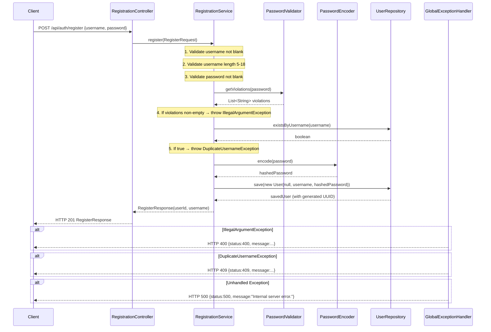

# Design Document: User Registration

## Overview

This document describes the technical design for the `POST /api/auth/register` endpoint. The
feature creates a new `User` account: it validates the submitted username and password, hashes
the password with BCrypt, persists the record to SQLite, and returns HTTP 201 with a
`RegisterResponse` body.

The design is scoped to **registration only**. Login, JWT issuance, and Spring Security filter
chains are handled by the authentication feature. This feature does introduce the
`BCryptPasswordEncoder` bean and `SecurityConfig`, which the authentication feature will extend.

### Relationship to Existing Code

| File | Status | Notes |
|---|---|---|
| `entity/User.java` | **Exists — do not modify** | Fields: `UUID id`, `String username`, `String password` |
| `repository/UserRepository.java` | **Exists — do not modify** | Already declares `existsByUsername` and `findByUsername` |
| `service/UserService.java` | **Exists — do not modify** | Handles both register and login; kept for backward compatibility. New code uses `RegistrationService`. |
| `controller/TodoController.java` | **Exists — empty stub** | Not involved in this feature |
| `security/JwtUtil.java` | **Exists — do not modify** | Not involved in this feature |
| `dto/RegisterRequest.java` | **Create** | Request DTO |
| `dto/RegisterResponse.java` | **Create** | Response DTO |
| `service/RegistrationService.java` | **Create** | Registration-only service |
| `controller/RegistrationController.java` | **Create** | REST controller for `/api/auth/register` |
| `exception/DuplicateUsernameException.java` | **Create** | Custom runtime exception |
| `exception/GlobalExceptionHandler.java` | **Create** | `@ControllerAdvice` error mapper |
| `security/PasswordValidator.java` | **Create** | Password strength checker |
| `security/SecurityConfig.java` | **Create** | Exposes `BCryptPasswordEncoder` bean |

---

## Architecture

The request travels through three Spring layers. There is no caching layer — every registration
hits the database exactly once (the duplicate check) and then again for the save.



---

## Components and Interfaces

### `dto/RegisterRequest.java`

A plain Java record (or Lombok `@Data` class) carrying the inbound payload.

```java
package com.revature.todomanagement.dto;

// Lombok @Data + @NoArgsConstructor + @AllArgsConstructor
// Fields: String username, String password
```

No Jakarta Bean Validation annotations are used — all validation is performed explicitly in
`RegistrationService` so that error messages are fully controlled.

---

### `dto/RegisterResponse.java`

Carries the outbound payload on success. Contains no password field.

```java
package com.revature.todomanagement.dto;

// Lombok @Data + @NoArgsConstructor + @AllArgsConstructor
// Fields: UUID userId, String username
```

---

### `security/PasswordValidator.java`

A `@Component` with a single public method. It evaluates each rule independently and collects all
violations into a list so the client receives all failure reasons in one response.

```java
package com.revature.todomanagement.security;

// @Component
// public List<String> getViolations(String password)
```

Rules checked in order (each adds its message to the list independently):

| Rule | Violation message |
|---|---|
| Length ≥ 8 | `"Password must be at least 8 characters long."` |
| Length ≤ 72 | `"Password must be no more than 72 characters long."` |
| At least one `A–Z` | `"Password must contain at least one uppercase letter."` |
| At least one `a–z` | `"Password must contain at least one lowercase letter."` |
| At least one `0–9` | `"Password must contain at least one digit."` |
| At least one `!@#$%^&*` | `"Password must contain at least one special character (!@#$%^&*)."` |
| No whitespace | `"Password must not contain whitespace."` |

The method never throws; it always returns a (possibly empty) `List<String>`. A blank/null
password is handled upstream in `RegistrationService` before `PasswordValidator` is ever called.

Combined regex (used as a secondary consistency check or documentation):

```
^(?=.*[A-Z])(?=.*[a-z])(?=.*\d)(?=.*[!@#$%^&*])\S{8,72}$
```

---

### `service/RegistrationService.java`

Contains all business logic for user registration. Dependencies are injected via constructor
(Lombok `@RequiredArgsConstructor`).

```java
package com.revature.todomanagement.service;

// @Service @RequiredArgsConstructor
// Dependencies: UserRepository, PasswordEncoder, PasswordValidator
// public RegisterResponse register(RegisterRequest request)
```

Validation order (throws immediately on first failure, except password-strength which collects
all violations first):

1. `username` blank → `IllegalArgumentException("Username must not be blank.")`
2. `username` length < 5 or > 18 → `IllegalArgumentException("Username must be between 5 and 18 characters.")`
3. `password` blank → `IllegalArgumentException("Password must not be blank.")`
4. `passwordValidator.getViolations(password)` non-empty → `IllegalArgumentException` whose message is all violations joined by `"\n"`
5. `userRepository.existsByUsername(username)` → `DuplicateUsernameException`
6. `passwordEncoder.encode(password)` → encoded string
7. `userRepository.save(new User(null, username, encodedPassword))` → saved `User`
8. Return `new RegisterResponse(savedUser.getId(), savedUser.getUsername())`

`UserRepository` is **never accessed** before steps 1–4 pass.

---

### `controller/RegistrationController.java`

A thin HTTP adapter. Contains no business logic.

```java
package com.revature.todomanagement.controller;

// @RestController @RequestMapping("/api/auth") @RequiredArgsConstructor
// POST /api/auth/register → ResponseEntity<RegisterResponse>
// @ResponseStatus(HttpStatus.CREATED) on the method, or return ResponseEntity.status(201).body(...)
```

Returns `ResponseEntity<RegisterResponse>` with HTTP 201 on success. All error cases are handled
by `GlobalExceptionHandler` — the controller does not catch exceptions.

---

### `exception/DuplicateUsernameException.java`

```java
package com.revature.todomanagement.exception;

// public class DuplicateUsernameException extends RuntimeException
// Constructor: public DuplicateUsernameException(String username)
// Message: "Username '" + username + "' is already taken."
```

---

### `exception/GlobalExceptionHandler.java`

A `@RestControllerAdvice` class mapping exceptions to structured JSON error bodies.

```java
package com.revature.todomanagement.exception;

// @RestControllerAdvice
```

| Exception | HTTP Status | Response body |
|---|---|---|
| `IllegalArgumentException` | 400 | `{"status": 400, "message": "<exception message>"}` |
| `DuplicateUsernameException` | 409 | `{"status": 409, "message": "<exception message>"}` |
| `Exception` (catch-all) | 500 | `{"status": 500, "message": "Internal server error."}` |

All responses set `Content-Type: application/json`.

The error body is a simple inner record or separate `ErrorResponse` DTO:

```java
// record ErrorResponse(int status, String message) {}
```

---

### `security/SecurityConfig.java`

Provides the `BCryptPasswordEncoder` bean. For now it also configures Spring Security to permit
all requests (so registration works without a JWT). The authentication feature will replace the
permissive rule with a proper filter chain.

```java
package com.revature.todomanagement.security;

// @Configuration @EnableWebSecurity
// @Bean PasswordEncoder passwordEncoder() → new BCryptPasswordEncoder()
// @Bean SecurityFilterChain — permit all (temporary, overridden by auth feature)
```

> **Rationale**: Declaring `BCryptPasswordEncoder` here rather than inline in `RegistrationService`
> makes it reusable for the login feature and keeps Spring's dependency injection clean.

---

## Data Models

### `User` entity (existing — no changes)

```
users
├── id       UUID   PK, generated
├── username TEXT   NOT NULL, UNIQUE
└── password TEXT   NOT NULL  (BCrypt hash, length ≈ 60 chars)
```

The `User` entity already maps to the `users` table via `@Table(name = "users")`. No schema
changes are required by this feature.

### `RegisterRequest` DTO

| Field | Type | Notes |
|---|---|---|
| `username` | `String` | Submitted by client; trimming is NOT applied — leading/trailing spaces count as characters |
| `password` | `String` | Submitted by client in plaintext over HTTPS |

### `RegisterResponse` DTO

| Field | Type | Notes |
|---|---|---|
| `userId` | `UUID` | Generated by the database on save |
| `username` | `String` | Echoed back from the saved entity |

### `ErrorResponse` (inline or DTO)

| Field | Type | Notes |
|---|---|---|
| `status` | `int` | HTTP status code integer |
| `message` | `String` | Human-readable error description |

---

## Correctness Properties

*A property is a characteristic or behavior that should hold true across all valid executions of a system — essentially, a formal statement about what the system should do. Properties serve as the bridge between human-readable specifications and machine-verifiable correctness guarantees.*

The prework analysis identified the following testable properties among the acceptance criteria. Properties are sourced from criteria where input variation meaningfully changes behavior and where testing the logic directly (not external infrastructure) is cost-effective.

---

### Property 1: Blank username always rejected

*For any* string that is null, empty, or composed entirely of whitespace characters, calling
`RegistrationService.register` with that value as the username SHALL throw
`IllegalArgumentException` with message `"Username must not be blank."` and SHALL NOT invoke
any method on `UserRepository`.

**Validates: Requirements 2.1**

---

### Property 2: Out-of-range username always rejected

*For any* string whose length is strictly less than 5 or strictly greater than 18, calling
`RegistrationService.register` with that value as the username (assuming it is non-blank) SHALL
throw `IllegalArgumentException` with message
`"Username must be between 5 and 18 characters."` and SHALL NOT invoke any method on
`UserRepository`.

**Validates: Requirements 2.2**

---

### Property 3: Duplicate username always rejected without persistence

*For any* valid username (non-blank, length 5–18), when `UserRepository.existsByUsername`
returns `true` for that username, calling `RegistrationService.register` SHALL throw
`DuplicateUsernameException` and SHALL NOT call `UserRepository.save`.

**Validates: Requirements 2.3**

---

### Property 4: Blank password always rejected before encoding

*For any* string that is null, empty, or composed entirely of whitespace characters, calling
`RegistrationService.register` with that value as the password (assuming a valid username) SHALL
throw `IllegalArgumentException` with message `"Password must not be blank."` and SHALL NOT
invoke `PasswordEncoder` or `UserRepository`.

**Validates: Requirements 3.1**

---

### Property 5: PasswordValidator returns a violation for each broken rule

*For any* password that violates exactly one of the seven strength rules, `PasswordValidator.getViolations`
SHALL return a list containing exactly the corresponding violation message and no other messages.
Conversely, *for any* password that satisfies all seven rules, `getViolations` SHALL return an
empty list.

**Validates: Requirements 3.2, 3.3**

---

### Property 6: BCrypt encode–then–matches round trip

*For any* valid plaintext password (satisfying all strength rules), encoding it with
`BCryptPasswordEncoder` to produce a hash and then calling `passwordEncoder.matches(plaintext, hash)`
SHALL return `true`. Calling `passwordEncoder.matches` with any other plaintext against the same
hash SHALL return `false`.

**Validates: Requirements 4.2, 4.4**

---

## Error Handling

| Scenario | Thrown by | Caught by | HTTP |
|---|---|---|---|
| Blank username | `RegistrationService` | `GlobalExceptionHandler` | 400 |
| Username too short / too long | `RegistrationService` | `GlobalExceptionHandler` | 400 |
| Blank password | `RegistrationService` | `GlobalExceptionHandler` | 400 |
| Password violates strength rules | `RegistrationService` | `GlobalExceptionHandler` | 400 |
| Duplicate username | `RegistrationService` | `GlobalExceptionHandler` | 409 |
| `DataAccessException` from save | `UserRepository` (propagated) | `GlobalExceptionHandler` | 500 |
| Malformed/absent request body | Spring MVC (Jackson) | `GlobalExceptionHandler` | 400 |
| Any other unhandled exception | anywhere | `GlobalExceptionHandler` | 500 |

`HttpMessageNotReadableException` (thrown by Spring when `@RequestBody` cannot be parsed) is a
subclass of `RuntimeException` and will be caught by the catch-all `Exception` handler if not
mapped explicitly. To ensure HTTP 400 (not 500) for malformed bodies, add an explicit
`@ExceptionHandler(HttpMessageNotReadableException.class)` mapping to 400 in
`GlobalExceptionHandler`.

---

## Testing Strategy

### Test infrastructure

- **Unit tests**: JUnit 5 + Mockito (via `spring-boot-starter-test`). No Spring context loaded.
- **Repository slice tests**: `@DataJpaTest` with H2 in-memory database (replaces SQLite in test
  profile). Spring Boot auto-configures H2 when it is on the test classpath.
- **Web MVC slice tests**: `@WebMvcTest(RegistrationController.class)` with `MockMvc`. Spring
  Security auto-configuration is excluded or a test `SecurityConfig` permits all, so the tests
  focus on HTTP behavior rather than auth filters.
- **Property-based tests**: Implemented using the
  [jqwik](https://jqwik.net/) library (JUnit 5 native). Each property test runs a minimum of
  100 iterations with randomly generated inputs.

  Add to `build.gradle.kts`:
  ```kotlin
  testImplementation("net.jqwik:jqwik:1.9.3")
  ```

### Test classes to create

| Class | Type | Covers |
|---|---|---|
| `RegistrationServiceTest` | Unit | Requirements 2.1–2.4, 3.1, 3.4, 4.1, 4.3, 5.1–5.3, 7.1 |
| `PasswordValidatorTest` | Unit + Property | Requirements 3.2, 3.3 (Property 5) |
| `BCryptRoundTripTest` | Property | Requirements 4.2, 4.4 (Property 6) |
| `UserRepositoryTest` | `@DataJpaTest` | Requirements 5.4, 5.5 |
| `RegistrationControllerTest` | `@WebMvcTest` | Requirements 1.1–1.3, 6.1–6.5, 8.8–8.10 |

### Unit tests are preferred over property tests for service-layer behavior

Because `RegistrationService` delegates all complex logic to `PasswordValidator` and
`UserRepository` (which are individually property- and integration-tested), the service unit
tests use concrete examples with Mockito verification. Property tests live at the validator and
encoder level where input variation genuinely matters.

### Property test configuration

Each property test must be tagged with:

```java
// Feature: user-registration, Property N: <property title>
```

Minimum iterations: **100** (jqwik default is 1000, which is fine).

### `@DataJpaTest` H2 configuration

Add `src/test/resources/application-test.properties` (or rely on Spring Boot's auto-configuration):

```properties
spring.datasource.url=jdbc:h2:mem:testdb;DB_CLOSE_DELAY=-1
spring.datasource.driver-class-name=org.h2.Driver
spring.jpa.database-platform=org.hibernate.dialect.H2Dialect
spring.jpa.hibernate.ddl-auto=create-drop
```

Spring Boot's `@DataJpaTest` activates the `test` profile by default and will pick up H2 from
the classpath automatically, overriding the SQLite datasource.
