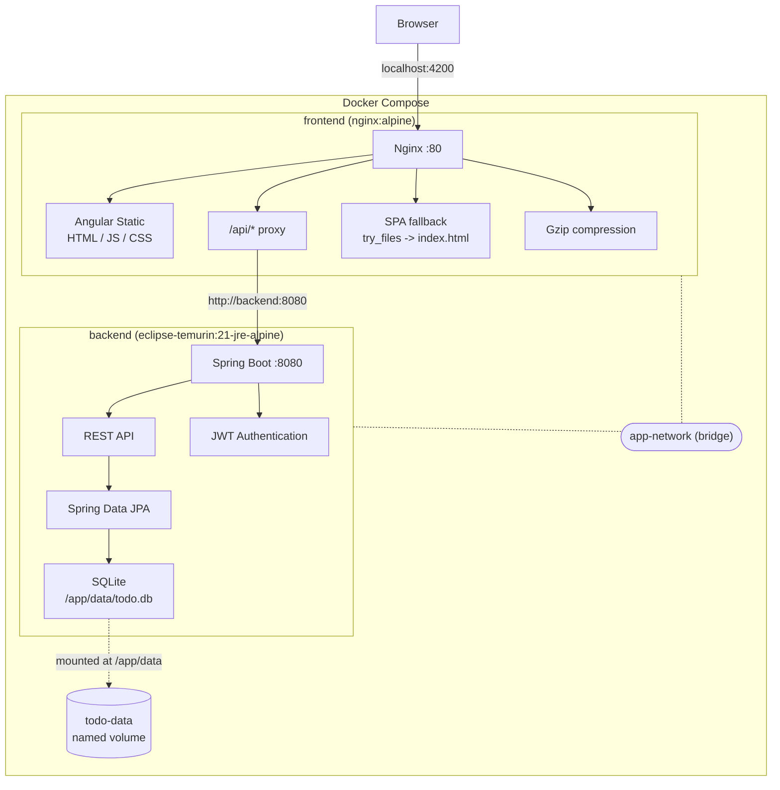
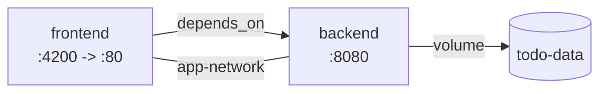
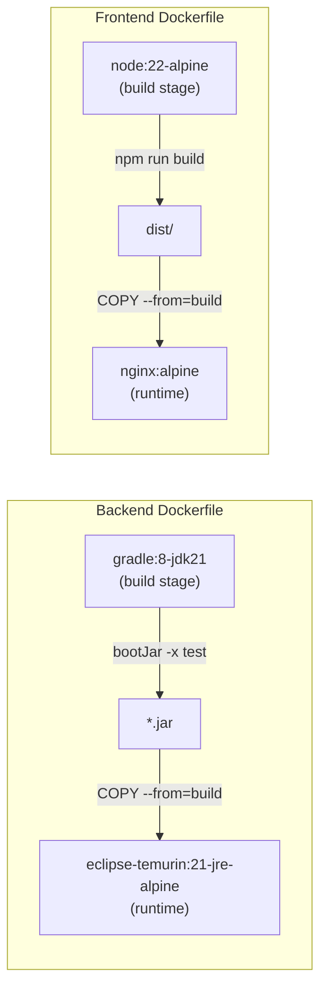

# Docker Deployment

The entire application can be launched with a single command using Docker Compose. No Java, Node.js, or Gradle installation required on the host — just Docker.

## Prerequisites

- **Docker** (v20+)
- **Docker Compose** (v2+)

## Quick Start

```bash
# Build images and start both containers
docker compose up --build

# View logs
docker compose logs -f

# Stop everything
docker compose down

# Stop and remove persisted data
docker compose down -v
```

Once running:
- **Frontend:** http://localhost:4200
- **Backend API:** http://localhost:8080

### Command Flags

| Command | Behavior |
|---------|----------|
| `docker compose up` | Start with existing images, logs in foreground |
| `docker compose up -d` | Start with existing images, runs in background |
| `docker compose up --build` | Rebuild images then start, logs in foreground |
| `docker compose up --build -d` | Rebuild images then start, runs in background |

- `--build` forces Docker to rebuild images from the Dockerfiles (picks up code changes)
- `-d` (detached) runs containers in the background so you get your terminal back

## Deployment Architecture



### Service Dependencies



## Environment Variables

The backend container accepts configuration via environment variables defined in `docker-compose.yml`:

| Variable | Default | Purpose |
|----------|---------|---------|
| `SPRING_DATASOURCE_URL` | `jdbc:sqlite:/app/data/todo.db` | Database connection string |
| `JWT_SECRET` | `default-dev-secret-change-in-production` | HS256 signing key (32+ chars) |
| `CORS_ALLOWED_ORIGINS` | `http://localhost:4200` | Allowed CORS origins |

The `JWT_SECRET` uses a shell variable expansion (`${JWT_SECRET:-default}`) so it can be overridden from the host environment or a `.env` file without modifying `docker-compose.yml`.

## How Nginx Works in This Setup

Nginx inside the frontend container serves three roles:

### 1. Static File Server

After the Angular app is compiled (`npm run build`), it produces plain HTML, JavaScript, and CSS files. Nginx serves these static assets directly to the browser — no Node.js runtime needed in production.

### 2. Reverse Proxy for API Calls

When the Angular app makes HTTP requests to `/api/*`, the browser sends them to `localhost:4200` (Nginx). Nginx intercepts these and forwards them internally to the backend container:

```
Browser -> localhost:4200/api/todos -> Nginx -> http://backend:8080/api/todos -> Spring Boot
```

This works because Docker Compose places both containers on the same network (`app-network`) and registers each service name as a DNS entry. Nginx resolves `backend` to the backend container's internal IP automatically.

The `backend` hostname comes from the service name defined in `docker-compose.yml`:

```yaml
services:
  backend:    # <- this becomes a DNS hostname on the Docker network
    build: ./spring-todo-backend
    ...
```

The relevant `nginx.conf` block:

```nginx
location /api/ {
    proxy_pass http://backend:8080/api/;
    proxy_set_header Host $host;
    proxy_set_header X-Real-IP $remote_addr;
    proxy_set_header X-Forwarded-For $proxy_add_x_forwarded_for;
    proxy_set_header X-Forwarded-Proto $scheme;
}
```

The `proxy_set_header` lines forward the original client information (IP address, protocol) so the backend knows who is actually making the request rather than thinking every request comes from Nginx.

### 3. SPA Routing Fallback

Angular uses client-side routing — URLs like `/login` or `/dashboard` do not correspond to actual files on disk. Without this rule, refreshing the browser on `/dashboard` would return a 404. Nginx catches any path that does not match a real file and serves `index.html`, letting Angular's router take over:

```nginx
location / {
    try_files $uri $uri/ /index.html;
}
```

## Request Flow Examples

**Loading the app:**
```
Browser -> GET localhost:4200/          -> Nginx serves index.html
Browser -> GET localhost:4200/main.js   -> Nginx serves Angular bundle
Browser -> GET localhost:4200/styles.css -> Nginx serves stylesheet
```

**Navigating in the SPA:**
```
Browser -> GET localhost:4200/dashboard -> Nginx: no file "dashboard" found
                                       -> Serves index.html instead
                                       -> Angular Router handles /dashboard
```

**Making an API call:**
```
Browser -> POST localhost:4200/api/auth/login -> Nginx proxies to backend:8080
                                             -> Spring Boot authenticates
                                             -> Returns JWT token
```

## Port Mapping

| Service | Container Port | Host Port | Why |
|---------|:--------------:|:---------:|-----|
| Frontend (Nginx) | 80 | 4200 | Matches Angular's default dev port for consistency |
| Backend (Tomcat) | 8080 | 8080 | Standard Spring Boot port |

The port mapping is defined in `docker-compose.yml` under the `ports` key:

```yaml
frontend:
  ports:
    - "4200:80"   # host:container -- maps your machine's 4200 to Nginx's 80
```

Inside the container, Nginx always listens on port 80. Docker's port mapping is what makes it accessible from your host at `localhost:4200`.

## Data Persistence

The SQLite database is stored in a Docker named volume (`todo-data`), mapped to `/app/data/todo.db` inside the backend container. This means:
- Data survives `docker compose down` and `docker compose restart`
- Data is only deleted with `docker compose down -v` (removes volumes)

## Multi-Stage Builds

Both Dockerfiles use multi-stage builds to keep production images small:

| Image | Build Stage | Runtime Stage | Final Size |
|-------|-------------|---------------|:----------:|
| Frontend | `node:22-alpine` (compile Angular) | `nginx:alpine` (serve static files) | ~94 MB |
| Backend | `gradle:8-jdk21` (compile JAR) | `eclipse-temurin:21-jre-alpine` (run JAR) | ~593 MB |

Source code, compilers, and dev dependencies are discarded after the build stage — only the compiled output makes it into the final image.

### Build Stage Flow



### Why Multi-Stage?

A single-stage build would include the entire Gradle SDK, JDK, source code, and all build dependencies in the final image. Multi-stage lets you use a heavy image to compile, then copy only the artifact (JAR or static files) into a minimal runtime image.

## Security

Both containers run as non-root users:
- Backend: `appuser` (UID 1001)
- Frontend: `nginx-user` (UID 1001)

If a container is compromised, the attacker has limited privileges — they cannot install packages, modify system files, or escalate to root.

## Docker Files Overview

| File | Location | Purpose |
|------|----------|---------|
| `Dockerfile` | `spring-todo-backend/` | Multi-stage build for the Spring Boot JAR |
| `Dockerfile` | `angular-todo-frontend/` | Multi-stage build for Angular + Nginx |
| `.dockerignore` | `spring-todo-backend/` | Excludes build/, .gradle/, todo.db, IDE files |
| `.dockerignore` | `angular-todo-frontend/` | Excludes node_modules/, dist/, .angular/ |
| `nginx.conf` | `angular-todo-frontend/` | Nginx config: static serving + API proxy + SPA routing |
| `docker-compose.yml` | Project root | Orchestrates both services with network and volume |


---

## Docker Desktop: What You See After `docker compose up --build`

After a successful build and run, Docker Desktop shows:

| Resource | Count | What It Is |
|----------|:-----:|------------|
| Container | 1 (group) | A Compose "stack" grouping both `frontend` and `backend` as one unit |
| Images | 2 | `pep-team02-thedjs-frontend` and `pep-team02-thedjs-backend` |
| Volume | 1 | `pep-team02-thedjs_todo-data` — persists `todo.db` across restarts |

Docker Desktop groups the two containers under one Compose project name (derived from the root directory name). Expanding the group reveals the individual `frontend` and `backend` containers.

The two images correspond to the final stage of each multi-stage Dockerfile. The build stages (`gradle:8-jdk21`, `node:22-alpine`) are intermediate layers that Docker caches but does not show as named images.

The volume is a persistent storage location managed by Docker. It maps to `/app/data/` inside the backend container. The SQLite file lives there so it survives container recreation.

---

## Detailed Script Reference

### `docker-compose.yml`

```yaml
services:
  backend:
    build: ./spring-todo-backend
    ports:
      - "8080:8080"
    environment:
      - SPRING_DATASOURCE_URL=jdbc:sqlite:/app/data/todo.db
      - JWT_SECRET=${JWT_SECRET:-default-dev-secret-change-in-production}
      - CORS_ALLOWED_ORIGINS=http://localhost:4200
    volumes:
      - todo-data:/app/data
    networks:
      - app-network

  frontend:
    build: ./angular-todo-frontend
    ports:
      - "4200:80"
    depends_on:
      - backend
    networks:
      - app-network

networks:
  app-network:
    driver: bridge

volumes:
  todo-data:
```

| Key | Value | Explanation |
|-----|-------|-------------|
| `build` | `./spring-todo-backend` | Path to the directory containing the Dockerfile |
| `ports` | `"8080:8080"` | Maps host port to container port (host:container) |
| `environment` | `SPRING_DATASOURCE_URL=...` | Injects config into the container as env vars; Spring Boot reads these automatically via relaxed binding |
| `JWT_SECRET` | `${JWT_SECRET:-default...}` | Shell expansion: uses host `$JWT_SECRET` if set, otherwise falls back to the default string |
| `volumes` | `todo-data:/app/data` | Mounts the named volume into the container at `/app/data` |
| `depends_on` | `backend` | Docker starts `backend` before `frontend` (does not wait for health, only start order) |
| `networks` | `app-network` | Both services join the same bridge network so they can resolve each other by service name |
| `driver: bridge` | — | Default Docker network type; containers get private IPs on an isolated subnet |
| `volumes: todo-data:` | — | Declares a named volume managed by Docker; persists across `down`/`up` cycles |

---

### `spring-todo-backend/Dockerfile`

```dockerfile
# Stage 1: Build
FROM gradle:8-jdk21 AS build
WORKDIR /workspace
COPY gradlew gradlew
COPY gradle/ gradle/
COPY build.gradle.kts build.gradle.kts
COPY settings.gradle.kts settings.gradle.kts
RUN chmod +x gradlew && ./gradlew dependencies --no-daemon
COPY src/ src/
RUN ./gradlew bootJar -x test --no-daemon

# Stage 2: Runtime
FROM eclipse-temurin:21-jre-alpine
RUN adduser -D -u 1001 appuser
RUN mkdir -p /app/data && chown -R appuser:appuser /app
WORKDIR /app
COPY --from=build /workspace/build/libs/*.jar app.jar
RUN chown appuser:appuser /app/app.jar
USER appuser
EXPOSE 8080
ENTRYPOINT ["java", "-jar", "app.jar", "--spring.datasource.url=jdbc:sqlite:/app/data/todo.db"]
```

| Line | Purpose |
|------|---------|
| `FROM gradle:8-jdk21 AS build` | Uses Gradle 8 + JDK 21 image for compilation. Named `build` so the runtime stage can reference it. |
| `COPY gradlew ... build.gradle.kts ...` | Copies only build config files first. Docker caches this layer — if dependencies haven't changed, it skips re-downloading. |
| `RUN ./gradlew dependencies` | Pre-downloads all Gradle dependencies into the cache layer. Subsequent code changes won't re-trigger this. |
| `COPY src/ src/` | Copies source code. This layer changes on every code edit. |
| `RUN ./gradlew bootJar -x test` | Compiles the application into a fat JAR. `-x test` skips tests (they run in CI, not in the Docker build). |
| `FROM eclipse-temurin:21-jre-alpine` | Starts a fresh minimal image with only JRE (no compiler, no Gradle). This is the final image. |
| `RUN adduser -D -u 1001 appuser` | Creates a non-root user for security. |
| `mkdir -p /app/data` | Creates the directory where the SQLite volume will be mounted. |
| `COPY --from=build ... app.jar` | Copies only the compiled JAR from the build stage. Everything else (source, Gradle, JDK) is discarded. |
| `USER appuser` | Switches to non-root for all subsequent commands and at runtime. |
| `EXPOSE 8080` | Documents which port the container listens on (does not publish it — `ports` in compose does that). |
| `ENTRYPOINT [...]` | Runs the JAR with the datasource URL pointing to the volume-mounted path. |

---

### `angular-todo-frontend/Dockerfile`

```dockerfile
# Stage 1: Build the Angular application
FROM node:22-alpine AS build
WORKDIR /app
COPY package.json package-lock.json ./
RUN npm ci
COPY . .
RUN npm run build

# Stage 2: Serve with Nginx
FROM nginx:alpine
RUN adduser -D -u 1001 nginx-user
RUN rm /etc/nginx/conf.d/default.conf
COPY nginx.conf /etc/nginx/conf.d/nginx.conf
COPY --from=build /app/dist/angular-todo-frontend/browser/ /usr/share/nginx/html/
RUN chown -R nginx-user:nginx-user /var/cache/nginx /var/run /usr/share/nginx/html /run && \
    touch /run/nginx.pid && chown nginx-user:nginx-user /run/nginx.pid
USER nginx-user
EXPOSE 80
CMD ["nginx", "-g", "daemon off;"]
```

| Line | Purpose |
|------|---------|
| `FROM node:22-alpine AS build` | Uses Node 22 for Angular compilation. Alpine variant keeps the build image small. |
| `COPY package.json package-lock.json` | Copies only dependency manifests first for layer caching. |
| `RUN npm ci` | Installs exact versions from lock file. Cached unless `package-lock.json` changes. |
| `COPY . .` | Copies all source code (`.dockerignore` excludes `node_modules/`, `dist/`, `.angular/`). |
| `RUN npm run build` | Compiles Angular into static HTML/JS/CSS in `dist/`. |
| `FROM nginx:alpine` | Starts a fresh Nginx image. Node.js is discarded — only static files carry over. |
| `RUN adduser -D -u 1001 nginx-user` | Creates a non-root user. |
| `RUN rm .../default.conf` | Removes Nginx's default config to avoid conflicts with the custom one. |
| `COPY nginx.conf ...` | Installs the custom config (API proxy + SPA fallback + gzip). |
| `COPY --from=build .../browser/ ...` | Copies only the compiled Angular output into Nginx's serving directory. |
| `RUN chown -R nginx-user:nginx-user ...` | Grants the non-root user write access to Nginx's runtime directories (cache, PID file, logs). |
| `USER nginx-user` | Runs Nginx as non-root at runtime. |
| `CMD ["nginx", "-g", "daemon off;"]` | Starts Nginx in the foreground (required for Docker to keep the container alive). |

---

### `angular-todo-frontend/nginx.conf`

```nginx
server {
    listen 80;
    server_name localhost;

    root /usr/share/nginx/html;
    index index.html;

    gzip on;
    gzip_types text/css application/javascript application/json;
    gzip_min_length 256;

    location /api/ {
        proxy_pass http://backend:8080/api/;
        proxy_set_header Host $host;
        proxy_set_header X-Real-IP $remote_addr;
        proxy_set_header X-Forwarded-For $proxy_add_x_forwarded_for;
        proxy_set_header X-Forwarded-Proto $scheme;
    }

    location / {
        try_files $uri $uri/ /index.html;
    }
}
```

| Directive | Purpose |
|-----------|---------|
| `listen 80` | Nginx listens on port 80 inside the container (mapped to 4200 on host via compose) |
| `root /usr/share/nginx/html` | Directory containing the compiled Angular files |
| `gzip on` | Enables response compression for CSS, JS, and JSON (reduces transfer size) |
| `gzip_min_length 256` | Only compress responses larger than 256 bytes (avoids overhead on tiny files) |
| `location /api/` | Matches any request path starting with `/api/` |
| `proxy_pass http://backend:8080/api/` | Forwards to the backend container. `backend` resolves via Docker DNS. |
| `proxy_set_header Host $host` | Passes the original Host header so the backend sees the real hostname |
| `proxy_set_header X-Real-IP` | Passes the real client IP (not Nginx's internal IP) |
| `proxy_set_header X-Forwarded-For` | Appends to the proxy chain for logging and rate limiting |
| `proxy_set_header X-Forwarded-Proto` | Tells the backend whether the original request was HTTP or HTTPS |
| `location /` | Catches all other paths (Angular routes) |
| `try_files $uri $uri/ /index.html` | Serves the file if it exists; otherwise falls back to `index.html` for client-side routing |

---

### `spring-todo-backend/.dockerignore`

```
build/
.gradle/
todo.db
.idea/
*.iml
.jqwik-database
```

Excludes build artifacts, the local SQLite database, IDE files, and test caches from the Docker build context. This keeps the build fast and prevents local state from leaking into images.

---

### `angular-todo-frontend/.dockerignore`

```
node_modules/
dist/
.angular/
.vscode/
```

Excludes local `node_modules` (rebuilt inside the container via `npm ci`), previous build output, Angular cache, and editor config. Without this, Docker would copy hundreds of MB of unnecessary files into the build context.
