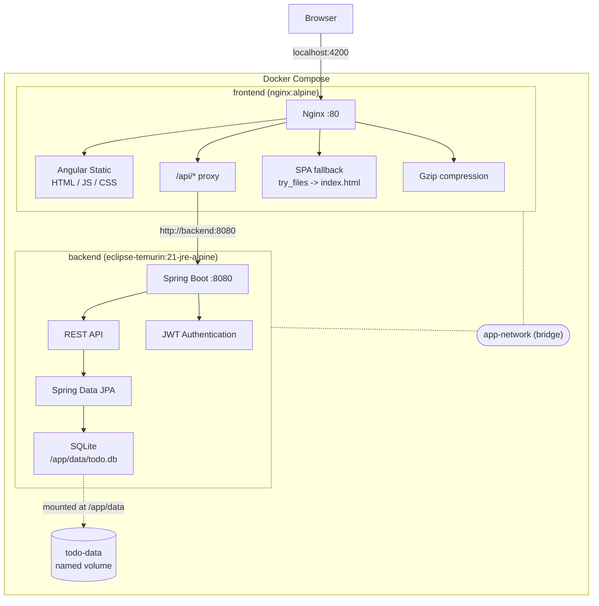
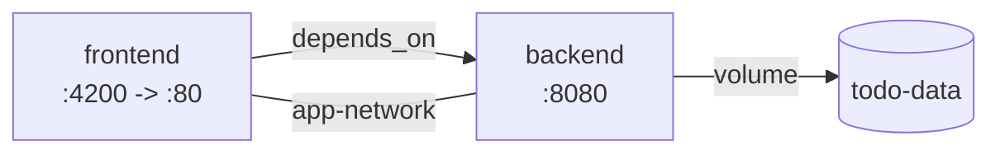
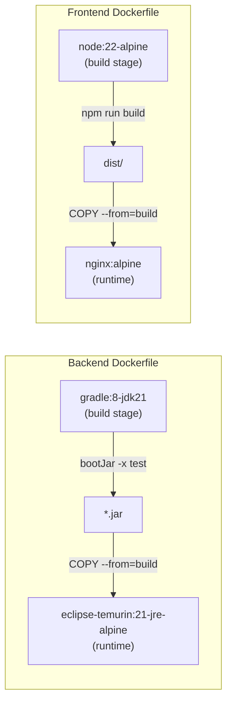
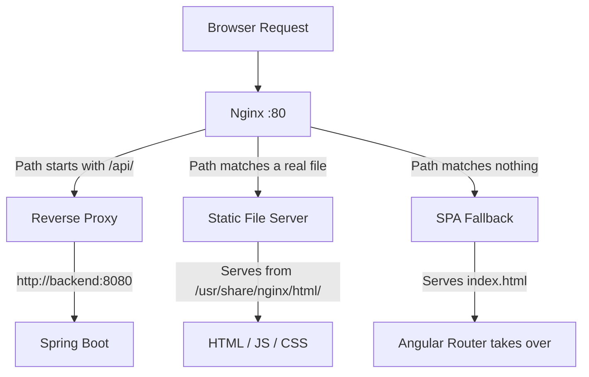
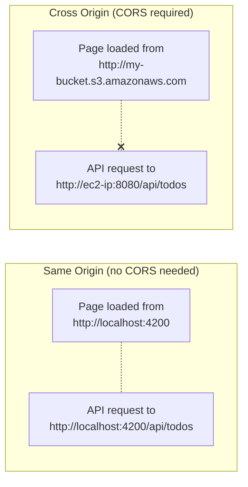
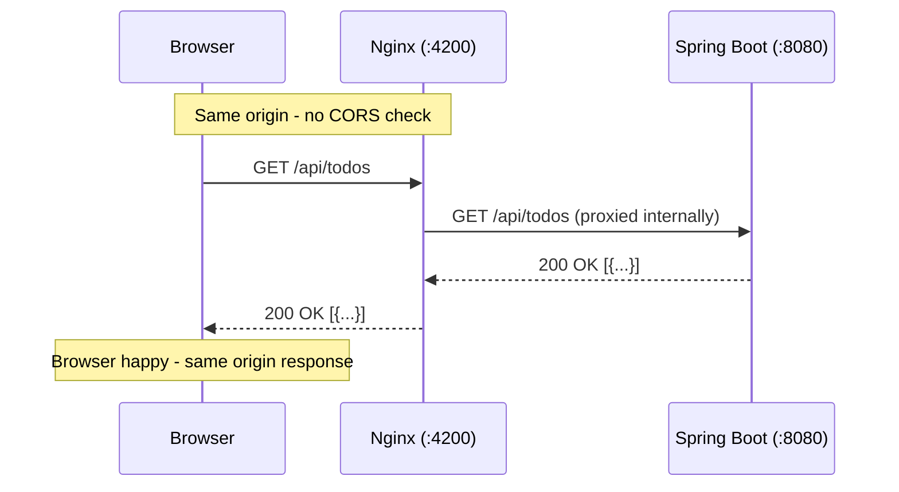
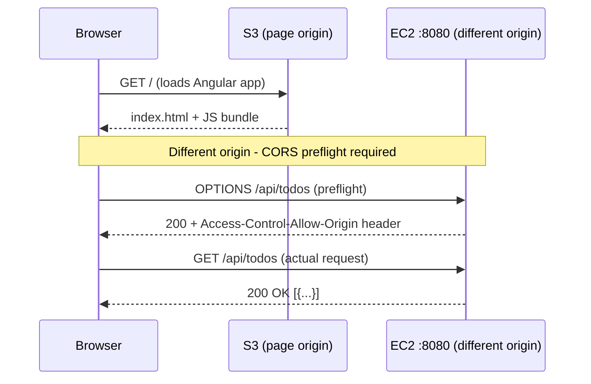

# Docker Deployment

The entire application can be launched with a single command using Docker Compose. No Java, Node.js, or Gradle installation required on the host — just Docker.

## Prerequisites

- **Docker** (v20+)
- **Docker Compose** (v2+)

## Quick Start

Create a `.env` file in the project root (same directory as `docker-compose.yml`):

```bash
# .env (gitignored — never committed)
JWT_SECRET=LocalDevSecretKeyThatIsAtLeast32Characters!!
CORS_ALLOWED_ORIGINS=http://localhost:4200
```

Then build and start:

```bash
docker compose up --build

# View logs
docker compose logs -f

# Stop everything
docker compose down

# Stop and remove persisted data
docker compose down -v
```

Once running:
- **Frontend:** http://localhost:4200
- **Backend API:** http://localhost:8080

### Command Flags

| Command | Behavior |
|---------|----------|
| `docker compose up` | Start with existing images, logs in foreground |
| `docker compose up -d` | Start with existing images, runs in background |
| `docker compose up --build` | Rebuild images then start, logs in foreground |
| `docker compose up --build -d` | Rebuild images then start, runs in background |

- `--build` forces Docker to rebuild images from the Dockerfiles (picks up code changes)
- `-d` (detached) runs containers in the background so you get your terminal back

## Deployment Architecture



### Service Dependencies



## Environment Variables and `.env` File

Configuration is externalized via environment variables. The codebase never changes between environments — only the `.env` file differs per machine.

### How It Works

1. Spring Boot reads `application.properties` for defaults (local dev values)
2. Environment variables override any matching property via Spring's relaxed binding:
   - `jwt.secret` in properties is overridden by env var `JWT_SECRET`
   - `cors.allowed-origins` is overridden by env var `CORS_ALLOWED_ORIGINS`
   - `spring.datasource.url` is overridden by env var `SPRING_DATASOURCE_URL`
3. Docker Compose reads a `.env` file in the project root and injects variables into containers

### The `.env` File (not committed to git)

Create a `.env` file in the project root for local Docker development:

```bash
# .env (local development — this file is gitignored)
JWT_SECRET=LocalDevSecretKeyThatIsAtLeast32Characters!!
CORS_ALLOWED_ORIGINS=http://localhost:4200
```

Docker Compose substitutes `${JWT_SECRET:-default-dev-secret-change-in-production}` with the value from `.env`. If no `.env` exists, the default after `:-` is used.

### Variable Reference

| Variable | Default (in docker-compose.yml) | Purpose |
|----------|--------------------------------|---------|
| `SPRING_DATASOURCE_URL` | `jdbc:sqlite:/app/data/todo.db` | Database connection string |
| `JWT_SECRET` | `default-dev-secret-change-in-production` | HS256 signing key (32+ chars) |
| `CORS_ALLOWED_ORIGINS` | `http://localhost:4200` | Allowed CORS origins |

### Angular (Frontend) — No Environment Config Needed

All Angular HTTP calls use relative paths (`/api/auth/login`, `/api/todos`). Nginx proxies these to the backend container. The frontend has zero environment-specific configuration — it works identically regardless of where it is deployed, as long as the serving layer (Nginx locally, ALB/CloudFront in production) routes `/api/*` to the backend.

## How Nginx Works in This Setup

Nginx inside the frontend container serves three roles:

### 1. Static File Server

After the Angular app is compiled (`npm run build`), it produces plain HTML, JavaScript, and CSS files. Nginx serves these static assets directly to the browser — no Node.js runtime needed in production.

### 2. Reverse Proxy for API Calls

When the Angular app makes HTTP requests to `/api/*`, the browser sends them to `localhost:4200` (Nginx). Nginx intercepts these and forwards them internally to the backend container:

```
Browser -> localhost:4200/api/todos -> Nginx -> http://backend:8080/api/todos -> Spring Boot
```

This works because Docker Compose places both containers on the same network (`app-network`) and registers each service name as a DNS entry. Nginx resolves `backend` to the backend container's internal IP automatically.

The `backend` hostname comes from the service name defined in `docker-compose.yml`:

```yaml
services:
  backend:    # <- this becomes a DNS hostname on the Docker network
    build: ./spring-todo-backend
    ...
```

The relevant `nginx.conf` block:

```nginx
location /api/ {
    proxy_pass http://backend:8080/api/;
    proxy_set_header Host $host;
    proxy_set_header X-Real-IP $remote_addr;
    proxy_set_header X-Forwarded-For $proxy_add_x_forwarded_for;
    proxy_set_header X-Forwarded-Proto $scheme;
}
```

The `proxy_set_header` lines forward the original client information (IP address, protocol) so the backend knows who is actually making the request rather than thinking every request comes from Nginx.

### 3. SPA Routing Fallback

Angular uses client-side routing — URLs like `/login` or `/dashboard` do not correspond to actual files on disk. Without this rule, refreshing the browser on `/dashboard` would return a 404. Nginx catches any path that does not match a real file and serves `index.html`, letting Angular's router take over:

```nginx
location / {
    try_files $uri $uri/ /index.html;
}
```

## Request Flow Examples

**Loading the app:**
```
Browser -> GET localhost:4200/          -> Nginx serves index.html
Browser -> GET localhost:4200/main.js   -> Nginx serves Angular bundle
Browser -> GET localhost:4200/styles.css -> Nginx serves stylesheet
```

**Navigating in the SPA:**
```
Browser -> GET localhost:4200/dashboard -> Nginx: no file "dashboard" found
                                       -> Serves index.html instead
                                       -> Angular Router handles /dashboard
```

**Making an API call:**
```
Browser -> POST localhost:4200/api/auth/login -> Nginx proxies to backend:8080
                                             -> Spring Boot authenticates
                                             -> Returns JWT token
```

## Port Mapping

| Service | Container Port | Host Port | Why |
|---------|:--------------:|:---------:|-----|
| Frontend (Nginx) | 80 | 4200 | Matches Angular's default dev port for consistency |
| Backend (Tomcat) | 8080 | 8080 | Standard Spring Boot port |

The port mapping is defined in `docker-compose.yml` under the `ports` key:

```yaml
frontend:
  ports:
    - "4200:80"   # host:container -- maps your machine's 4200 to Nginx's 80
```

Inside the container, Nginx always listens on port 80. Docker's port mapping is what makes it accessible from your host at `localhost:4200`.

## Data Persistence

The SQLite database is stored in a Docker named volume (`todo-data`), mapped to `/app/data/todo.db` inside the backend container. This means:
- Data survives `docker compose down` and `docker compose restart`
- Data is only deleted with `docker compose down -v` (removes volumes)

## Multi-Stage Builds

Both Dockerfiles use multi-stage builds to keep production images small:

| Image | Build Stage | Runtime Stage | Final Size |
|-------|-------------|---------------|:----------:|
| Frontend | `node:22-alpine` (compile Angular) | `nginx:alpine` (serve static files) | ~94 MB |
| Backend | `gradle:8-jdk21` (compile JAR) | `eclipse-temurin:21-jre-alpine` (run JAR) | ~593 MB |

Source code, compilers, and dev dependencies are discarded after the build stage — only the compiled output makes it into the final image.

### Build Stage Flow



### Why Multi-Stage?

A single-stage build would include the entire Gradle SDK, JDK, source code, and all build dependencies in the final image. Multi-stage lets you use a heavy image to compile, then copy only the artifact (JAR or static files) into a minimal runtime image.

## Security

Both containers run as non-root users:
- Backend: `appuser` (UID 1001)
- Frontend: `nginx-user` (UID 1001)

If a container is compromised, the attacker has limited privileges — they cannot install packages, modify system files, or escalate to root.

## Docker Files Overview

| File | Location | Purpose |
|------|----------|---------|
| `Dockerfile` | `spring-todo-backend/` | Multi-stage build for the Spring Boot JAR |
| `Dockerfile` | `angular-todo-frontend/` | Multi-stage build for Angular + Nginx |
| `.dockerignore` | `spring-todo-backend/` | Excludes build/, .gradle/, todo.db, IDE files |
| `.dockerignore` | `angular-todo-frontend/` | Excludes node_modules/, dist/, .angular/ |
| `nginx.conf` | `angular-todo-frontend/` | Nginx config: static serving + API proxy + SPA routing |
| `docker-compose.yml` | Project root | Orchestrates both services with network and volume |


---

## Docker Desktop: What You See After `docker compose up --build`

After a successful build and run, Docker Desktop shows:

| Resource | Count | What It Is |
|----------|:-----:|------------|
| Container | 1 (group) | A Compose "stack" grouping both `frontend` and `backend` as one unit |
| Images | 2 | `pep-team02-thedjs-frontend` and `pep-team02-thedjs-backend` |
| Volume | 1 | `pep-team02-thedjs_todo-data` — persists `todo.db` across restarts |

Docker Desktop groups the two containers under one Compose project name (derived from the root directory name). Expanding the group reveals the individual `frontend` and `backend` containers.

The two images correspond to the final stage of each multi-stage Dockerfile. The build stages (`gradle:8-jdk21`, `node:22-alpine`) are intermediate layers that Docker caches but does not show as named images.

The volume is a persistent storage location managed by Docker. It maps to `/app/data/` inside the backend container. The SQLite file lives there so it survives container recreation.

---

## Detailed Script Reference

### `docker-compose.yml`

```yaml
services:
  backend:
    build: ./spring-todo-backend
    ports:
      - "8080:8080"
    environment:
      - SPRING_DATASOURCE_URL=jdbc:sqlite:/app/data/todo.db
      - JWT_SECRET=${JWT_SECRET:-default-dev-secret-change-in-production}
      - CORS_ALLOWED_ORIGINS=${CORS_ALLOWED_ORIGINS:-http://localhost:4200}
    volumes:
      - todo-data:/app/data
    networks:
      - app-network

  frontend:
    build: ./angular-todo-frontend
    ports:
      - "4200:80"
    depends_on:
      - backend
    networks:
      - app-network

networks:
  app-network:
    driver: bridge

volumes:
  todo-data:
```

| Key | Value | Explanation |
|-----|-------|-------------|
| `build` | `./spring-todo-backend` | Path to the directory containing the Dockerfile |
| `ports` | `"8080:8080"` | Maps host port to container port (host:container) |
| `environment` | `SPRING_DATASOURCE_URL=...` | Injects config into the container as env vars; Spring Boot reads these automatically via relaxed binding |
| `JWT_SECRET` | `${JWT_SECRET:-default...}` | Shell expansion: uses host `$JWT_SECRET` if set, otherwise falls back to the default string |
| `volumes` | `todo-data:/app/data` | Mounts the named volume into the container at `/app/data` |
| `depends_on` | `backend` | Docker starts `backend` before `frontend` (does not wait for health, only start order) |
| `networks` | `app-network` | Both services join the same bridge network so they can resolve each other by service name |
| `driver: bridge` | — | Default Docker network type; containers get private IPs on an isolated subnet |
| `volumes: todo-data:` | — | Declares a named volume managed by Docker; persists across `down`/`up` cycles |

---

### `spring-todo-backend/Dockerfile`

```dockerfile
# Stage 1: Build
FROM gradle:8-jdk21 AS build
WORKDIR /workspace
COPY gradlew gradlew
COPY gradle/ gradle/
COPY build.gradle.kts build.gradle.kts
COPY settings.gradle.kts settings.gradle.kts
RUN chmod +x gradlew && ./gradlew dependencies --no-daemon
COPY src/ src/
RUN ./gradlew bootJar -x test --no-daemon

# Stage 2: Runtime
FROM eclipse-temurin:21-jre-alpine
RUN adduser -D -u 1001 appuser
RUN mkdir -p /app/data && chown -R appuser:appuser /app
WORKDIR /app
COPY --from=build /workspace/build/libs/*.jar app.jar
RUN chown appuser:appuser /app/app.jar
USER appuser
EXPOSE 8080
ENTRYPOINT ["java", "-jar", "app.jar", "--spring.datasource.url=jdbc:sqlite:/app/data/todo.db"]
```

| Line | Purpose |
|------|---------|
| `FROM gradle:8-jdk21 AS build` | Uses Gradle 8 + JDK 21 image for compilation. Named `build` so the runtime stage can reference it. |
| `COPY gradlew ... build.gradle.kts ...` | Copies only build config files first. Docker caches this layer — if dependencies haven't changed, it skips re-downloading. |
| `RUN ./gradlew dependencies` | Pre-downloads all Gradle dependencies into the cache layer. Subsequent code changes won't re-trigger this. |
| `COPY src/ src/` | Copies source code. This layer changes on every code edit. |
| `RUN ./gradlew bootJar -x test` | Compiles the application into a fat JAR. `-x test` skips tests (they run in CI, not in the Docker build). |
| `FROM eclipse-temurin:21-jre-alpine` | Starts a fresh minimal image with only JRE (no compiler, no Gradle). This is the final image. |
| `RUN adduser -D -u 1001 appuser` | Creates a non-root user for security. |
| `mkdir -p /app/data` | Creates the directory where the SQLite volume will be mounted. |
| `COPY --from=build ... app.jar` | Copies only the compiled JAR from the build stage. Everything else (source, Gradle, JDK) is discarded. |
| `USER appuser` | Switches to non-root for all subsequent commands and at runtime. |
| `EXPOSE 8080` | Documents which port the container listens on (does not publish it — `ports` in compose does that). |
| `ENTRYPOINT [...]` | Runs the JAR with the datasource URL pointing to the volume-mounted path. |

---

### `angular-todo-frontend/Dockerfile`

```dockerfile
# Stage 1: Build the Angular application
FROM node:22-alpine AS build
WORKDIR /app
COPY package.json package-lock.json ./
RUN npm ci
COPY . .
RUN npm run build

# Stage 2: Serve with Nginx
FROM nginx:alpine
RUN adduser -D -u 1001 nginx-user
RUN rm /etc/nginx/conf.d/default.conf
COPY nginx.conf /etc/nginx/conf.d/nginx.conf
COPY --from=build /app/dist/angular-todo-frontend/browser/ /usr/share/nginx/html/
RUN chown -R nginx-user:nginx-user /var/cache/nginx /var/run /usr/share/nginx/html /run && \
    touch /run/nginx.pid && chown nginx-user:nginx-user /run/nginx.pid
USER nginx-user
EXPOSE 80
CMD ["nginx", "-g", "daemon off;"]
```

| Line | Purpose |
|------|---------|
| `FROM node:22-alpine AS build` | Uses Node 22 for Angular compilation. Alpine variant keeps the build image small. |
| `COPY package.json package-lock.json` | Copies only dependency manifests first for layer caching. |
| `RUN npm ci` | Installs exact versions from lock file. Cached unless `package-lock.json` changes. |
| `COPY . .` | Copies all source code (`.dockerignore` excludes `node_modules/`, `dist/`, `.angular/`). |
| `RUN npm run build` | Compiles Angular into static HTML/JS/CSS in `dist/`. |
| `FROM nginx:alpine` | Starts a fresh Nginx image. Node.js is discarded — only static files carry over. |
| `RUN adduser -D -u 1001 nginx-user` | Creates a non-root user. |
| `RUN rm .../default.conf` | Removes Nginx's default config to avoid conflicts with the custom one. |
| `COPY nginx.conf ...` | Installs the custom config (API proxy + SPA fallback + gzip). |
| `COPY --from=build .../browser/ ...` | Copies only the compiled Angular output into Nginx's serving directory. |
| `RUN chown -R nginx-user:nginx-user ...` | Grants the non-root user write access to Nginx's runtime directories (cache, PID file, logs). |
| `USER nginx-user` | Runs Nginx as non-root at runtime. |
| `CMD ["nginx", "-g", "daemon off;"]` | Starts Nginx in the foreground (required for Docker to keep the container alive). |

---

### `angular-todo-frontend/nginx.conf`

```nginx
server {
    listen 80;
    server_name localhost;

    root /usr/share/nginx/html;
    index index.html;

    gzip on;
    gzip_types text/css application/javascript application/json;
    gzip_min_length 256;

    location /api/ {
        proxy_pass http://backend:8080/api/;
        proxy_set_header Host $host;
        proxy_set_header X-Real-IP $remote_addr;
        proxy_set_header X-Forwarded-For $proxy_add_x_forwarded_for;
        proxy_set_header X-Forwarded-Proto $scheme;
    }

    location / {
        try_files $uri $uri/ /index.html;
    }
}
```

| Directive | Purpose |
|-----------|---------|
| `listen 80` | Nginx listens on port 80 inside the container (mapped to 4200 on host via compose) |
| `root /usr/share/nginx/html` | Directory containing the compiled Angular files |
| `gzip on` | Enables response compression for CSS, JS, and JSON (reduces transfer size) |
| `gzip_min_length 256` | Only compress responses larger than 256 bytes (avoids overhead on tiny files) |
| `location /api/` | Matches any request path starting with `/api/` |
| `proxy_pass http://backend:8080/api/` | Forwards to the backend container. `backend` resolves via Docker DNS. |
| `proxy_set_header Host $host` | Passes the original Host header so the backend sees the real hostname |
| `proxy_set_header X-Real-IP` | Passes the real client IP (not Nginx's internal IP) |
| `proxy_set_header X-Forwarded-For` | Appends to the proxy chain for logging and rate limiting |
| `proxy_set_header X-Forwarded-Proto` | Tells the backend whether the original request was HTTP or HTTPS |
| `location /` | Catches all other paths (Angular routes) |
| `try_files $uri $uri/ /index.html` | Serves the file if it exists; otherwise falls back to `index.html` for client-side routing |

---

### `spring-todo-backend/.dockerignore`

```
build/
.gradle/
todo.db
.idea/
*.iml
.jqwik-database
```

Excludes build artifacts, the local SQLite database, IDE files, and test caches from the Docker build context. This keeps the build fast and prevents local state from leaking into images.

---

### `angular-todo-frontend/.dockerignore`

```
node_modules/
dist/
.angular/
.vscode/
```

Excludes local `node_modules` (rebuilt inside the container via `npm ci`), previous build output, Angular cache, and editor config. Without this, Docker would copy hundreds of MB of unnecessary files into the build context.


---

## Cleanup Commands

### Remove Everything This Project Created

```bash
# Stop containers + remove containers + remove volume + remove images (all in one)
docker compose down -v --rmi all
```

| Flag | Removes |
|------|---------|
| (no flags) | Stops and removes containers only |
| `-v` | Also removes the named volume (`todo-data`) and its data |
| `--rmi all` | Also removes the images built by compose (`frontend` and `backend`) |

After running this, Docker Desktop will show 0 containers, 0 project images, and 0 project volumes.

### Selective Cleanup

```bash
# Stop and remove containers only (keep images and data)
docker compose down

# Stop containers and remove volume (keep images)
docker compose down -v

# Remove dangling build cache (intermediate layers from multi-stage builds)
docker builder prune
```

### Nuclear Option (removes ALL Docker resources, not just this project)

```bash
docker system prune -a --volumes
```

This removes all stopped containers, all unused images, all unused volumes, and all build cache across your entire Docker installation. Use with caution.


---

## Nginx Deep Dive

Nginx is the production-grade web server inside the frontend container. It replaces the Node.js development server (`ng serve`) that runs during local development. Understanding Nginx's role is critical because it handles three fundamentally different types of requests through a single port.

### What Nginx Is

Nginx (pronounced "engine-x") is an open-source, high-performance HTTP server and reverse proxy. In this project it runs inside the frontend Docker container on port 80 (mapped to host port 4200). It serves compiled Angular files and proxies API requests to the backend.

### What Nginx Is NOT Doing Here

- It is NOT a load balancer (only one backend instance exists)
- It is NOT terminating TLS/HTTPS (handled by AWS or a separate layer in production)
- It is NOT running application logic (just serving files and forwarding requests)

### The Three Request Paths



### Path 1: Reverse Proxy (`/api/*`)

Any request path starting with `/api/` is forwarded to the backend container.

```nginx
location /api/ {
    proxy_pass http://backend:8080/api/;
}
```

The browser never talks directly to port 8080. From the browser's perspective, everything comes from a single origin (`localhost:4200`), eliminating CORS issues entirely. This is the key difference from production (where the browser talks to EC2 directly and CORS is required).

**Why this matters:** In local Docker, Nginx acts as a same-origin gateway. The Angular app calls `/api/todos` and Nginx silently routes it to the Java backend. No CORS headers needed. No cross-origin preflight requests. Clean.

### How Nginx Eliminates CORS (Same-Origin Trick)

CORS (Cross-Origin Resource Sharing) is a browser security policy. The browser blocks JavaScript from making HTTP requests to a different **origin** than the page was loaded from. An origin is defined as the combination of **protocol + hostname + port**.



In the local Docker setup, the browser loads the Angular app from `http://localhost:4200` and sends API requests to `http://localhost:4200/api/todos`. Same protocol (`http`), same hostname (`localhost`), same port (`4200`). The browser sees one origin and never triggers CORS.

Behind the scenes, Nginx receives the `/api/todos` request and forwards it to `http://backend:8080/api/todos` internally on the Docker network. But the browser does not know this. It only sees that it sent a request to `:4200` and got a response from `:4200`. The proxy is invisible.



Without Nginx (production S3 + EC2 setup), the browser sends requests directly to a different origin and CORS kicks in:



In the S3+EC2 case, the browser first sends a preflight OPTIONS request asking "Am I allowed to call this origin?" The backend must respond with `Access-Control-Allow-Origin: http://your-s3-url` or the browser blocks the real request.

**Summary:**
- Nginx proxy = same origin = CORS bypassed (browser never notices the proxy)
- S3 + EC2 = different origins = CORS required (backend must send allow headers)

### Path 2: Static File Server (real files)

When the browser requests `/main.js`, `/styles.css`, or any other file that physically exists in `/usr/share/nginx/html/`, Nginx serves it directly from disk.

```nginx
root /usr/share/nginx/html;
index index.html;
```

These are the compiled Angular build artifacts produced by `npm run build` during the Docker image build stage.

### Path 3: SPA Routing Fallback (everything else)

Angular uses client-side routing. URLs like `/login`, `/dashboard`, `/register` are virtual routes handled by JavaScript in the browser. There are no corresponding files on disk.

Without Nginx's fallback rule, refreshing the browser on `/dashboard` would return 404 because no `dashboard` file exists. The `try_files` directive solves this:

```nginx
location / {
    try_files $uri $uri/ /index.html;
}
```

Translation: "Try to serve the exact path as a file. If that fails, try it as a directory. If that also fails, serve `index.html` instead." Angular's router then reads the URL and renders the correct component.

### Gzip Compression

```nginx
gzip on;
gzip_types text/css application/javascript application/json;
gzip_min_length 256;
```

Nginx compresses responses before sending them to the browser. A 500KB JavaScript bundle becomes roughly 150KB over the wire. Only files larger than 256 bytes are compressed (compressing tiny responses would add overhead without meaningful size reduction).

### Why Nginx Instead of Node.js in Production

| Concern | Node.js (`ng serve`) | Nginx |
|---------|---------------------|-------|
| Purpose | Development server with hot reload | Production static server |
| Performance | Single-threaded, ~1K concurrent connections | Event-driven, ~10K+ concurrent connections |
| Memory | ~200MB (Angular compiler loaded) | ~5MB |
| Security | Exposes source maps, dev tooling | Serves only compiled output |
| Image size | Requires full Node.js runtime (~300MB) | Nginx Alpine image (~7MB) |

In production (Docker or otherwise), Angular is always compiled ahead of time and served as static files. There is no reason to ship the Node.js runtime.

### Proxy Headers Explained

```nginx
proxy_set_header Host $host;
proxy_set_header X-Real-IP $remote_addr;
proxy_set_header X-Forwarded-For $proxy_add_x_forwarded_for;
proxy_set_header X-Forwarded-Proto $scheme;
```

| Header | Value | Why the backend needs it |
|--------|-------|--------------------------|
| `Host` | Original hostname from browser | Some apps route differently based on hostname |
| `X-Real-IP` | Client's actual IP address | Logging, rate limiting, geolocation |
| `X-Forwarded-For` | Chain of proxy IPs the request passed through | Audit trail for multi-layer architectures |
| `X-Forwarded-Proto` | `http` or `https` | Backend can generate correct redirect URLs |

Without these headers, the backend would see every request as coming from Nginx's internal Docker IP (e.g., `172.18.0.3`) instead of the actual client.
