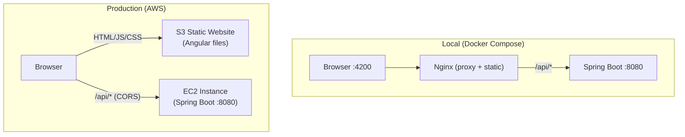
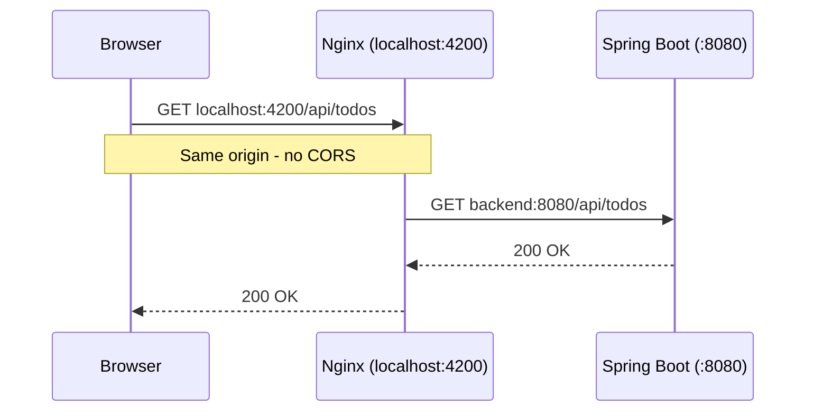
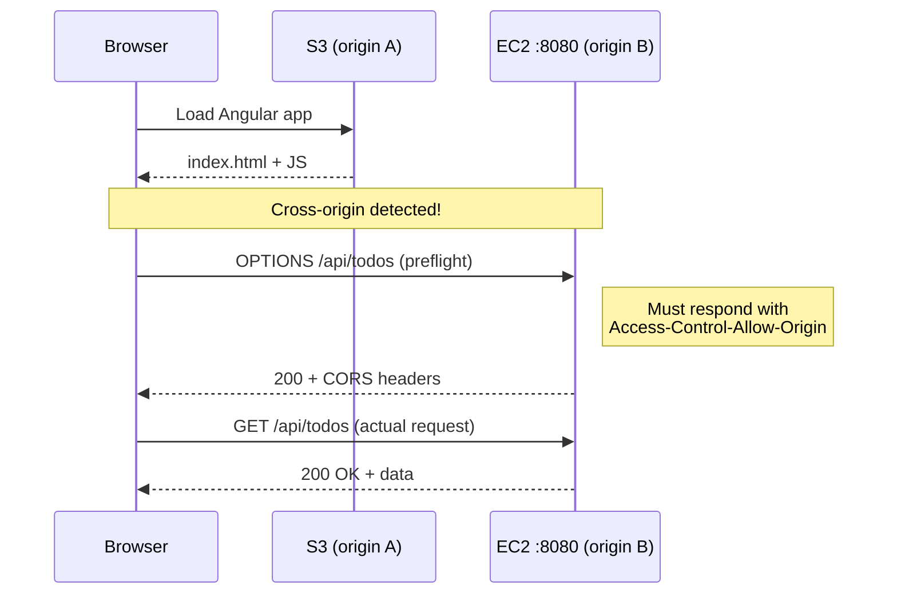

# Production Deployment Guide (AWS S3 + EC2)

This document describes how to deploy the Todo Management Application to AWS using S3 for the frontend and EC2 for the backend. This is the production architecture — distinct from the local Docker Compose setup which runs everything on one machine.

## Architecture Comparison



| Concern | Local (Docker) | Production (AWS) |
|---------|---------------|-----------------|
| Frontend hosting | Nginx container | S3 static website |
| API routing | Nginx reverse proxy (same origin) | Browser calls EC2 directly (cross-origin) |
| CORS | Not needed (same origin via proxy) | Required (S3 origin differs from EC2 origin) |
| TLS/HTTPS | Not configured | ACM certificate + CloudFront or ALB |
| Database | SQLite in Docker volume | SQLite on EBS volume attached to EC2 |
| Scaling | Single instance | EC2 sizing, optionally behind ALB |

## What Changes Between Local and Production

### 1. No Nginx — But You Still Need a Routing Layer

In local Docker, Nginx proxies `/api/*` to the backend. In production you have two options:

**Option A: S3 serves frontend directly (CORS required)**
The browser loads from S3 and calls EC2 directly. Different origins. CORS headers must be set on the backend via `CORS_ALLOWED_ORIGINS` in the `.env` file.

**Option B: CloudFront or ALB in front of both (no CORS needed)**
A single domain (e.g., `app.example.com`) routes `/api/*` to EC2 and everything else to S3. Same origin from the browser's perspective. No CORS. This is the cleaner production pattern but requires more AWS configuration.

The code works with both options unchanged — only the infrastructure and `.env` differ.

### 2. CORS Must Be Configured

#### What is CORS?

CORS (Cross-Origin Resource Sharing) is a browser security mechanism. When a web page loaded from one origin (protocol + hostname + port) tries to make an HTTP request to a different origin, the browser blocks it by default. This prevents malicious websites from making requests to your bank's API using your logged-in session.

An **origin** is defined as:
```
protocol :// hostname : port
```

Examples:
- `http://localhost:4200` and `http://localhost:8080` are **different origins** (different port)
- `http://my-bucket.s3.amazonaws.com` and `http://ec2-ip:8080` are **different origins** (different hostname and port)
- `http://localhost:4200` and `http://localhost:4200/api/todos` are the **same origin** (path does not matter)

#### Why CORS Is Not Needed Locally (Docker)

In the local Docker setup, Nginx acts as a reverse proxy on port 4200. The browser loads the page from `localhost:4200` and sends API requests to `localhost:4200/api/...`. From the browser's perspective, everything is the same origin. Nginx invisibly forwards `/api/*` to the backend on port 8080, but the browser never knows — it only sees responses from `:4200`.



#### Why CORS Is Required in Production (S3 + EC2)

In production, there is no Nginx proxy. The browser loads the Angular app from S3 (`http://bucket.s3-website.amazonaws.com`) and then tries to call the API on EC2 (`http://ec2-ip:8080/api/todos`). These are different origins. The browser blocks the request unless the backend explicitly permits it.



The **preflight** is an automatic OPTIONS request the browser sends before the real request. It asks: "Is origin A allowed to call you?" The backend must respond with:

```
Access-Control-Allow-Origin: http://bucket.s3-website.amazonaws.com
Access-Control-Allow-Methods: GET, POST, PUT, DELETE, OPTIONS
Access-Control-Allow-Headers: Content-Type, Authorization
```

If these headers are missing or the origin does not match, the browser discards the response and the JavaScript code receives a network error.

#### How to Configure CORS in This Project

The Spring Boot application already has CORS support via the `cors.allowed-origins` property (read by `WebConfig.java`). Update it to include the S3 website URL:

```properties
cors.allowed-origins=http://your-bucket.s3-website-us-east-1.amazonaws.com
```

Or set it as an environment variable on EC2:
```bash
export CORS_ALLOWED_ORIGINS=http://your-bucket.s3-website-us-east-1.amazonaws.com
```

Multiple origins can be comma-separated:
```bash
export CORS_ALLOWED_ORIGINS=http://your-bucket.s3-website-us-east-1.amazonaws.com,http://localhost:4200
```

### 3. Angular Uses Relative Paths (No Environment Config)

All Angular HTTP calls use relative paths (`/api/auth/login`, `/api/todos`). The frontend never knows or cares where the backend lives. The routing responsibility belongs entirely to the infrastructure layer:

- **Local Docker:** Nginx proxies `/api/*` to `backend:8080`
- **Production:** An ALB, CloudFront, or Nginx on EC2 proxies `/api/*` to the backend

This means the Angular build artifact is identical for every environment. No `environment.prod.ts`, no build flags, no URL substitution needed.

### 4. Production `.env` File on EC2

The codebase is identical everywhere. Only the `.env` file differs per machine. On EC2, create a `.env` file (or set system environment variables) with production values:

```bash
# /home/ec2-user/.env (production — never committed to git)
JWT_SECRET=your-cryptographically-random-64-char-string-here
CORS_ALLOWED_ORIGINS=http://your-bucket.s3-website-us-east-1.amazonaws.com
SPRING_DATASOURCE_URL=jdbc:sqlite:./todo.db
```

Generate a secure JWT secret with: `openssl rand -base64 48`

Spring Boot's relaxed binding automatically picks up these environment variables and overrides the defaults in `application.properties`. No code changes, no property file edits, no branch-specific configuration.

---

## Frontend Deployment (S3)

### Step 1: Build the Angular App for Production

```bash
cd angular-todo-frontend
npm run build -- --configuration=production
```

This produces `dist/angular-todo-frontend/browser/` containing static HTML, JS, and CSS files.

### Step 2: Create and Configure S3 Bucket

1. Create a bucket (e.g., `todo-app-frontend-team02`)
2. Enable **Static website hosting** (Properties tab)
   - Index document: `index.html`
   - Error document: `index.html` (enables Angular client-side routing)
3. Disable **Block all public access** (Permissions tab)
4. Add a **Bucket Policy** for public read:

```json
{
  "Version": "2012-10-17",
  "Statement": [{
    "Sid": "PublicReadGetObject",
    "Effect": "Allow",
    "Principal": "*",
    "Action": "s3:GetObject",
    "Resource": "arn:aws:s3:::todo-app-frontend-team02/*"
  }]
}
```

### Step 3: Upload Build Artifacts

```bash
aws s3 sync dist/angular-todo-frontend/browser/ s3://todo-app-frontend-team02/ --delete
```

The `--delete` flag removes files from S3 that no longer exist in the local build (keeps the bucket clean).

### Step 4: Verify

Navigate to the S3 website endpoint:
```
http://todo-app-frontend-team02.s3-website-us-east-1.amazonaws.com
```

---

## Backend Deployment (EC2)

### Step 1: Provision EC2 Instance

- AMI: Amazon Linux 2023 or Ubuntu 22.04
- Instance type: `t2.micro` (free tier) or `t3.small`
- Storage: 8GB+ EBS (for OS + SQLite database)
- Security Group inbound rules:

| Port | Source | Purpose |
|------|--------|---------|
| 22 | Your IP only | SSH access |
| 8080 | 0.0.0.0/0 | Backend API (or restrict to S3/CloudFront IPs) |

### Step 2: Install Java 21 on EC2

```bash
sudo yum install java-21-amazon-corretto -y   # Amazon Linux
# or
sudo apt install openjdk-21-jre-headless -y    # Ubuntu
```

### Step 3: Build and Transfer the JAR

On your local machine:
```bash
cd spring-todo-backend
./gradlew bootJar -x test
scp build/libs/*.jar ec2-user@your-ec2-ip:~/app.jar
```

### Step 4: Run the Backend on EC2

Create a `.env` file on the EC2 instance:

```bash
# /home/ec2-user/.env
JWT_SECRET=your-production-secret-here
CORS_ALLOWED_ORIGINS=http://todo-app-frontend-team02.s3-website-us-east-1.amazonaws.com
SPRING_DATASOURCE_URL=jdbc:sqlite:./todo.db
```

Then run with environment loaded:

```bash
set -a && source .env && set +a
nohup java -jar app.jar --server.port=8080 &
```

`set -a` exports all variables from the file. `nohup` keeps the process running after SSH disconnect.

For proper production use, create a systemd service that reads the `.env` file:

```ini
# /etc/systemd/system/todo-backend.service
[Unit]
Description=Todo Management Backend
After=network.target

[Service]
User=ec2-user
WorkingDirectory=/home/ec2-user
EnvironmentFile=/home/ec2-user/.env
ExecStart=/usr/bin/java -jar /home/ec2-user/app.jar
Restart=always
RestartSec=10

[Install]
WantedBy=multi-user.target
```

Then:
```bash
sudo systemctl daemon-reload
sudo systemctl enable todo-backend
sudo systemctl start todo-backend
```

### Step 5: Verify

```bash
curl http://your-ec2-ip:8080/api/auth/register \
  -H "Content-Type: application/json" \
  -d '{"username":"testuser","password":"TestPass1!"}'
```

Should return HTTP 201.

---

## Alternative: Docker on EC2

Instead of running a bare JAR, you can run the Docker image on EC2:

```bash
# Install Docker on EC2
sudo yum install docker -y
sudo systemctl start docker
sudo usermod -aG docker ec2-user

# Build and run using the .env file for configuration
docker build -t todo-backend ./spring-todo-backend
docker run -d --name backend \
  -p 8080:8080 \
  --env-file /home/ec2-user/.env \
  -v todo-data:/app/data \
  todo-backend
```

This reuses the same Dockerfile from your Docker Compose setup. The `--env-file` flag reads variables from the production `.env` file — same pattern as local, different values.

---

## Production Checklist

- [ ] Angular app uses relative paths for all API calls (`/api/*`) — no hardcoded URLs
- [ ] S3 bucket has static website hosting enabled with `index.html` as error document
- [ ] S3 bucket policy allows public read
- [ ] EC2 security group opens port 8080 (and optionally 443 for HTTPS)
- [ ] EC2 has Java 21 installed (or Docker)
- [ ] `.env` file exists on EC2 with production `JWT_SECRET` (strong random value)
- [ ] `.env` file has `CORS_ALLOWED_ORIGINS` set to the S3 website URL
- [ ] `.env` file is NOT committed to git (verify with `git status`)
- [ ] SQLite database is on persistent storage (EBS, not ephemeral)
- [ ] Backend runs as a systemd service with `EnvironmentFile` pointing to `.env`
- [ ] Tested: frontend loads from S3, login works, API calls reach EC2
