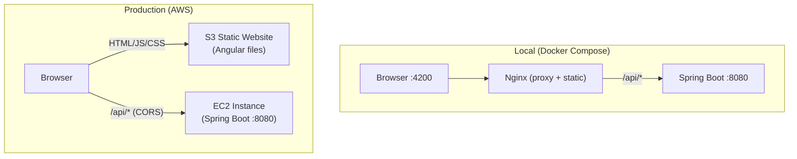

# Production Deployment Guide (AWS S3 + EC2)

This document describes how to deploy the Todo Management Application to AWS using S3 for the frontend and EC2 for the backend. This is the production architecture — distinct from the local Docker Compose setup which runs everything on one machine.

## Architecture Comparison



| Concern | Local (Docker) | Production (AWS) |
|---------|---------------|-----------------|
| Frontend hosting | Nginx container | S3 static website |
| API routing | Nginx reverse proxy (same origin) | Browser calls EC2 directly (cross-origin) |
| CORS | Not needed (same origin via proxy) | Required (S3 origin differs from EC2 origin) |
| TLS/HTTPS | Not configured | ACM certificate + CloudFront or ALB |
| Database | SQLite in Docker volume | SQLite on EBS volume attached to EC2 |
| Scaling | Single instance | EC2 sizing, optionally behind ALB |

## What Changes Between Local and Production

### 1. No Nginx in Production

In local Docker, Nginx serves two roles: static file server and API reverse proxy. In production, these are split:
- S3 serves static files (replaces Nginx's static role)
- The browser calls EC2 directly (replaces Nginx's proxy role)

The Nginx container, `nginx.conf`, and the frontend Dockerfile are **not used in production**. They exist only for the Docker Compose local environment.

### 2. CORS Must Be Configured

Locally, the browser sends all requests to `localhost:4200` (Nginx), which proxies API calls to the backend. Same origin — no CORS.

In production, the browser loads the Angular app from `http://your-bucket.s3-website.amazonaws.com` but sends API requests to `http://your-ec2-ip:8080`. These are different origins, so the backend must include CORS headers.

The Spring Boot application already has CORS configured via the `cors.allowed-origins` property. Update it to include the S3 website URL:

```properties
cors.allowed-origins=http://your-bucket.s3-website-us-east-1.amazonaws.com
```

Or set it as an environment variable on EC2:
```bash
export CORS_ALLOWED_ORIGINS=http://your-bucket.s3-website-us-east-1.amazonaws.com
```

### 3. Angular API Base URL Must Point to EC2

The Angular app's HTTP interceptor sends requests to `/api/*` (relative path). In local Docker, Nginx resolves this to the backend. In production, relative paths resolve to S3 (which has no API).

You need to configure the Angular app to send API requests to the EC2 public IP/domain. This is typically done via Angular's `environment.ts`:

```typescript
// src/environments/environment.prod.ts
export const environment = {
  production: true,
  apiUrl: 'http://your-ec2-public-ip:8080'
};
```

Then prefix all HTTP calls with `environment.apiUrl` in your services, or configure a base URL in the HTTP interceptor.

### 4. JWT Secret Must Be Production-Grade

The local default (`default-dev-secret-change-in-production`) is not secure. On EC2, set a real secret:

```bash
export JWT_SECRET="your-cryptographically-random-64-char-string-here"
```

Generate one with: `openssl rand -base64 48`

---

## Frontend Deployment (S3)

### Step 1: Build the Angular App for Production

```bash
cd angular-todo-frontend
npm run build -- --configuration=production
```

This produces `dist/angular-todo-frontend/browser/` containing static HTML, JS, and CSS files.

### Step 2: Create and Configure S3 Bucket

1. Create a bucket (e.g., `todo-app-frontend-team02`)
2. Enable **Static website hosting** (Properties tab)
   - Index document: `index.html`
   - Error document: `index.html` (enables Angular client-side routing)
3. Disable **Block all public access** (Permissions tab)
4. Add a **Bucket Policy** for public read:

```json
{
  "Version": "2012-10-17",
  "Statement": [{
    "Sid": "PublicReadGetObject",
    "Effect": "Allow",
    "Principal": "*",
    "Action": "s3:GetObject",
    "Resource": "arn:aws:s3:::todo-app-frontend-team02/*"
  }]
}
```

### Step 3: Upload Build Artifacts

```bash
aws s3 sync dist/angular-todo-frontend/browser/ s3://todo-app-frontend-team02/ --delete
```

The `--delete` flag removes files from S3 that no longer exist in the local build (keeps the bucket clean).

### Step 4: Verify

Navigate to the S3 website endpoint:
```
http://todo-app-frontend-team02.s3-website-us-east-1.amazonaws.com
```

---

## Backend Deployment (EC2)

### Step 1: Provision EC2 Instance

- AMI: Amazon Linux 2023 or Ubuntu 22.04
- Instance type: `t2.micro` (free tier) or `t3.small`
- Storage: 8GB+ EBS (for OS + SQLite database)
- Security Group inbound rules:

| Port | Source | Purpose |
|------|--------|---------|
| 22 | Your IP only | SSH access |
| 8080 | 0.0.0.0/0 | Backend API (or restrict to S3/CloudFront IPs) |

### Step 2: Install Java 21 on EC2

```bash
sudo yum install java-21-amazon-corretto -y   # Amazon Linux
# or
sudo apt install openjdk-21-jre-headless -y    # Ubuntu
```

### Step 3: Build and Transfer the JAR

On your local machine:
```bash
cd spring-todo-backend
./gradlew bootJar -x test
scp build/libs/*.jar ec2-user@your-ec2-ip:~/app.jar
```

### Step 4: Run the Backend on EC2

```bash
export JWT_SECRET="your-production-secret-here"
export CORS_ALLOWED_ORIGINS="http://todo-app-frontend-team02.s3-website-us-east-1.amazonaws.com"

nohup java -jar app.jar \
  --spring.datasource.url=jdbc:sqlite:./todo.db \
  --server.port=8080 &
```

`nohup` keeps the process running after SSH disconnect. For proper production use, create a systemd service:

```ini
# /etc/systemd/system/todo-backend.service
[Unit]
Description=Todo Management Backend
After=network.target

[Service]
User=ec2-user
WorkingDirectory=/home/ec2-user
ExecStart=/usr/bin/java -jar /home/ec2-user/app.jar --spring.datasource.url=jdbc:sqlite:./todo.db
Environment=JWT_SECRET=your-production-secret
Environment=CORS_ALLOWED_ORIGINS=http://your-s3-url
Restart=always
RestartSec=10

[Install]
WantedBy=multi-user.target
```

Then:
```bash
sudo systemctl daemon-reload
sudo systemctl enable todo-backend
sudo systemctl start todo-backend
```

### Step 5: Verify

```bash
curl http://your-ec2-ip:8080/api/auth/register \
  -H "Content-Type: application/json" \
  -d '{"username":"testuser","password":"TestPass1!"}'
```

Should return HTTP 201.

---

## Alternative: Docker on EC2

Instead of running a bare JAR, you can run the Docker image on EC2:

```bash
# Install Docker on EC2
sudo yum install docker -y
sudo systemctl start docker
sudo usermod -aG docker ec2-user

# Build and run (or pull from a registry)
docker build -t todo-backend ./spring-todo-backend
docker run -d --name backend \
  -p 8080:8080 \
  -e JWT_SECRET="your-secret" \
  -e CORS_ALLOWED_ORIGINS="http://your-s3-url" \
  -v todo-data:/app/data \
  todo-backend
```

This reuses the same Dockerfile from your Docker Compose setup. The only difference is the CORS and JWT environment variables point to production values.

---

## Production Checklist

- [ ] Angular `environment.prod.ts` points to EC2 public IP or domain
- [ ] S3 bucket has static website hosting enabled with `index.html` as error document
- [ ] S3 bucket policy allows public read
- [ ] EC2 security group opens port 8080 (and optionally 443 for HTTPS)
- [ ] EC2 has Java 21 installed (or Docker)
- [ ] `JWT_SECRET` is set to a strong random value on EC2
- [ ] `CORS_ALLOWED_ORIGINS` includes the S3 website URL
- [ ] SQLite database is on persistent storage (EBS, not ephemeral)
- [ ] Backend runs as a systemd service (survives reboots)
- [ ] Tested: frontend loads from S3, login works, API calls reach EC2
