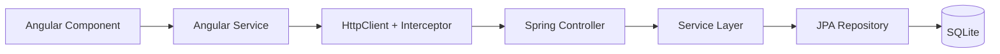

# 1. System Architecture

## Stack and layers

| Layer | Technology | Responsibility |
|-------|------------|----------------|
| Client | Angular | UI, routing, auth state, HTTP calls |
| API | Spring Boot (Web) | REST controllers, validation, security filter |
| Business | Spring services | Auth, todo/subtask rules, ownership checks |
| Data | Spring Data JPA | Repositories, entity mapping |
| Storage | SQLite | Persistent `users`, `todos`, `subtasks` |

## Data flow (Angular → Spring Boot → SQLite)



**Typical request path**

1. User action in an Angular component (e.g. create todo).
2. Component calls a domain service (`TodoService`).
3. Service issues `HttpClient` request to `/api/...` with `Authorization: Bearer <JWT>` on protected routes.
4. Spring Security validates the token; controller maps JSON to DTO.
5. Service enforces business rules (ownership, validation).
6. Repository reads/writes SQLite; response returns as JSON (or `204 No Content` for DELETE).

## Backend package layout (proposed)

```
com.tdj.todo
├── controller/     AuthController, TodoController
├── service/        AuthService, TodoService, SubtaskService
├── repository/     UserRepository, TodoRepository, SubtaskRepository
├── model/          User, Todo, Subtask (JPA entities)
├── dto/            request/response payloads
└── security/       JwtFilter, JwtUtil, SecurityConfig
```
