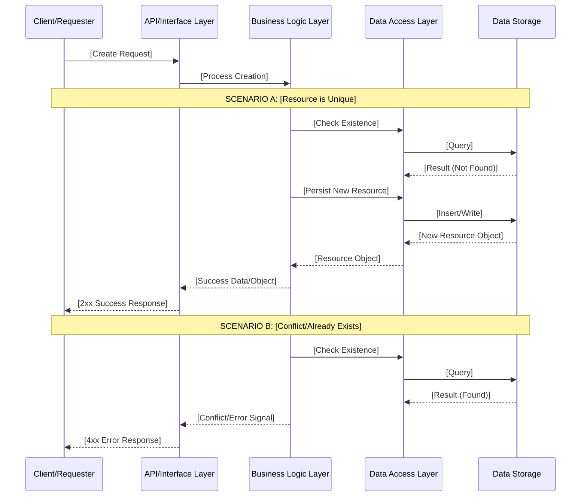
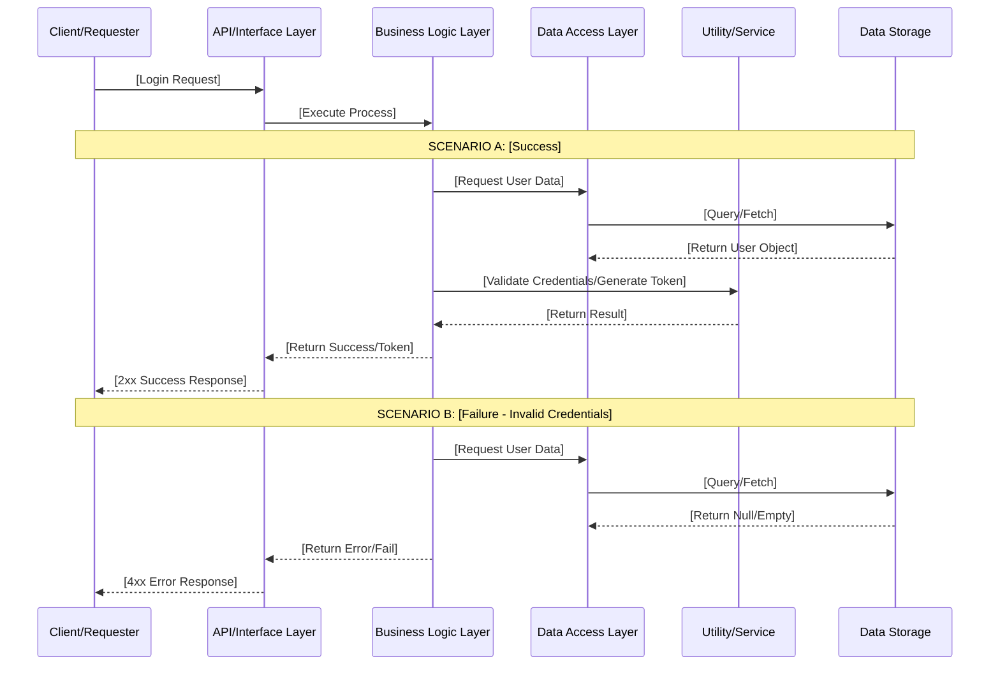

# Phase 2: Design

## Objective
The goal of this phase is architectural and interface planning. The team must define the data flow, security protocols, and user interface layouts. Successful completion of this phase ensures that the Backend and Frontend teams can work in parallel without integration conflicts.

## Checkpoints
- [ ] **System Architecture:** Document the data flow (Angular $\rightarrow$ Spring Boot $\rightarrow$ SQLite).
- [ ] **Security Planning:** Familiarize yourself with JJWT
- [ ] **UI Wireframing:** Map out the interface for authentication and task management.
- [ ] **Component Design:** Loosely define the Angular component hierarchy and service structure.

## Technical Reference: Design Standards

### 1. API Design Principles
All endpoints must follow RESTful conventions. Use the following templates for your design documentation:

**Resource Creation Flow (Template)**
Use this logic to design your `POST` endpoints to ensure consistent error handling (e.g., handling duplicate entries).

**Login/Auth Flow (Template)**
Use this logic to design your `/auth` endpoints to ensure secure credential validation.

## Deliverables for Phase 2
By the end of this phase, your team should have:
1.  **API Specification:** A completed document defining all endpoints, request bodies, and response codes.
2.  **Wireframes:** Visual mockups of the Login, Register, and Dashboard screens.
3.  **Database Schema:** A final relational model (ERD) ready for implementation.

## Moving to Phase 3
Once the API contracts and UI wireframes are finalized and agreed upon by all team members, proceed to **Phase 3: Backend Development**.

---

[Return to README](../README.md)